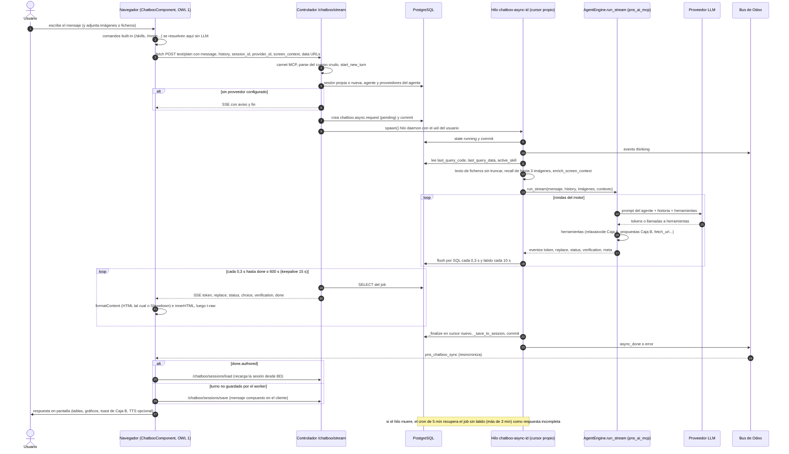

# Análisis pns_ai_chatboo — Consolidación (bloque C4) (Odoo 14.0, rama 14.0-analisis-pns-ai)

> Documento de análisis, **no** es una especificación de diseño ni propone código.
> `pns_ai_chatboo` es código de terceros (PATANEGRA Soft) y no se modifica.
>
> Consolida los bloques C1 a C3 de Chatboo frente a la consolidación de `pns_ai_mcp`. No copia su
> contenido: remite a cada bloque con su apartado (§) o su número de riesgo.
>
> | Clave | Documento |
> |---|---|
> | [SRV] | [Bloque C1: servidor y skills de fábrica](analisis_pns_ai_chatboo_1_servidor.md) |
> | [COMP] | [Bloque C2: componente principal del chat](analisis_pns_ai_chatboo_2_componente.md) |
> | [CLI] | [Bloque C3: resto del cliente web](analisis_pns_ai_chatboo_3_cliente.md) |
> | [CONS] | [Consolidación de pns_ai_mcp (bloque 9)](analisis_pns_ai_mcp.md) |
> | [VERIF] | [Verificación de seguridad controlada](../pendiente/verificacion_seguridad_pns_ai.md) |
>
> Notación heredada de [CONS]: **HECHO** (archivo:línea verificado), **INFERENCIA** (deducción no
> ejecutada), **PENDIENTE** (se comprobará con `odoo-dev 14`), **CONFIRMADO** (reproducido en
> [VERIF]). Ningún hallazgo propio de Chatboo está CONFIRMADO todavía: [VERIF] solo probó
> `pns_ai_mcp`.
>
> Referencias a riesgos de los bloques: [SRV] §11.3-n (lista numerada), [COMP] Rn (§10),
> [CLI] Rn (§8). Las numeraciones R de [COMP] y [CLI] son independientes.

---

## 1. Resumen funcional (para un consultor)

1. Chatboo es el **chat de IA dentro del backend de Odoo**: una ventana flotante que se abre desde
   el icono de la barra superior o desde el menú Chatboo ([COMP] resumen 1).
2. No razona por sí mismo: cada mensaje lo resuelve el motor de `pns_ai_mcp` (agente
   `pns_ai_chatboo`, proveedor LLM, skills, Caja A para leer y Caja B para escribir) ([SRV] resumen 1-2).
3. Guarda cada conversación por usuario (`chatboo.session`) con mensajes, adjuntos, datos de la
   última consulta y skill activa; cada turno se ejecuta en segundo plano (`chatboo.async.request`)
   y la pantalla va recibiendo el texto en directo ([SRV] §2, §5).
4. Solo lo ven los usuarios con **API key MCP generada** ("carnet"); no hay grupo propio
   ([SRV] resumen 3; [COMP] resumen 1).
5. Puede usar la pantalla abierta como contexto (modelo, registro, vista), adjuntar imágenes y
   ficheros (Excel, PDF…), pintar tablas, gráficos y tarjetas, y leer las respuestas en voz alta
   ([COMP] §5.2; [CLI] §3-5).
6. Exporta las respuestas a PDF, Word y Excel; algunos documentos se generan en el navegador y se
   suben solos a Odoo ([CLI] resumen 3-4).
7. Trae 11 skills de fábrica (financieras, usuarios, sistema, previsión meteorológica…) y tres
   contextos obligatorios para el modelo ([SRV] §7-8).
8. Hallazgo principal de servidor: **sin record rules**, cualquier interno puede leer, cambiar o
   borrar por RPC las conversaciones, adjuntos y trabajos de otros usuarios ([SRV] resumen 4).
9. Hallazgo principal de cliente: casi todo lo que responde el modelo se pinta como **HTML sin
   sanear**, lo que abre XSS, robo de datos sin clic mediante imágenes externas y confirmación de
   la Caja B sin el usuario ([COMP] resumen 4-9).
10. Conclusión técnica: hereda el "no apto para producción" de [CONS] §1.15 y añade dos riesgos
    críticos propios (§4, riesgos 54 y 55); decisión de Seges en D1 y D33.

---

## 2. Configuración completa del chatbot, en orden

Requisito previo: **toda** la configuración de `pns_ai_mcp` de [CONS] §2 (pasos 0-11). Esta tabla
solo añade lo de Chatboo, intercalado en el punto donde corresponde. Rutas de menú en inglés
(traducciones no verificadas). Detalle en [SRV] §9-10.

> **Advertencia previa:** ningún paso de esta tabla protege frente a los riesgos 54-58 de §4 (no
> dependen de grupos ni de carnet) ni frente a los hallazgos A-D de [VERIF].

| # | Paso | Ruta de menú / lugar | Qué añade Chatboo | Se intercala con [CONS] §2 |
|---|---|---|---|---|
| C0 | Imagen | Dockerfile del cliente | Nada nuevo obligatorio: `openpyxl` ya lo exige `pns_ai_mcp` (lo usa Chatboo al adjuntar Excel). `xlrd` opcional para `.xls`. Pillow viene con Odoo. | Paso 0 |
| C1 | Instalar | Aplicaciones → "Chatboo" | Siembra el agente `pns_ai_chatboo` (noupdate), 3 contextos, 11 skills, parámetros y el cron. | Tras paso 1 |
| C2 | Proveedor del agente | AI Engine → Agents → Chatboo → pestaña "Providers" | Con más de un proveedor activo y sin cadena, `/chatboo/stream` responde "No AI provider is configured". Definir prioridad (failover, [CONS] riesgo 25). | Es el paso 4 de [CONS] aplicado al agente de Chatboo, tras el paso 3 |
| C3 | Carnet por usuario | AI Engine → Security → Users → (usuario) → "Generate API Key" | Sin hash no aparece el menú ni el icono y todas las rutas (salvo `check_health`) responden "access denied". Puede hacer falta recargar el navegador (caché de `load_menus`, F46). | Es el paso 5 de [CONS] |
| C4 | Grupos | Ajustes → Usuarios y compañías → Usuarios → (usuario) → "Artificial Intelligence" | AI Writer para `/create-skill`, `/delete-skill`, `/rename-skill`; AI Administrator para "guardar resultado en bruto"; Contabilidad para las skills financieras; Ventas para `team_id` en `/dashboard`. | Completa el paso 2 |
| C5 | Ajustes de Chatboo | Ajustes → AI Engine → bloque "Chatboo" | Icono en la barra (systray), memoria de conversación (MB y horas), motor de gráficos (`echarts`/Chart.js), modo inicial (`show-table`); botón "Configuration" abre el agente. | Tras paso 6 |
| C6 | Parámetros del sistema | Ajustes → Técnico → Parámetros → Parámetros del sistema | `pns_ai_chatboo.history_retention_days` (30, solo aquí) y `pns_ai_chatboo.download_max_bytes` (15 MB). | Tras C5 |
| C7 | Lista blanca | AI Engine → Connections → Whitelist | `open-meteo.com` (ya sembrado) para `/forecast`; decidir si se mantiene (D36). | Paso 7 |
| C8 | Cron | Ajustes → Técnico → Automatización → Acciones planificadas | "Chatboo: async queue maintenance" (cada 5 min) activo: recupera turnos colgados y borra trabajos de más de 72 h. | Paso 9 |
| C9 | Servidor y proxy | `odoo.conf` y proxy inverso del cliente | Con prefork, `limit_time_real` ≥ 600; proxy **sin buffering** y `proxy_read_timeout` alto (SSE); HTTPS. Opcional y recomendable valorar CSP `img-src` (D39). | Paso 11 (y D15 de [CONS]) |

---

## 3. Flujo completo de un mensaje

Base: [COMP] §5.2 (navegador) y [SRV] §5 (servidor). Los números de línea están en esos apartados.

Puntos de control relevantes para §4: el **carnet** solo se comprueba en el paso 4 (la ruta), no
en el ORM (riesgos 56, 58); `history` y `provider_id` llegan del navegador (riesgo 62, [CONS] 31);
el contenido vuelve al DOM como HTML en el paso de `formatContent` (riesgos 54, 55, 60, 61).

---

## 4. Riesgos

Mismo criterio de gravedad que [CONS] §4 (Crítico = escalada a administrador de Odoo o salto del
control humano de escrituras; Alto = fuga de datos, ejecución sin control o integridad; Medio =
operación, despliegue, cumplimiento o efectos laterales; Bajo = calidad o mantenimiento). La
numeración **continúa la de [CONS] §4 (1-53)** para tener un registro único.

### 4.1 Riesgos nuevos de Chatboo

#### Crítico (2)

| # | Riesgo | Estado | Origen |
|---|---|---|---|
| 54 | **XSS almacenado entre usuarios**: sin record rules, cualquier interno escribe por RPC `chatboo.session.messages` de otro usuario (también de un administrador) y ese contenido llega al DOM por `t-raw`/`innerHTML` al abrir Chatboo. El JS se ejecuta con la sesión de la víctima: con una víctima administradora equivale a escalada. Distinto de [CONS] 15 (allí el origen es el LLM o un campo; aquí basta el ORM, sin LLM). | HECHO (ACL y sumidero, estático); PENDIENTE prueba (F31) | [SRV] §3.2, §11.3-1; [COMP] §7.1 X9, R3 |
| 55 | **XSS ⇒ salto de la Caja B**: cualquier XSS en el chat (riesgos 54, 61 o [CONS] 15, también disparado por *prompt injection* sin clic) puede llamar a `/verification/confirm` y `/verification/execute` sin el usuario; el enfriamiento de 5 s es solo visual y solo para `high`. Un admin MCP lo puede hacer con operaciones de otros. | HECHO (cliente); servidor PENDIENTE (F36) | [COMP] §7.3, R4 |

#### Alto (6)

| # | Riesgo | Estado | Origen |
|---|---|---|---|
| 56 | Sin aislamiento en el ORM: ACL `base.group_user` con CRUD en sesiones y lectura/escritura/creación en jobs, sin record rules. Lectura, modificación y borrado de conversaciones, datasets, adjuntos (con sus `access_token`) y jobs con imágenes y ficheros en base64 de otros usuarios. | HECHO (ACL); PENDIENTE (F29) | [SRV] §3.1-3.2, §11.3-1 |
| 57 | Inyección cruzada en el siguiente turno de otro usuario manipulando `last_query_code`, `last_query_data`, `active_skill_*` o `messages` de su sesión: el motor los reutiliza con el `env` de la víctima. | INFERENCIA (F32) | [SRV] §3.2.4, §11.3-2 |
| 58 | Turnos lanzados por RPC (`create` + `spawn()`) sin carnet y sobre sesiones ajenas: ejecución del motor con coste y escritura en la conversación de la víctima. | INFERENCIA (F30) | [SRV] §3.2.5, §11.3-3 |
| 59 | `/chatboo/stream` con `csrf=False`, `cors='*'` y cuerpo crudo (`text/plain`): una web externa podría lanzar turnos con la cookie del usuario (cookie sin `SameSite` en 14). Encadena con [CONS] 16 (*prompt injection* + auto-confirmación). | INFERENCIA; PENDIENTE (F33) | [SRV] §4.1, §11.3-4 |
| 60 | **Exfiltración sin clic** con imágenes externas en Markdown o HTML de la respuesta: no hay CSP en `/web` ni filtro de dominios en el cliente; la lista blanca de `fetch_url` no cubre lo que pide el navegador. Se repite en el streaming y en cada recarga. | HECHO (estático); PENDIENTE (F35) | [COMP] §7.2, R5, R10 |
| 61 | Sumideros de XSS adicionales a los de [CONS] 15: `enhanceHtmlProse` desescapa y re-renderiza (X7), `user_ack_message` de la Caja B (X8), `_escapeHtml` sin comillas en atributos, `modelLabel`, errores concatenados, nombres de serie (X10-X13), **clave de columna** en la tabla de estadísticas de gráficos, y Showdown 2.1.0 (CVE-2026-104477, sin versión corregida) sobre el Markdown crudo en exportaciones que se lanzan solas. | HECHO (estático); explotación INFERENCIA (F38) | [COMP] R6-R8; [CLI] R1, R2 |

#### Medio (10)

| # | Riesgo | Estado | Origen |
|---|---|---|---|
| 62 | `agent_code` del navegador aceptado sin restricción y `history`/`backend_history` fabricables (también vía `/chatboo/sessions/save`): el usuario inventa turnos previos o resultados de herramientas. La parte de proveedor libre ya está en [CONS] 31. | HECHO; alcance de `_merge_meta` PENDIENTE (F37) | [SRV] §11.3-5; [COMP] §7.4, R9 |
| 63 | Coste y DoS: texto de adjuntos sin truncar (todas las hojas Excel), imágenes sin tope (`download_max_bytes` no aplica a `_persist_turn_images` ni al cuerpo del stream), *recall* de imágenes en cada turno; documentos subidos como vector de *prompt injection* indirecta. | HECHO / INFERENCIA | [SRV] §9, §11.3-6 |
| 64 | Retención sin cron: las sesiones se purgan a los 30 días solo cuando el usuario vuelve a usar Chatboo; usuarios inactivos o archivados conservan conversaciones y adjuntos con token sin caducidad; jobs con base64 72 h; posibles huérfanos al borrar usuario o desinstalar. | HECHO / INFERENCIA (F42) | [SRV] §6, §11.3-7 |
| 65 | TTS con Web Speech API sin filtrar voces locales: el texto de las respuestas puede salir a servicios de voz de Google o Microsoft. | HECHO (código); envío INFERENCIA (F51) | [CLI] §5.2, R5 |
| 66 | Exportaciones generadas en el navegador: subida automática de documentos pendientes a `/chatboo/sessions/fulfill_export`; Word con el HTML de la burbuja (recursos remotos, UNC/NTLM en Windows); `src` de imágenes sin escapar en Word y en el HTML subido; columnas del dataset no visibles incluidas; `mimetype` y usuario del adjunto por confirmar. | HECHO / INFERENCIA (F38, F40) | [CLI] §2, R3, R4, R6, R7 |
| 67 | Skills de fábrica disponibles para cualquiera con carnet: `users-all`, `users-logged` y `sys-info` agregan datos de usuarios y del sistema; `forecast` envía la ciudad de la empresa a Open-Meteo. | HECHO | [SRV] §7, §11.3-8 |
| 68 | Errores funcionales en skills: `financial-health` nunca detecta urgencias; `customer-risk-analysis` calcula DSO con la fecha de factura y hace N+1; las financieras recorren todos los apuntes 7 veces sin filtro de compañía. Información de negocio errónea presentada como análisis. | HECHO; rendimiento PENDIENTE (F49) | [SRV] §7, §11.3-9 |
| 69 | Migraciones 2.1.296 y 2.1.300 borran skills `flota`/`payroll` por código sin filtrar `owner_id`: también borrarían skills de usuario con ese código. | HECHO | [SRV] §11.3-10, §11.4 |
| 70 | `SELF_READABLE_FIELDS`/`SELF_WRITEABLE_FIELDS` redefinidos como `property` en `res.users`: funciona porque `mail` los reasigna antes; con otro orden de carga (p. ej. `hr`), `TypeError` al cargar el registro (Odoo no arranca). | INFERENCIA; PENDIENTE (F45) | [SRV] §11.2 |
| 71 | Choque de `window.Chart`: tras abrir una vista gráfico o el tablero contable, Odoo 14 carga Chart.js 2.x encima del 4.x de Chatboo y los gráficos del chat quedan rotos hasta recargar. | HECHO del mecanismo; efecto INFERENCIA (F39) | [CLI] §7.1, R10 |

#### Bajo (7)

| # | Riesgo | Estado | Origen |
|---|---|---|---|
| 72 | `check_health` expone el proveedor a internos sin carnet; `/chatboo/providers` puede listar todos los proveedores con `sudo`; `_json_response` devuelve 200 en errores. | HECHO | [SRV] resumen 7, §11.3-11 |
| 73 | Todo el JS/CSS (7 librerías, 3 duplicadas con MCP, SheetJS sin uso) se carga a todos los internos y cada carga del cliente llama a `check_health`. | HECHO | [CLI] R8, R9, §6 |
| 74 | Compatibilidad de cliente: sintaxis ES2022 sin transpilar en el bundle compartido; `setup()`/flechas en `t-on` por verificar con OWL 1; overlay `z-index:1050` y `display:none` del panel de control con posibles conflictos con diálogos del core. | INFERENCIA (F48, D40) | [COMP] R12, R13; [CLI] §7.2 |
| 75 | Código muerto o heredado: `chatboo_floating_transfer_history`, `_saveRawForTemplate`, rama `result.error`, "#undefined" en el modal, `o_chatboo_dismiss_btn` con `window.open` sin `noopener`, `mail_service` inexistente en 14, `chatboo_has_access` sin lectura, clave de `sessionStorage` que nadie escribe. | HECHO | [COMP] R14; [CLI] R11 |
| 76 | TSV copiado al portapapeles con celdas `=…` se evalúa al pegar en una hoja de cálculo. | INFERENCIA | [CLI] R12 |
| 77 | Operación: el agente queda con recetas distintas en BD migradas (`acl_security` en `default_context_codes`) y en instalaciones nuevas; el menú puede no aparecer tras generar la API key (caché de `load_menus`). | INFERENCIA (F46, D37) | [SRV] §9, §10 paso 3 |
| 78 | Sin tests propios. | HECHO | [SRV] resumen 13 |

**Totales de riesgos nuevos:** Crítico 2 · Alto 6 · Medio 10 · Bajo 7 · **25 riesgos (54-78)**.

### 4.2 Riesgos de pns_ai_mcp que Chatboo confirma, agrava o mitiga

| # [CONS] | Efecto | Motivo | Origen |
|---|---|---|---|
| 3, 4 | Agrava | Además del `write` RPC, un XSS en el chat confirma y ejecuta operaciones desde el navegador (riesgo 55); un admin MCP puede hacerlo con las de otros. | [COMP] §7.3 |
| 11 | **Agrava** | [CONS] lo acotaba porque `pns_ai_mcp` no trae skills de fábrica; con Chatboo instalado, `unlink_named_factory_skills` afecta a sus 11 skills. | [SRV] §11.3-8 |
| 15 | Confirma (estático) y agrava | El JS de Chatboo deja pasar HTML y pasa el Markdown por Showdown sin filtro hasta `t-raw`; `innerHTML` temprano ejecuta el código ya durante el streaming y en cada recarga, TTS y exportación. Sigue sin ejecutar (F15). | [COMP] resumen 4-6, R1, R2, R10, R11 |
| 16 | Agrava | La *prompt injection* ya no solo dirige herramientas: lo que el LLM repite llega al DOM (XSS, exfiltración por imagen) y los documentos subidos son una entrada más. | [COMP] resumen 7; [SRV] §11.3-6 |
| 17 | Agrava | La lista blanca de `fetch_url` no protege lo que el navegador pide al pintar la respuesta (riesgo 60). | [COMP] §7.2 |
| 18 | Confirma | `screen_context` (modelo, id, vista, menú, URL completa) se envía en cada turno con el chip activo; el texto de los adjuntos va entero al proveedor. | [CLI] §4; [SRV] §5 |
| 21 | Confirma y agrava | Los adjuntos con token viven mientras viva la sesión, y las sesiones de usuarios inactivos no se purgan (riesgo 64); además los documentos pendientes se suben solos. | [SRV] §6; [CLI] resumen 4 |
| 25 | Confirma el ámbito | El agente de Chatboo es el que usará la cadena de failover (paso C2). | [SRV] §10 |
| 27 | Confirma y matiza | Chatboo carga otra copia de showdown, jsPDF y SheetJS en las mismas versiones (prevalece la suya, INFERENCIA); usa jsPDF pero no SheetJS. Añade showdown con CVE-2026-104477 y CVE-2024-1899. | [CLI] §6, R8 |
| 31 | Confirma y agrava | `provider_id` del navegador se acepta para **cualquier proveedor existente**; sin tope de tamaño en adjuntos (riesgo 63). | [COMP] §5.2-5; [SRV] §11.3-5 |
| 32 | Confirma | La retención de `ai.log` de los turnos de Chatboo depende de la política de MCP. | [SRV] §6 |
| 33 | Agrava | Overlay global en `document.body`, `<style>` global, *listeners* en la barra de navegación y en ventanas de chat de `mail`, 7 librerías y un cron más cada 5 min. | [COMP] resumen 11; [CLI] §7.1; [SRV] §9 |
| 34 | Confirma | Los tres contextos y las skills de fábrica de Chatboo se reimportan con sobrescritura en cada `-u`. | [SRV] resumen 11 |
| 35 | Confirma y mitiga en parte | El turno va en un hilo con cursor propio y el *tail* tiene tope de 600 s; el cron recupera los jobs sin latido como "respuesta incompleta". El worker HTTP sigue ocupado hasta 10 min. | [SRV] §5 |
| 39 | **Mitiga** (ruta del chat) | El Excel de exportación del chat lo construye el servidor con celdas `inlineStr` escapadas: sin inyección de fórmulas en esa ruta. Aparece el riesgo menor 76 (portapapeles). | [CLI] §2.2 |
| 48 | Posible agravante, sin resolver | Chatboo llama a `check_health` en cada carga del cliente; si es el mismo chequeo que espera a las fuentes FX, sin Internet cada carga del backend esperaría hasta 8 s (F50). | [CLI] R9; [CONS] 48 |

---

## 5. Contradicciones con los análisis anteriores

Continúa la numeración de [CONS] §5 (K1-K8).

| # | Contradicción | Qué prevalece | Fuentes |
|---|---|---|---|
| K9 | [CONS] riesgo 11 dice "impacto acotado: este módulo no trae skills de fábrica". Con Chatboo instalado sí hay 11 skills de fábrica afectadas. | [SRV] (contexto con Chatboo); [CONS] sigue siendo correcto para `pns_ai_mcp` solo | [CONS] §4-11; [SRV] §11.3-8 |
| K10 | [CONS] riesgo 39 y F16 plantean inyección de fórmulas en XLSX (openpyxl, INFERENCIA). [CLI] verifica que el Excel de la exportación del chat se escribe con celdas `inlineStr` escapadas. | [CLI] para la ruta del chat; F16 queda para otras rutas de `pns_ai_mcp` | [CONS] §4-39; [CLI] §2.2 |
| K11 | [CONS] riesgo 15 marca el XSS como "PENDIENTE en el JS". [COMP] lo establece por lectura completa del JS. | [COMP]: HECHO estático (sigue sin reproducir) | [CONS] §4-15; [COMP] §6-7 |
| K12 | [SRV] §5 y §11.2: "PENDIENTE que el cliente parsee el mensaje del bus en cadena JSON". [COMP] §5.2-9: el cliente hace hasta 3 `JSON.parse` encadenados. | [COMP] (HECHO); queda solo la prueba en ejecución (F43) | [SRV] §5, §11.2; [COMP] §5.2 |
| K13 | [SRV] pregunta 3 ("¿pinta el cliente como HTML `messages`?") queda abierta; [COMP] responde que sí (X9). | [COMP] | [SRV] preguntas; [COMP] §7.1 |
| K14 | [COMP] §5.2-4 incluye `name` en el `screen_context` y deja `domain = null` como INFERENCIA; [CLI] §4 verifica que en 14 `name` y `domain` van nulos. | [CLI] (lectura completa del archivo) | [COMP] §5.2; [CLI] §4 |
| K15 | Recuentos de líneas en la tabla de cobertura de [COMP] (systray.js 512, screen_context ~160, svg_cards 381, systray.xml 13) frente a [CLI] (513, 151, 382, 14). | [CLI] (lectura completa); diferencias de 1 línea atribuibles al salto final | [COMP] cobertura; [CLI] cobertura |
| K16 | [CONS] §2 paso 4 da a entender que el agente de inferencia necesita siempre proveedores en su pestaña; [SRV] §10 paso 2 precisa que el error aparece **sin cadena y con más de un proveedor**. | [SRV] (más específico) | [CONS] §2; [SRV] §10 |

Preguntas de [CONS] que los bloques de Chatboo responden total o parcialmente (no se repiten en §6):

- [CONS] F28, enfriamiento de 5 s para `unlink`: **solo visual y solo para `high`** ([COMP] §7.3). Si
  hay enfriamiento en servidor, pasa a F36.
- [CONS] F28, carga de imágenes y enlaces externos: **sí, sin filtro ni CSP** (estático; prueba en F35).
- [CONS] F28, adjuntos de sesiones ajenas sin token: por RPC sí, por ACL sin reglas (estático; prueba en F29).
- [CONS] F28, versiones de jsPDF/SheetJS que prevalecen: las de Chatboo (INFERENCIA), con la misma
  versión; queda la comprobación byte a byte (F41).
- [CONS] F15, ruta `formatted_text` → DOM: establecida en [COMP] §6.2-6.3; queda la reproducción.
- [CONS] F28 sigue abierta **solo** en lo relativo a llamadas externas a `build_mcp_extra_headers`
  o `chat_completion` con `extra_headers` (no aparece en los resúmenes de C1-C3).

---

## 6. Preguntas abiertas unificadas

Numeración: la última usada en [CONS] §6 es **F28** y **D32**; los bloques C1-C3 usan numeración
local (1-16, 1-11, 1-10) sin prefijo F/D. Este documento asigna **F29-F51** y **D33-D46**.

### 6.1 Se resuelven en el laboratorio (solo en local con `odoo-dev 14`; nunca con datos de producción salvo decisión del usuario)

| # | Pregunta | Origen |
|---|---|---|
| F29 | Dos usuarios internos: `search_read`, `write` y `unlink` sobre `chatboo.session` y `chatboo.async.request` ajenos; descarga de un adjunto de una sesión ajena. | [SRV] P1; [CONS] F28 |
| F30 | ¿Puede un interno sin carnet crear un job con `session_id` ajeno y ejecutar `spawn()` por `call_kw`? ¿Se escribe el turno en la sesión de la víctima y se contabiliza el coste? | [SRV] P2 |
| F31 | XSS almacenado cruzado: escribir `messages` de la sesión de otro (también de un administrador) por `/web/dataset/call_kw` y que la víctima abra Chatboo. ¿La limpieza de HTML de burbujas de usuario de `_merge_meta` cubre el ORM directo? | [SRV] P3; [COMP] P6, P7 |
| F32 | Inyección cruzada: modificar `last_query_code`, `last_query_data` y `active_skill_*` de una sesión ajena y comprobar qué ejecuta el siguiente turno de la víctima. | [SRV] §11.3-2 |
| F33 | CSRF de `/chatboo/stream`: `fetch(..., {mode:'no-cors', credentials:'include'})` con JSON en `text/plain` desde otro origen en Firefox y Safari; ¿qué responde al *preflight*? | [SRV] P4 |
| F34 | ¿Showdown 2.1.0 deja pasar `[x](javascript:alert(1))` como `href`? ¿Qué hace cada navegador con `javascript:` y `target="_blank"`? | [COMP] P2 |
| F35 | Exfiltración sin clic con ``: ver la petición en la pestaña Red, durante el streaming y al recargar. | [COMP] P3 |
| F36 | ¿`resolve_confirm` de `ai.safe.operation` aplica en servidor enfriamiento o confirmación adicional para `high`? Con un script en consola, ¿se confirma y ejecuta una operación sin interacción? | [COMP] P4 |
| F37 | ¿`_merge_meta` impide que `/chatboo/sessions/save` **sustituya** `backend_history`, `records` o `meta` de mensajes existentes, o solo que los borre? ¿Acepta el motor un `history` fabricado con resultados de herramientas? | [COMP] P5 |
| F38 | ¿Puede el servidor o el LLM fijar libremente las claves de columna de `data-chatboo-dataset` (alias SQL, etiquetas) y los nombres de serie de gráficos? ¿Incluye el dataset columnas no visibles y salen en PDF/Word/Excel? | [CLI] P1, P2; [COMP] P8 |
| F39 | Choque de Chart.js: pedir un gráfico, abrir una vista *graph* o el tablero de Contabilidad y volver a pedir un gráfico sin recargar. | [CLI] P3 |
| F40 | El adjunto de `/chatboo/sessions/fulfill_export`, ¿se crea con el usuario o con `sudo`, y con qué `mimetype` (riesgo de HTML servido como `text/html`)? | [CLI] P5 |
| F41 | `sha256sum` de `showdown.js`, `jspdf.umd.min.js` y `xlsx.full.min.js` de Chatboo y de MCP. | [CLI] P9 |
| F42 | ¿Quedan adjuntos huérfanos (con token) al borrar un usuario (cascada SQL) o al desinstalar el módulo? | [SRV] P7 |
| F43 | Confirmar en ejecución que el mensaje del bus en cadena JSON se procesa (resincronización tras `async_done`). | [SRV] P8; K12 |
| F44 | Con `workers > 0` y `limit_time_real=120`, ¿un turno de más de 120 s mata el hilo y el cron lo recupera como "respuesta incompleta"? Amplía [CONS] F26. | [SRV] P9 |
| F45 | ¿Carga el registro con `hr` instalado junto a Chatboo (`SELF_READABLE_FIELDS` como `property`)? | [SRV] P10 |
| F46 | ¿Aparece el menú Chatboo tras generar la API key sin reiniciar ni recargar? | [SRV] P11 |
| F47 | ¿Inyecta el sandbox siempre `start_date`, `end_date`, `year`, `anio`, `lugar`, `fecha`? Si no, `/annual-billing` falla con `NameError`. | [SRV] P12 |
| F48 | OWL 1 del core 14 del cliente: ¿soporta `setup()` y funciones flecha en `t-on-*`? (el JS del core no está en `/opt/odoo-src/14.0`; comprobar en el navegador con `odoo-dev 14`). | [COMP] P9 |
| F49 | Rendimiento de `/analisis-financiero` y `/customer-risk-analysis` con una copia de producción (cargarla lo decide el usuario). | [SRV] P16 |
| F50 | ¿Es `/chatboo/check_health` el chequeo que espera a las fuentes FX de [CONS] riesgo 48? Sin Internet, ¿cuánto tarda cada carga del backend? | Este documento (§4.2) |
| F51 | En Chrome, Edge y Firefox: ¿qué devuelve `speechSynthesis.getVoices()` (voces con `localService=false`) y cuál usa por defecto el TTS de Chatboo? | [CLI] P4 (parte técnica) |

Preguntas de los bloques absorbidas por preguntas existentes: [COMP] P1 se resuelve con [CONS] F15
(añadiendo la observación durante el streaming y al recargar).

### 6.2 Decisiones de Seges (o información que debe aportar el cliente)

| # | Pregunta | Origen |
|---|---|---|
| D33 | ¿Se acepta que cualquier interno lea y modifique por RPC sesiones, adjuntos y jobs ajenos, o se bloquea el despliegue de Chatboo (también en el VPS de pruebas con usuarios reales) hasta que el fabricante añada record rules? Amplía D1. | [SRV] P1; riesgos 54, 56 |
| D34 | ¿Se pide al fabricante restringir `provider_id` y `agent_code` del navegador a la cadena del agente Chatboo? Enlaza con D12. | [SRV] P5 |
| D35 | Retención: sesiones de usuarios inactivos o archivados, adjuntos con token, jobs con base64; ¿hace falta un cron de retención? Amplía D13. | [SRV] P6 |
| D36 | ¿Se limita por grupo quién puede ejecutar `users-all`, `users-logged` y `sys-info`? ¿Se mantiene `forecast` (salida a Open-Meteo)? Enlaza con D14. | [SRV] P13 |
| D37 | ¿Es intencionado que las BD migradas lleven `acl_security` en `default_context_codes` y las nuevas no? (pregunta al fabricante) | [SRV] P14 |
| D38 | ¿Deben conservarse los cambios de un administrador en contextos y skills de fábrica de Chatboo, o se acepta que cada `-u` los sobrescriba? Enlaza con D17. | [SRV] P15 |
| D39 | ¿Se quiere una CSP (`img-src`, al menos) para `/web` en el proxy del cliente como barrera frente a la exfiltración por imágenes? | [COMP] P3 |
| D40 | ¿Qué navegadores (y versiones) usan los usuarios del cliente? (ES2022 sin transpilar, voces TTS) | [COMP] P10; [CLI] P4 |
| D41 | ¿Se acepta que el texto de las respuestas pueda salir hacia servicios de voz de Google o Microsoft, o se pide desactivar el TTS? | [CLI] P4 |
| D42 | ¿Es aceptable la subida automática de documentos pendientes sin acción del usuario? | [CLI] P6 |
| D43 | ¿Se acepta cargar en todo el backend las 7 librerías (y las 3 duplicadas de MCP), incluida SheetJS 0.18.5 sin uso? | [CLI] P7 |
| D44 | ¿Se pide al fabricante un plan para showdown (sin versión corregida publicada) y jsPDF ≥ 3.0.2? Amplía D32. | [CLI] P8 |
| D45 | Código muerto o heredado del cliente: ¿se reporta al fabricante para retirarlo o se documenta como inocuo? | [COMP] P11; [CLI] P10 |
| D46 | ¿A qué usuarios se generará el carnet (API key MCP) para usar Chatboo? Da acceso al chat, a las 11 skills de fábrica y al servidor MCP externo. Enlaza con D4. | [SRV] §10 paso 3; riesgo 67 |

**Totales:** 23 preguntas de laboratorio (F29-F51) · 14 decisiones de Seges (D33-D46) · 1 pregunta
de bloque absorbida por [CONS] F15 · 5 subpreguntas de [CONS] F15/F28 respondidas por los bloques (§5).

---

## 7. Cobertura global del módulo

| Zona | Archivos | Lectura | Bloque |
|---|---|---|---|
| Manifest y arranque | `__manifest__.py`, `__init__.py`, `hooks.py` | Entero | [SRV] |
| Seguridad | `security/ir.model.access.csv` | Entero | [SRV] |
| Datos | `data/ai_agent_data.xml`, `chatboo_context_data.xml`, `chatboo_skill_data.xml`, `chatboo_icp_data.xml`, `chatboo_async_cron.xml` | Entero | [SRV] |
| Vistas | `views/chatboo_menus.xml`, `assets.xml`, `res_config_settings_mcp_agents_views.xml` | Entero | [SRV] (assets y menús también en [COMP], [CLI]) |
| Modelos | `models/__init__.py`, `chatboo_session.py` (1079), `chatboo_async_request.py` (1880), `ai_agent.py`, `ai_skill.py`, `res_users.py`, `res_config_settings.py`, `skill_capture_wizard.py`, `ir_ui_menu.py` | Entero | [SRV] |
| Controladores | `controllers/__init__.py`, `controllers/chatboo.py` (955) | Entero | [SRV] |
| Utilidades | `utils/` (10 archivos) | Entero | [SRV] |
| Conocimiento | `ai/contexts/domain/*/*.xml` (3), `ai/skills/system/*.md` y `*.py` (11 + 11) | Entero | [SRV] |
| Migraciones | 23 scripts (2.1.33 … 2.1.301) | Entero | [SRV] |
| Migraciones | 9 scripts (2.1.130-2.1.136, 2.1.146, 2.1.177) | **Parcial**: Grep de docstring y llamada (mismo patrón que 2.1.129) | [SRV] |
| JS principal | `chatboo_component_v2.js` (6043), `chatboo_formatters.js` (914), `chatboo_sse.js` (369) | Entero | [COMP] |
| JS resto | `chatboo_export.js` (3751), `chatboo_charts.js` (2583), `chatboo_dashboard.js` (853), `chatboo_systray.js` (513), `chatboo_svg_cards.js` (382), `chatboo_tts.js` (404), `chatboo_context_stats.js` (281), `chatboo_choice_list.js` (143), `chatboo_screen_context.js` (151), `chatboo_card_width.js` (118) | Entero | [CLI] (parcial antes en [COMP]) |
| Plantillas cliente | `static/src/xml/chatboo_systray.xml` | Entero | [COMP], [CLI] |
| CSS | `chatboo_floating.css` (1350), `chatboo_dashboard.css` (360), `chatboo_systray.css` (4) | Entero | [CLI] |
| Librerías de terceros | `showdown.js`, `jspdf.umd.min.js`, `jspdf.plugin.autotable.min.js`, `html2canvas.min.js`, `xlsx.full.min.js`, `chart.umd.min.js`, `echarts.min.js` | **No abiertas** (por regla): solo cabecera y cadena de versión | [CLI] |
| Tests | — | No existen | [SRV] |
| Sin leer | `i18n/`, `LICENSE`, `static/description/` | **No leídos** en ningún bloque (asignados a C2 por C1, no cubiertos) | — |
| Externos consultados (parcial) | `pns_ai_mcp`: `utils/session_download.py`, `models/ai_execution_engine.py`, `models/ai_agent_consumer.py` (entero), `models/ai_skill.py`, `models/mcp_user.py`, `controllers/verification_ui.py`, `controllers/safe_plan.py`, `views/assets.xml` (entero), `utils/artifact_export.py`; core 14 (`odoo/http.py`, `ir_ui_menu.py`, `res_users.py`, `bus`) | Tramos citados en cada bloque | [SRV], [COMP], [CLI] |

Cobertura del código propio de Chatboo: **completa** salvo 9 migraciones de resiembra (patrón
conocido) y los archivos no ejecutables `i18n/`, `LICENSE` y `static/description/`.
