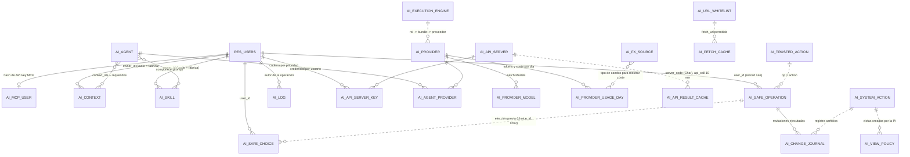

# Análisis pns_ai_mcp — Consolidación (bloque 9) (Odoo 14.0, rama 14.0-analisis-pns-ai)

> Documento de análisis, **no** es una especificación de diseño ni propone código.
> `pns_ai_mcp` es código de terceros (PATANEGRA Soft, Apache 2.0) y no se modifica.
>
> Consolida los bloques 1 a 8 y la verificación controlada de seguridad. No copia su contenido:
> remite a cada bloque con su apartado (§).
>
> | Clave | Documento |
> |---|---|
> | [MAPA] | [Bloque 1: mapa y configuración](analisis_pns_ai_mcp_1_mapa.md) |
> | [CONOC] | [Bloque 2: conocimiento (contextos, skills, agentes)](analisis_pns_ai_mcp_2_conocimiento.md) |
> | [SECR] | [Bloque 3: conexiones y secretos](analisis_pns_ai_mcp_3_conexiones_secretos.md) |
> | [MCP] | [Bloque 4: servidor MCP](analisis_pns_ai_mcp_4_servidor_mcp.md) |
> | [CAJAB] | [Bloque 5: Caja B (operaciones supervisadas y acciones de sistema)](analisis_pns_ai_mcp_5_caja_b.md) |
> | [CODE] | [Bloque 6: ejecución de código (relaxaicode, sandbox, skills) + complemento 6b](analisis_pns_ai_mcp_6_ejecucion_codigo.md) |
> | [LLM] | [Bloque 7: motor del agente y llamadas al LLM](analisis_pns_ai_mcp_7_motor_llm.md) |
> | [UI] | [Bloque 8: presentación, exportaciones, cliente web y tests](analisis_pns_ai_mcp_8_presentacion_cliente_tests.md) |
> | [VERIF] | [Verificación de seguridad controlada](../pendiente/verificacion_seguridad_pns_ai.md) |
> | [BASE] | [Análisis de pns_base](analisis_pns_base.md) |
>
> **Regla de prevalencia:** lo que [VERIF] marca como **CONFIRMADO** prevalece sobre las
> INFERENCIAS de los bloques. [VERIF] no tiene ningún resultado "NO SE REPRODUCE": sus cuatro
> pruebas (A-D) se confirmaron.
>
> Notación heredada: **HECHO** (archivo:línea verificado), **INFERENCIA** (deducción no
> ejecutada), **PENDIENTE** (se comprobará con `odoo-dev 14`), **CONFIRMADO** (reproducido en
> [VERIF]).

---

## 1. Resumen funcional (para un consultor)

1. `pns_ai_mcp` ("AI Engine") es el motor de IA de la familia PNS sobre `pns_base`: no es un chat,
   sino la infraestructura que usan Chatboo y otros módulos `pns_*`.
2. Guarda **conocimiento** para el modelo de lenguaje: contextos de texto (`ai.context`), skills con
   código Python (`ai.skill`) y agentes (`ai.agent`) que componen y cachean el prompt ([CONOC]).
3. Se conecta a **proveedores LLM** externos o locales (OpenAI-compatible y Anthropic) con cadena
   de respaldo (failover) y contabiliza tokens y coste por día, sin topes ([SECR], [LLM]).
4. Expone Odoo como **servidor MCP** (`/mcp`) para que clientes externos (Claude Desktop, Cursor…)
   consulten Odoo con la API key MCP de cada usuario ([MCP]).
5. Puede usar **servidores externos** (MCP o APIs OpenAPI, p. ej. cdmon o Sesame) y descargar URLs
   de una lista blanca ([SECR] §5-6).
6. Para consultar datos, el modelo escribe Python ("relaxaicode") que se ejecuta en el proceso de
   Odoo sobre un cursor de solo lectura ("Caja A") ([CODE]).
7. Para escribir, el modelo propone una **operación supervisada** ("Caja B") que un humano
   confirma y que se ejecuta con diario de cambios reversible ([CAJAB]).
8. Incluye **acciones de sistema**: añadir grupos a usuarios, instalar o desinstalar módulos,
   cambiar vistas y campos obligatorios ([CAJAB] §5).
9. Registra toda la actividad en `ai.log` y las mutaciones en `ai.change.journal` ([SECR] §7-8).
10. Cuatro grupos propios: AI Administrator, AI Writer, External URL y External API ([MAPA] §4.1).
11. La verificación en laboratorio **confirmó** que cualquier usuario autenticado, **incluido uno
    de portal**, puede hacerse administrador de Odoo por RPC ([VERIF] prueba A).
12. También confirmó que el propietario de una operación supervisada puede auto-confirmarla o
    reasignarla sin pasar por el flujo humano ([VERIF] prueba D).
13. Hay además fugas de secretos de servidores externos, XSS posible en el chat y envío de datos
    de negocio al proveedor LLM sin filtros por modelo, campo o empresa (§4 de este documento).
14. Con la imagen común del kit **no se instala**: faltan `openpyxl`, `httpx` y `pydantic`
    ([VERIF], nota de imagen).
15. Conclusión técnica: el módulo **no es apto para producción** en su estado actual sin una
    corrección del fabricante de los hallazgos críticos (decisión de Seges, pregunta D1).

---

## 2. Configuración completa, en orden

Base: [MAPA] §9, completado con [VERIF], [MCP] §11 y [LLM]. Las rutas de menú son las de la
interfaz en inglés (el módulo no trae traducción de menús al español verificada; `i18n/es.po` no
se ha leído).

> **Advertencia previa (CONFIRMADO):** ningún paso de esta lista protege contra los hallazgos A-D
> de [VERIF]; no dependen de los grupos asignados. Ver §4 (riesgos 1-4) y pregunta D1.

| # | Paso | Ruta de menú / lugar | Detalle | Fuente |
|---|---|---|---|---|
| 0 | Imagen del servidor | Dockerfile del cliente (`DOCKERFILE=` en `.odoo-dev.conf`) | Python ≥ 3.7 con `openpyxl`, `httpx` y `pydantic` además de `reportlab` y `requests` (estos dos vienen con Odoo 14). Sin ellos Odoo aborta la instalación. Node.js/npx solo si se usan servidores MCP `stdio`. Salida a Internet hacia proveedores LLM y fuentes FX. | [MAPA] §1.2, §9.1; [VERIF] |
| 1 | Instalar | Aplicaciones → "AI Engine" | Instala `pns_base` y `pns_ai_mcp`. El `post_init_hook` carga además proveedores, servidores OpenAPI, lista blanca y valores por defecto. | [MAPA] §1.3, §3.1 |
| 2 | Asignar grupos | Ajustes → Usuarios y compañías → Usuarios → (usuario) → sección "Artificial Intelligence" | Al menos un usuario **AI Administrator** que además tenga **Administración / Ajustes**; Writer / External URL / External API a quien deba proponer escrituras, consultar URLs o llamar APIs. Ningún grupo se asigna solo. | [MAPA] §4.1, §5.1 |
| 3 | Proveedor LLM | AI Engine → Connections → Providers | En el proveedor elegido: `API Key`, botón "Fetch Models", elegir modelo, "Test Connection" (hace un chat real que queda en `ai.log`). Los cuatro sembrados no tienen clave. | [MAPA] §9.4; [SECR] §2 |
| 4 | Agentes | AI Engine → Agents | El agente MCP (endpoint, sin proveedor) ya existe. Los agentes de inferencia los aportan otros módulos (Chatboo): asignarles proveedores en la pestaña "Providers" por prioridad. | [MAPA] §9.5; [SECR] §2.4 |
| 5 | Usuarios MCP y claves | AI Engine → Security → Users | Abrir la lista crea las filas `ai.mcp.user`; en el formulario de cada usuario, "Generate API Key" y copiarla en ese momento (solo se guarda el hash). | [MAPA] §5.1; [SECR] §4 |
| 6 | Ajustes | Ajustes → AI Engine (o AI Engine → Settings) | Política de URL (`whitelist_only` por defecto) y lista blanca; moneda de presentación y fuentes de cambio; "Turn-scoped domain packs" (`domain_index_inject`); prefijos de skills (`custom_` / `custom-`). Exige a la vez Ajustes y AI Administrator. | [MAPA] §6, §9.7 |
| 7 | Lista blanca | AI Engine → Connections → Whitelist | Revisar los dominios sembrados por el hook. | [SECR] §6.1 |
| 8 | Opcional: servidores externos | AI Engine → Connections → External Servers | Pegar token, activar, "Discover Tools"; decidir `trusted` (si se activa, `api_call` se ejecuta sin confirmación humana). Credenciales por usuario en `ai.api.server.key`. | [MAPA] §9.8; [SECR] §5 |
| 9 | Revisar crons | Ajustes → Técnico → Automatización → Acciones planificadas | Tres crons nuevos; "AI: purge expired api_call result cache" queda inactivo tras su primera ejecución. | [MAPA] §7.2 |
| 10 | Cliente MCP externo | Configuración del cliente (fuera de Odoo) | URL `https://<odoo>/mcp` (o `/mcp/<agent_code>`), cabecera `X-MCP-API-Key` (Claude Desktop vía `mcp-remote`). Requiere BD única o `dbfilter`; con prefork usar solo POST `/mcp` (no SSE). | [MCP] §2.4, §7, §11 |
| 11 | Despliegue del VPS | `odoo.conf` del cliente | Fijar `workers`, `limit_time_real`, `limit_time_cpu`, `limit_memory_hard`; HTTPS (el botón copiar de la API key lo necesita). | [LLM] §7; [CODE] §8; [UI] Q10 |

---

## 3. Compatibilidad con Odoo 14 y Python 3.7.3

### 3.1 `external_dependencies` (manifest)

| Librería | ¿Se importa? | ¿En la imagen común del kit? | Consecuencia | Fuente |
|---|---|---|---|---|
| `requests` | Sí (proveedores, drivers, cliente MCP, Caja B) | Sí (core 14) | — | [MAPA] §1.2 |
| `reportlab` | Sí (PDF en `controllers/formatters.py`, imports locales) | Sí (core 14) | — | [MAPA] §1.2 |
| `openpyxl` | Sí (XLSX, imports locales) | **No** (CONFIRMADO) | Bloquea la instalación | [MAPA] §1.2; [VERIF] |
| `httpx` | **No** (solo nombre prohibido en el sandbox y comentarios) | **No** (CONFIRMADO) | Bloquea la instalación aunque no se use | [MAPA] §1.2; [VERIF] |
| `pydantic` | **No** (el "shim" del comentario no existe) | **No** (CONFIRMADO) | Bloquea la instalación aunque no se use | [MAPA] §1.2; [VERIF] |

En laboratorio se instaló con `openpyxl==3.1.2`, `httpx==0.24.1`, `pydantic==1.10.13` en una imagen
solo local (`odoo-dev:14-lab_pns_ai`) ([VERIF]). Ninguna de las tres está en la imagen común ni en
ningún VPS.

### 3.2 Python 3.7.3

| Punto | Estado | Fuente |
|---|---|---|
| Sintaxis (`:=`, `match`, `removeprefix`, genéricos…) | No aparece (HECHO) | [MAPA] §10.1 |
| `from __future__ import annotations` | Requiere ≥ 3.7: válido | [MAPA] §10.1 |
| `ast.unparse` (3.9+) | Cae en `except` y deja el código igual: recetas de relaxaicode inertes; literales grandes rechazados siempre | [CODE] §9, 6b.2 |
| `ast.get_source_segment` (3.8+) | `AttributeError` posiblemente no capturado (`tools_relaxaicode.py:1706`): una `def` con parámetro de fecha podría hacer fallar la herramienta (PENDIENTE) | [CODE] 6b.2 |
| `zoneinfo` / `ZoneInfo` (3.9+) | El prompt de sistema lo anuncia; no existe y no hay alternativa | [CONOC] §8.3; [CODE] §9 |
| `include_extras` (3.9) | Sin efecto hoy | [MCP] §12.2 |
| `except:` sin tipo, variable usada antes de asignar (absorbida por `try`) | Funciona, calidad baja | [LLM] §8.2 |
| Commit "adapt to Python 3.7/3.8" | Solo tocó `controllers/mcp_decorators.py` | [MAPA] §2.2 |

Versión exacta de Python del VPS: PENDIENTE (pregunta D3). La imagen local usa 3.7.3 ([BASE] §12.1).

### 3.3 Odoo 14

| Punto | Estado | Fuente |
|---|---|---|
| Clave `assets` del manifest | Ignorada en 14; sustituida por `views/assets.xml` (HECHO) | [MAPA] §1.1, §5.4 |
| Plantillas OWL (`static/src/xml/mcp_field_widgets.xml`) y CSS de 17+ | No se cargan; sin efecto (los JS `_v14` no las usan) | [MAPA] §1.1; [UI] §7.2 |
| `version` `3.1.486` (no `14.0.x.y.z`) | **Ningún script de `migrations/` se ejecuta en 14** (INFERENCIA fuerte; PENDIENTE `-u`) | [MAPA] §10.3 |
| Hooks, `convert_file`, herencia de Ajustes, `_visible_menu_ids`, `_process_ondelete`, `Root.get_request` | Firmas de 14 respetadas (HECHO) | [MAPA] §10.2 |
| `http_patch.py` | Imprescindible en 14 para POST JSON a `/mcp*` | [MCP] §8 |
| Rutas OPTIONS propias / decoradores `@http.route` apilados | No se ejecutan en 14; el preflight lo responde el core; se pierden dos rutas | [MCP] §2.2-2.3 |
| `widget="ace"` modo `javascript` | PENDIENTE (estáticos no presentes en la referencia) | [MAPA] §10.2 |
| Cron sin `numbercall` | Se desactiva tras una ejecución | [MAPA] §7.2 |
| `ActionManager.include` (`display_notification` con `next=reload`) | Inerte en 14 | [UI] §3.3 |
| Cliente web legacy (widgets, `ListController.include`, `FormRenderer.include`) | Correcto en 14 | [UI] §7.2 |
| `test_presentation_mode` (`unittest.TestCase` sin `@tagged`) | El cargador de 14 lo descarta | [UI] §6 |
| `web_read`, `search_fetch` | Código muerto en 14 | [CONOC] §8.2; [SECR] §11.2 |
| Transporte SSE (`/mcp/sse`) | Incompatible con prefork salvo afinidad estricta | [MCP] §7 |

---

## 4. Riesgos consolidados (sin duplicados, por gravedad)

Criterio de gravedad: **Crítico** = escalada a administrador de Odoo o salto del control humano
de escrituras; **Alto** = fuga de secretos o datos, ejecución sin control o integridad de datos;
**Medio** = operación, despliegue, cumplimiento o efectos laterales; **Bajo** = calidad,
mantenimiento o cosmética. Estado: el más fuerte de los disponibles (CONFIRMADO > HECHO >
INFERENCIA).

### Crítico (7)

| # | Riesgo | Estado | Origen |
|---|---|---|---|
| 1 | `ai.system.action.apply_user_add_group` invocable por RPC por **cualquier usuario autenticado, incluido portal**: se añade `base.group_system`. `AbstractModel` + `@api.model` + `sudo()` sin comprobación; el ACL no se evalúa. | **CONFIRMADO** (prueba A) | [VERIF] A; [CAJAB] §5; [CODE] 6b.4 |
| 2 | Resto de métodos `apply_*` de `ai.system.action` con la misma forma: `apply_module_update` (instalar/actualizar/**desinstalar** módulos con commit), `apply_user_remove_group`, `apply_view_*`, `apply_field_set_required`. | INFERENCIA fuerte (el gemelo `preview_module_update` está CONFIRMADO, prueba B) | [VERIF] B; [CAJAB] §5; [CODE] 6b.4 |
| 3 | El propietario de una `ai.safe.operation` la modifica por `write` RPC: auto-confirma (`pending→confirmed`), reasigna `user_id`, cambia plan y descripción. `readonly` solo afecta a la vista. | **CONFIRMADO** (prueba D, estado y `user_id`) | [VERIF] D; [MAPA] §4.5-3; [CAJAB] §3.1 |
| 4 | `resolve_execute` / `resolve_confirm(confirmed_uid=X)` son públicos y ejecutan como el uid recibido (incluido el superusuario): escalada desde un interno con una operación propia (encadenable con el riesgo 3). | INFERENCIA | [CAJAB] §3.2 |
| 5 | `get_safe_operation_status` (herramienta del LLM) busca en `sudo` sin filtrar por usuario y ejecuta las operaciones `confirmed` como superusuario. | INFERENCIA | [CAJAB] §3.3 |
| 6 | El `code_body` de un skill se ejecuta al **guardarlo** (smoke-run del constraint) con el `env` del autor, sin cursor READ ONLY y sin usar `requires_write`: un Writer escala o escribe con `.sudo().write()`. Si el skill se activa, quien lo invoque lo ejecuta con **sus** permisos. | HECHO de flujo; persistencia INFERENCIA | [CODE] 6b.4 |
| 7 | Desde el sandbox relaxaicode, `getattr` dinámico a `resolve_*` / `execute_plan_now` / `cleanup_*` evita el detector de escrituras y abre cursores nuevos no READ ONLY: escritura persistente saltándose la Caja A. | INFERENCIA | [CODE] §4, pregunta 9 |

### Alto (20)

| # | Riesgo | Estado | Origen |
|---|---|---|---|
| 8 | Secretos de servidores externos (`auth_token`, `env_vars`, duplicados en `config_json`; tokens de `ai.api.server.key`) legibles por cualquier usuario interno por RPC. | HECHO (ACL); no reproducido | [MAPA] §4.5-1; [SECR] §3, §5.2 |
| 9 | Servidores MCP `stdio`: comando libre con el entorno completo de Odoo, sin timeout de lectura ni limpieza del proceso; los métodos de prueba/descubrimiento no comprueban grupo; AI Administrator equivale a acceso al sistema operativo. | HECHO | [MAPA] §4.5-5; [SECR] §5.4-5.5; [MCP] §10 |
| 10 | `skip_hardcoded_restrictions` llega por contexto RPC: un Writer convierte su contexto o skill en global o `core` → inyección persistente en el prompt de todos los usuarios. | HECHO de flujo; PENDIENTE | [CONOC] §4.3; [MAPA] §4.5-4; [LLM] §10 |
| 11 | `ai.skill.unlink_named_factory_skills` invocable por cualquier interno (con `sudo` y `skip_hardcoded_restrictions`): borraría skills de fábrica. Impacto acotado: este módulo no trae skills de fábrica (solo `.gitkeep`); afecta a las de otros `pns_*`. | **CONFIRMADO** (invocación, prueba C; no se borró nada) | [VERIF] C; [CONOC] §4.4 |
| 12 | Conocimiento privado de otros usuarios expuesto: el índice de dominios lee con `sudo` (cuerpos `discovery` ajenos en el `system`) y MCP `prompts/list`/`prompts/get` muestra contextos privados ajenos. | HECHO (`sudo` sin filtro); PENDIENTE | [CONOC] §4.4; [MCP] §5.4; [LLM] §10 |
| 13 | `/mcp/message` no revalida clave ni usuario y las sesiones SSE no caducan: una clave revocada con un id de sesión antiguo sigue ejecutando herramientas. | INFERENCIA; PENDIENTE | [MCP] §3.4, §7 |
| 14 | Cachés legibles por todos los internos; la de `api_call` no lleva el usuario en la clave (respuestas de un usuario servidas a otro durante 10 min); `ai.safe.choice` sin reglas (cualquier interno altera elecciones ajenas). | HECHO | [MAPA] §4.5-2; [SECR] §6; [CAJAB] §3.4 |
| 15 | XSS: Markdown del LLM por Showdown sin filtro e `innerHTML` en Chatboo; celda base64 sin escapar (`relaxaicode_render.py:897`, XSS almacenado desde un campo de texto); `author_html` de skills sin saneado; `href` sin filtro de esquema; `pns_html_readonly` con `Html(sanitize=False)`. | HECHO (Python); PENDIENTE en el JS | [CODE] 6b.1; [UI] §5 |
| 16 | Prompt injection sin defensas en el motor (resultados sin delimitar, registro en pantalla como `system`) combinada con auto-confirmación sin humano de `fetch_url` (política `open`) y de `api_call` a servidores `trusted`; el modelo ve todas las herramientas sin filtro por usuario. | HECHO | [LLM] §1.3, §6; [CAJAB] §3, §6 |
| 17 | `fetch_url` sin protección SSRF (IP privadas, metadatos, redirecciones) ni límite de tamaño; la política `open` añade dominios sola; los drivers externos no consultan la lista blanca; OpenAPI deja que la spec elija host y le envía la credencial. | HECHO | [CAJAB] §6; [SECR] §6.1; [MCP] §10 |
| 18 | Datos de negocio hacia el proveedor LLM sin control por modelo, campo o empresa (hasta ~2 MB / 50 000 filas por resultado); el registro abierto en pantalla se envía en cada turno; un failover externo envía lo mismo; `is_on_premise` solo afecta al coste mostrado. | HECHO | [LLM] §3-4, §9 |
| 19 | El sandbox permite `sudo()` y solo bloquea dos modelos: la API key del proveedor, `database.secret` u otros secretos podrían salir en un resultado de herramienta hacia el LLM. | INFERENCIA; PENDIENTE contra el AST | [LLM] §3.3 |
| 20 | Copias de configuración: la completa siempre lleva secretos (y los hashes MCP), "sin secretos" no vacía `config_json`, los adjuntos no se borran; la importación sobrescribe y puede cambiar la política de URL. | HECHO | [MAPA] §8; [SECR] §10 |
| 21 | Exportaciones del chat (`ir.attachment` de `chatboo.session`, `sudo` + commit) descargables por URL con `access_token` **sin sesión**; solo se borran con la sesión; la URL con token se devuelve al LLM en descargas de Caja B. | HECHO | [UI] §2.3 |
| 22 | La puerta `group_ai_writer` de `tools/call` no se aplica (`is_write`) y el `DummyController` del motor también la salta: `clean_system` (borra) ejecutable sin ser Writer. | HECHO; PENDIENTE desde Chatboo | [MCP] §5.1; [LLM] §1.3 |
| 23 | Ciclo de vida de skills: un Writer crea y activa skills; `skill.capture.wizard` con `from_chatboo` las activa sin revisión; la importación ZIP deja `active=True` (solo el AST protege el código). | HECHO | [CODE] §6 |
| 24 | `module.update` (acción de sistema): rompe la atomicidad (commit y recarga del registro), salta la comprobación de administrador de Odoo con `sudo` y solo veta desinstalar `base`, `web`, `pns_base`, `pns_ai_mcp` (no `mail`/`bus`, que arrastran a todo). | HECHO | [CAJAB] §2.2, §4.2, §5 |
| 25 | Failover tras ejecutar herramientas: repite el turno desde cero con otro proveedor → posible doble ejecución de operaciones auto-confirmadas. | INFERENCIA; PENDIENTE | [LLM] §2.5 |
| 26 | Commits fuera del flujo: errores de herramienta MCP confirman efectos parciales; varios `commit()` sobre el cursor del llamador en la Caja B; cursores auxiliares con commit en proveedores, logs y journal. | HECHO | [MCP] §12.3; [CAJAB] §4.2; [SECR] §2.5 |
| 27 | Librerías JS vendor con CVE cargadas en todo el backend: jsPDF 2.5.1 (CVE-2025-29907, CVE-2025-57810), SheetJS 0.18.5 (CVE-2023-30533, CVE-2024-22363); el módulo no las usa y Chatboo las vuelve a cargar. | HECHO | [UI] §4 |

### Medio (17)

| # | Riesgo | Estado | Origen |
|---|---|---|---|
| 28 | Instalación imposible con la imagen común: faltan `openpyxl`, `httpx` y `pydantic` (dos de ellas ni se usan). | **CONFIRMADO** (laboratorio) | [VERIF]; [MAPA] §1.2 |
| 29 | `migrations/` (68 scripts) nunca se ejecuta en 14 por la versión `3.1.486`: futuras actualizaciones del fabricante que dependan de migraciones no se aplicarán; la migración de claves en claro tampoco se invoca. | INFERENCIA fuerte; PENDIENTE | [MAPA] §10.3; [SECR] resumen |
| 30 | CORS `*` + registro de peticiones no autenticadas: cualquier web abierta en el navegador de un usuario puede inundar `ai.log`; no se valida `Origin` (MUST de la spec MCP). | HECHO | [MCP] §4 |
| 31 | Sin tope de gasto, tokens ni turnos; tokens no contados en respaldos no-stream, `llm_json_completion` y caché de Anthropic; elección libre de proveedor desde la interfaz. | HECHO | [SECR] §9; [LLM] §5 |
| 32 | `ai.log` guarda prompts, respuestas, código y resultados (hasta 100 KB por campo) sin retención automática; el AI admin puede modificar filas. | HECHO | [SECR] §7 |
| 33 | Efectos fuera de PNS: parche de proceso `Root.get_request`, backport global de `_process_ondelete`, `set_values` en todos los guardados de Ajustes, escaneo de módulos en cada arranque, parches JS globales (9 `ListController.include`, `FormRenderer.include`, oyente global de clics, `MutationObserver` de todo el DOM), 3 crons (uno cada 5 min). | HECHO | [MAPA] §3, §5.4, §6.3; [UI] §3 |
| 34 | Sincronización del conocimiento de fábrica en cada cambio de sello: sobrescribe y reactiva contextos editados por el administrador, borra carpetas `ai/contexts/domain/self/` en disco, puede ejecutarse en paralelo en varios workers y abortar transacciones. | HECHO | [CONOC] §5 |
| 35 | Rendimiento: `/chatboo/stream` ocupa un worker hasta 10 min; con prefork `limit_time_real` puede matar el proceso con el hilo del motor; en multihilo el hilo escapa del límite; cada stream SSE ocupa un worker. | INFERENCIA | [LLM] §7; [MCP] §7 |
| 36 | Python 3.7.3: `zoneinfo` anunciado en el prompt y no disponible; `ast.unparse`/`ast.get_source_segment` dejan recetas inertes o pueden lanzar excepción. | HECHO | [CODE] §9, 6b.2; [CONOC] §8.3 |
| 37 | API keys MCP: aceptadas por query string, prefijo en logs, en claro en la tabla transitoria del asistente hasta su vaciado, SHA-256 sin sal, sin caducidad. | HECHO | [MAPA] §4.5-6; [SECR] §4; [MCP] §3 |
| 38 | `test_mcp_http` hace commit de una API key MCP predecible para el administrador: peligroso si se ejecutan los tests sobre una copia de producción. | HECHO | [UI] §6.3 |
| 39 | Inyección de fórmulas en exportaciones XLSX (openpyxl). | INFERENCIA; PENDIENTE | [UI] §2 |
| 40 | Por MCP, cualquier usuario con clave obtiene el esquema de cualquier modelo (`fields_get` sin permiso de lectura) y el nombre de la BD (`system://info`). | HECHO | [MCP] §5-6 |
| 41 | Diario de cambios incompleto: no revierte `unlink`, módulos, grupos, campos redactados ni x2many vacíos; `field.set_required` en campos de módulo solo cambia la memoria del worker. | HECHO | [SECR] §8; [CAJAB] §1.6, §5 |
| 42 | El conocimiento de fábrica empuja al modelo a proponer instalaciones, cambios de grupos y peticiones externas, y cita campos inexistentes en 14. | HECHO | [CONOC] §7, §8.4; [CAJAB] §10 |
| 43 | Servidor MCP: desviaciones de la spec (204 en vez de 202, 200 en errores, GET `/mcp` con evento suelto, sin `isError`); sin selector de BD (404 HTML con varias BD sin `dbfilter`). | HECHO | [MCP] §1-2 |
| 44 | Protocolo LLM: `temperature` siempre (0 pasa a 0.7), `max_tokens` en vez de `max_completion_tokens`, `image_url` enviado a Anthropic → acaban en failover; el error final muestra el endpoint al usuario. | HECHO | [LLM] §2, §8.3 |

### Bajo (8)

| # | Riesgo | Estado | Origen |
|---|---|---|---|
| 45 | Cron "AI: purge expired api_call result cache" sin `numbercall`: se desactiva tras la primera ejecución. | HECHO; PENDIENTE | [MAPA] §7.2; [SECR] §6.4 |
| 46 | `controllers/__init__.py` importa las herramientas en `try/except ImportError: pass`: si una falla, sus herramientas MCP desaparecen sin error. | HECHO | [MAPA] §2.2 |
| 47 | Probable: el glosario `es_ES` no llega a la parte fija del prompt; una sola caché por agente e idioma que se recompila a menudo. | INFERENCIA | [CONOC] §3.2-3.4 |
| 48 | Sin Internet, cada `check_health` espera los timeouts de las dos fuentes FX (hasta 8 s). | HECHO | [SECR] §9 |
| 49 | Menú Settings visible a AI admin pero inaccesible sin Ajustes; acciones "Export/Import skills ZIP" duplicadas en el menú Acción. | HECHO / INFERENCIA | [MAPA] §5.1-5.2 |
| 50 | Código muerto: `moe_controller.py`, `write_verification.py` (con tabla errónea), `cleanup_stuck_state`, tokens de confianza, `web_read`, `search_fetch`, `api_key_migration`, `ActionManager.include`, `_onToggleBoolean`, `showdown.min.js`, driver `ollama` no seleccionable, `ai.execution.engine` sin llamadas en este repo. | HECHO | [MAPA] §2.2; [CAJAB] resumen; [SECR] resumen; [UI] §3; [LLM] §2.2 |
| 51 | Tests: `test_change_journal` y `test_session_download` no importados, `test_presentation_mode` descartado; otros se saltan según el entorno; cobertura nula en motor LLM y presentación; ningún test de seguridad negativa (XSS, autenticación, PIN, `session_file`). | HECHO | [UI] §6 |
| 52 | El módulo `platform` está permitido por el validador del sandbox (no por el prompt): datos del SO del contenedor accesibles al código del LLM. | HECHO | [CODE] Q8 |
| ~~53~~ | **Descartado en la revisión:** las 266 `.pyc` de CPython 3.12 en `__pycache__/` no están versionadas (`git ls-files` no devuelve ninguna y `.gitignore` excluye `__pycache__/` y `*.pyc`). Son artefactos locales y no llegan al VPS. | Descartado | Revisión del bloque 9 |

**Totales:** Crítico 7 · Alto 20 · Medio 17 · Bajo 8 · **52 riesgos** (el 53 se descartó en la revisión; se conserva la numeración).

---

## 5. Contradicciones entre bloques

| # | Contradicción | Qué prevalece | Fuentes |
|---|---|---|---|
| K1 | [CAJAB] (§1.7, resumen) y [MAPA] (§9 paso 3, riesgo 2) sitúan las acciones de sistema tras el grupo **AI Administrator** ("AI admin ≈ administrador de Odoo"). [VERIF] A/B demuestra que **no hace falta ningún grupo**: cualquier usuario autenticado, también portal, las invoca. | [VERIF] (CONFIRMADO) | [CAJAB] §1.7, §5; [MAPA] §11.1-2; [VERIF] A, B |
| K2 | [CODE] 6b.4 presenta la escalada a `group_system` como exclusiva de un **Writer** que guarda un skill (INFERENCIA). Es correcta pero de alcance menor al real: el mismo método se invoca directamente por RPC sin skill. | [VERIF] A; el camino del skill sigue siendo relevante para `.sudo().write()` y para invocaciones por terceros | [CODE] 6b.4; [VERIF] A |
| K3 | [MAPA] §10.1 ("no hay construcciones posteriores a 3.7", HECHO) y los resúmenes de [CONOC], [MCP] y [LLM] ("Python 3.7.3 compatible") frente a [CODE] §9/6b.2 (`ast.unparse` 3.9, `ast.get_source_segment` 3.8, `zoneinfo` 3.9) y [MCP] §12.2 (`include_extras` 3.9). [MAPA] buscó sintaxis, no APIs de la biblioteca estándar. | [CODE]: hay incompatibilidades de API (no de sintaxis) | [MAPA] §10.1; [CODE] §9, 6b.2 |
| K4 | [MAPA] §1.2/§9 solo señala `httpx` y `pydantic` como posibles faltantes; [VERIF] confirma que en la imagen común falta también `openpyxl`. | [VERIF] | [MAPA] §1.2; [VERIF] nota de imagen |
| K5 | [MCP] (resumen §3.3): "las herramientas corren como el dueño de la clave, con ACL y reglas, salvo contextos/recursos". [CAJAB] §3.3 muestra que `get_safe_operation_status` busca en `sudo` y ejecuta como superusuario, y [LLM] §3.3 que el sandbox admite `sudo()`. La afirmación de [MCP] es incompleta. | [CAJAB] y [LLM] (más específicos) | [MCP] §3.3; [CAJAB] §3.3; [LLM] §3.3 |
| K6 | [SECR] (resumen): "la clave del proveedor está bien protegida por `groups`". [LLM] §3.3: puede salir dentro de un resultado del sandbox mediante `sudo()`. Ambos ciertos en su plano (RPC frente a sandbox); [CODE] §3 describe un AST que bloquea `cursor`/`registry` y catálogos, pero no confirma ni descarta la lectura de `ai.provider.api_key`. | Sin resolver: pregunta F7 | [SECR] §3; [LLM] §3.3; [CODE] §3-4 |
| K7 | [MAPA] §2 describe `mcp_safe_operation.py` y `write_verification.py` como verificación con **PIN**; [CAJAB] verifica que **no hay PIN** (la prueba de humano es la cookie de sesión) y que `write_verification.py` es código muerto. | [CAJAB] (lectura completa frente a inventario por docstring) | [MAPA] §2.1-2.2; [CAJAB] §1.5, §7 |
| K8 | Recuentos del inventario de [MAPA]: `utils/` "73 archivos" (hay 71), `ai/` "63 archivos" (hay 60), `migrations/` "78 scripts" en §10.4 (hay 68: 65 `post-migrate.py` + 3 `pre-migrate.py`). [UI] dice "24 archivos `.py` incl. `__init__` y `_helpers`" en `tests/` (hay 25, que es lo que dice [MAPA]). [MAPA] §11.1 habla de "10 parches de prototipo"; [UI] §3 cuenta 9 `ListController.include` + `ActionManager.include` + `FormRenderer.include` + dos oyentes globales. | Recuento con Glob de este bloque y [UI] §3 | [MAPA] §2, §11.1; [UI] §3, tabla de cobertura |

Preguntas de los bloques que [VERIF] ya responde (no se repiten en §6):

- [CAJAB] Q3 (¿se puede escribir `user_id` de una operación propia?): **sí** (prueba D).
- [MAPA] §11.2 (`write` de su `ai.safe.operation` por un interno): **sí** (prueba D).
- [MAPA] Q1, primera parte, y §11.2 (¿la imagen trae `httpx` y `pydantic`?): **no**, ni `openpyxl`.
- [CONOC] Q8(b), parte de usuario interno (`unlink_named_factory_skills` sin grupo IA): **sí, invocable** (prueba C). Queda pendiente el usuario portal (F2).

---

## 6. Preguntas abiertas unificadas

### 6.1 Se resuelven ejecutando (fase 2, solo en local con `odoo-dev 14` e imagen de laboratorio; nunca con datos de producción)

| # | Pregunta | Origen |
|---|---|---|
| F1 | ¿`apply_module_update` lo ejecuta un interno sin permisos y un portal? (BD desechable, módulo inocuo.) ¿Qué pasa al desinstalar un módulo del que depende `pns_ai_mcp` (p. ej. `bus`)? | [VERIF] B; [CAJAB] Q10 |
| F2 | ¿El resto de `apply_*` de `ai.system.action` y `preview_*`/`unlink_named_factory_skills` funcionan también con portal? | [VERIF]; [CONOC] Q8(b) |
| F3 | ¿Escala un interno con una operación propia + `resolve_execute(confirmed_uid=2)` y con `confirmed_uid=1`? | [CAJAB] Q1 |
| F4 | ¿Ejecuta en `sudo` `get_safe_operation_status` una operación `confirmed` sin ejecutar? ¿Ve el LLM el `result_info` de operaciones ajenas? | [CAJAB] Q2 |
| F5 | ¿Persiste un `getattr(…, 'resolve_execute')()` (o `execute_plan_now`, `cleanup_stuck_state`, `_retry_confirmed_not_executed`) lanzado desde relaxaicode? | [CODE] Q1 |
| F6 | ¿Un Writer obtiene `base.group_system` guardando un skill que llama a `apply_user_add_group`? ¿Escribe un `code_body` con el patrón `getattr`→método de negocio? | [CODE] Q2, Q9, 6b.4 |
| F7 | ¿Puede el código del sandbox leer con `env.sudo()` `ai.provider.api_key`, `ir.config_parameter`, `ai.mcp.user`, `res.users.apikeys`? | [LLM] Q1 |
| F8 | ¿Un interno sin grupos IA lee por RPC `ai.api.server` (`auth_token`, `env_vars`, `config_json`), `ai.fetch.cache`, `ai.api.result.cache` y `ai.safe.choice` ajenas? | [MAPA] §11.2; [SECR] Q1 |
| F9 | ¿Un interno sin grupos IA ejecuta `ai.api.server.action_test_connection` / `action_discover_tools` y `ai.url.whitelist.ensure_domain_whitelisted`? | [SECR] Q4 |
| F10 | Escenarios 1 y 2 de `skip_hardcoded_restrictions` con un Writer por RPC; fuga por `discovery`. | [CONOC] Q8(a)(c) |
| F11 | Clave MCP revocada + `Mcp-Session-Id` antiguo + POST `/mcp/message`: ¿se ejecuta la herramienta? (modo threaded) | [MCP] Q4 |
| F12 | Usuario A crea un contexto privado `domain`; B con clave MCP hace `prompts/list`/`prompts/get`: ¿lo ve? | [MCP] Q5 |
| F13 | ¿Se ejecuta `clean_system` desde Chatboo sin AI Writer? | [LLM] Q8 |
| F14 | Proveedor que devuelve 400 en la ronda 2 tras un `propose_safe_operations` auto-confirmado: ¿doble ejecución? | [LLM] Q3 |
| F15 | XSS: pedir al chat que repita ``; valor base64 manipulado en un campo de texto; `author_html` de un skill; ruta `formatted_text` → DOM en el JS de Chatboo. | [UI] Q8; [CODE] Q3, Q10 |
| F16 | Exportar a Excel un listado con un contacto llamado `=1+1`: ¿se evalúa la fórmula? | [UI] Q7 |
| F17 | En Python 3.7, una `def` con parámetro de fecha en relaxaicode: ¿falla por `ast.get_source_segment` (`tools_relaxaicode.py:1706`)? | [CODE] Q11 |
| F18 | `odoo-dev 14 actualizar pns_ai_mcp`: confirmar que no aparece "Running migration". | [MAPA] §10.3 |
| F19 | Instalación limpia: log de `post_init_hook`, validación de vistas (`ace` en modo `javascript`, filtros con `datetime`), número de `ai.context`; `context_ids` del agente MCP tras la sincronización y `cached_content` en `es_ES`; `owner_id` de lo importado por ZIP; log de `_register_hook` con sello igual y distinto. | [MAPA] §11.2; [CONOC] Q8(d)(e)(f) |
| F20 | ¿Queda inactivo el cron de `api_result_cache` tras su primera ejecución? | [MAPA] §11.2 |
| F21 | Usuario con solo AI Administrator (sin Ajustes) abriendo AI Engine → Settings; presentación de los grupos IA en la ficha de usuario. | [MAPA] §11.2 |
| F22 | Guardar los Ajustes de otro módulo con `domain_index_inject` desmarcado y con un prefijo de skill en conflicto. | [MAPA] §11.2 |
| F23 | `odoo-dev 14 tests pns_ai_mcp`: tests saltados, fallos de `test_relaxaicode_model_stamp` y `test_mcp_agent`; `display_name` almacenado en `ai.log`, `can_revert` con modelos sin lectura, cursores propios en tests. | [UI] Q1, Q2; [SECR] Q10 |
| F24 | En `odoo-dev 14` con varias BD y sin `dbfilter`, ¿`/mcp` devuelve 404? | [MCP] Q2 |
| F25 | `curl -X OPTIONS -i` a `/mcp`, `/mcp/message`, `/mcp/<agente>/message` (solo si se usarán clientes de navegador). | [MCP] Q10 |
| F26 | Con `workers > 0`, ¿un turno más largo que `limit_time_real` mata el proceso con el hilo del motor? | [LLM] Q2 |
| F27 | Trazado estático pendiente: ¿el `body` de las descargas binarias de Caja B (URL con `access_token`) entra en el prompt? ¿Con qué usuario corre el `env` del motor al exportar? | [UI] Q5, Q6 |
| F28 | Análisis pendiente de `pns_ai_chatboo` y repos del cliente: enfriamiento de 5 s del toast para `unlink`; carga de imágenes/enlaces externos de la respuesta; lectura de adjuntos de sesiones ajenas sin token; versiones de jsPDF/SheetJS que prevalecen; llamadas externas a `build_mcp_extra_headers` o `chat_completion` con `extra_headers`. | [CAJAB] Q8; [LLM] Q5, Q6; [UI] Q9, Q11 |

### 6.2 Decisiones de Seges (o información que debe aportar el cliente)

| # | Pregunta | Origen |
|---|---|---|
| D1 | ¿Se bloquea cualquier despliegue (también el VPS de pruebas con usuarios reales o de portal) hasta que el fabricante corrija los hallazgos CONFIRMADOS A-D? | [VERIF] |
| D2 | ¿Qué se comunica al fabricante y con qué prioridad? Como mínimo: A-D, riesgos críticos 2 y 4-7, migraciones que no se ejecutan, cron sin `numbercall`, ACL de `ai.safe.choice` y cachés, `auth_token` sin `groups`, `skip_hardcoded_restrictions`, `set_values` con `domain_index_inject`, clave de caché de `api_call` sin usuario, clave MCP por query string, migración de claves no invocada, clave de caché de `fetch_url` sin método, lista blanca sin `kind`, reversión de x2many vacíos, `cache_ttl` obsoleto. | [MAPA] Q7; [SECR] Q2, Q9 |
| D3 | Imagen: ¿se añaden `openpyxl`, `httpx` y `pydantic` al Dockerfile del cliente o se pide al fabricante quitar `httpx`/`pydantic` de `external_dependencies`? ¿Qué versión exacta de Python tiene el VPS? | [MAPA] Q1; [CODE] Q4 |
| D4 | ¿Quién tendrá AI Administrator y AI Writer en producción? (Hoy un Writer escribe en el prompt de todos y crea código ejecutable.) | [MAPA] Q2; [CONOC] Q1; [CAJAB] Q5 |
| D5 | ¿Quién debe poder abrir AI Engine → Settings? (Hoy exige Ajustes y AI Administrator.) | [MAPA] Q10 |
| D6 | ¿Se acepta que cualquier interno lea los tokens de servidores externos? ¿Se darán de alta `cdmon` o `sesame` (datos de fichajes)? ¿Habrá credenciales por usuario (fuga por la caché de `api_call`)? | [MAPA] Q3; [CONOC] Q5; [SECR] Q1, Q2 |
| D7 | ¿Se usará el transporte `stdio` o servidores OpenAPI con `base_url` vacío? Si no, ¿se dejan inactivos los tres de ejemplo y se documenta `stdio` como prohibido? | [MAPA] Q5; [SECR] Q3; [MCP] Q7 |
| D8 | ¿Se usarán las copias de configuración (siempre con secretos)? ¿Quién las genera y custodia los adjuntos? | [MAPA] Q4; [SECR] Q5 |
| D9 | ¿Es aceptable el parche de `Root.get_request` y el backport global de `_process_ondelete` para el resto de módulos del cliente? ¿Algún módulo usa rutas bajo `/mcp`? | [MAPA] Q6 |
| D10 | Protección de datos: ¿son aceptables proveedores LLM externos, las fuentes FX públicas y el envío del registro en pantalla en cada turno? ¿Se usará un proveedor on-premise (Ollama/Lemonade)? ¿Qué cadenas de failover habrá en el agente de Chatboo? | [MAPA] Q8; [LLM] Q4, Q10 |
| D11 | ¿Qué proveedor, modelo y clave se configurarán? ¿Modelos Claude recientes, de razonamiento OpenAI o Azure OpenAI? | [MAPA] Q9; [LLM] Q7 |
| D12 | ¿Hace falta un tope de gasto o restringir la elección libre de proveedor desde la interfaz? | [SECR] Q6 |
| D13 | ¿Qué retención se quiere para `ai.log`, las cachés y los adjuntos de exportación de `chatboo.session` (accesibles por URL con token)? ¿Es aceptable que el AI admin modifique filas de log? | [SECR] Q7; [UI] Q4 |
| D14 | ¿Hay salida a Internet desde el servidor? Si no, ¿se desactivan las fuentes FX? | [SECR] Q8 |
| D15 | Despliegue del VPS: `workers`, `limit_time_real`, `limit_time_cpu`, `limit_memory_hard`, `limit_request`, proxy, `dbfilter`, HTTPS; ¿solo POST `/mcp` (sin SSE)? ¿Límites de CPU/memoria propios para el sandbox o los del worker? | [CONOC] Q6; [MCP] Q1; [CODE] Q6; [LLM] Q2; [UI] Q10 |
| D16 | ¿La carpeta de addons está montada en solo lectura? (La sincronización puede borrar carpetas `ai/contexts/domain/self/`.) | [CONOC] Q7 |
| D17 | ¿Se han editado a mano contextos de fábrica en la BD del cliente? (Se pierden en la próxima actualización.) | [CONOC] Q2 |
| D18 | ¿Qué otros módulos `pns_*` con `ai/` se instalarán (Chatboo, geo, ACL, `presentation_grids`)? | [CONOC] Q3 |
| D19 | ¿Qué idiomas tienen los usuarios? (Caché única por idioma; glosario `es_ES`.) | [CONOC] Q4 |
| D20 | ¿Qué cliente MCP se usará (Claude Desktop con `mcp-remote`, Claude Code, Cursor…)? | [MCP] Q3 |
| D21 | ¿Es aceptable que cualquier web pueda crear filas en `ai.log`? ¿Hay proxy que filtre `Origin` o limite `/mcp`? | [MCP] Q6 |
| D22 | ¿Se expone a todos los usuarios con clave `fetch_native_mcp_resource` (`odoo://models/<modelo>`) y `system://info`? | [MCP] Q9 |
| D23 | ¿Hay módulos del cliente con acciones de ventana sobre asistentes `pns_ai_mcp.*` que `clean_system` pudiera borrar? | [MCP] Q8 |
| D24 | ¿Qué política de URL (`pns_ai_mcp.url_access_policy`) tendrá el cliente? (Con `open`, acceso sin humano a cualquier URL interna.) | [CAJAB] Q4 |
| D25 | ¿Habrá servidores `api_call` con `trusted=True`? | [CAJAB] Q6 |
| D26 | ¿Se confirmará con el toast de Chatboo o con el botón de Autorizaciones? | [CAJAB] Q7 |
| D27 | Skills: ¿puede un Writer crear y activar skills con código? ¿Se fuerza `active=False` y revisión en la captura desde Chatboo y en la importación ZIP? ¿Debe el smoke-run del constraint ejecutarse sin cursor READ ONLY? | [CODE] Q5, Q7, Q9 |
| D28 | ¿Es intencional permitir `platform` en el sandbox? ¿Se pide corregir el `system_prompt.xml` para no anunciar `ZoneInfo`/`zoneinfo`? | [CODE] Q4, Q8 |
| D29 | ¿Se acepta el riesgo de XSS sin saneado (celda base64, `author_html`, Markdown) hasta que lo corrija el fabricante? | [CODE] Q10; [UI] §5 |
| D30 | ¿Qué valor tendrá `pns_ai_mcp.dataset_cache_max_bytes` en producción (0 = sin límite)? | [LLM] Q9 |
| D31 | ¿Se ejecutarán alguna vez los tests sobre una copia de producción en el VPS? (`test_mcp_http` deja una API key conocida.) | [UI] Q3 |
| D32 | ¿Se pide actualizar jsPDF y SheetJS (CVE conocidas)? | [UI] Q9 |

**Totales:** 28 preguntas de fase 2 (F1-F28) · 32 decisiones de Seges (D1-D32) · 4 preguntas de
los bloques ya respondidas por [VERIF] (§5).

---

## 7. Diagrama de modelos principales

Relaciones deducidas de los bloques; los nombres de campo solo aparecen cuando un bloque los cita
(`owner_id`, `user_id`, `context_ids`). `ai.system.action` y `ai.execution.engine` son
`AbstractModel` (sin tabla).

Líneas discontinuas: relación lógica por código, no por campo relacional verificado.

---

## 8. Cobertura global

Recuentos de archivos comprobados con Glob sobre la copia de trabajo
`/home/soporte/GitHub/third_party/pns_ai_mcp/` (no se ha consultado la copia de referencia).

| Carpeta / archivos | Nº | Bloque(s) | Estado | Sin leer (o solo parcial) |
|---|---|---|---|---|
| Raíz: `__manifest__.py`, `__init__.py`, `hooks.py`, `http_patch.py`, `constants.py` | 5 | [MAPA] | Enteros | — |
| Raíz: `LICENSE` | 1 | — | No leído | `LICENSE` (Apache 2.0 según el manifest) |
| `security/` | 3 | [MAPA] (apoyo en [SECR], [CAJAB]) | Enteros | — |
| `data/` | 12 | [MAPA] (apoyo en [CAJAB], [SECR]) | Enteros | — |
| `views/` | 19 | [MAPA] (`mcp_field_widgets.xml` vacío) | Enteros | — |
| `wizard/` (30 `.py` + 27 `_views.xml`) | 57 | [MAPA]; [CODE] (`skill_capture`, `skill_import`, `agent_skill_import`); [SECR] (`config_backup`) | Enteros | — |
| `models/` | 27 (26 + `__init__.py`) | [MAPA] (4 + `mcp_api_key_wizard`), [CONOC] (4), [SECR] (11), [CAJAB] (5), [CODE] (`ai_execution_engine`) | Enteros | `models/__init__.py` (solo inventario: líneas de imports citadas) |
| `controllers/` | 21 | [MAPA] (`__init__`, `moe_controller`, `safe_operation`), [MCP] (12), [CAJAB] (2), [CODE] (3), [UI] (`formatters`) | Enteros | — |
| `utils/` | 71 (no 73, ver K8) | [MAPA] (3), [CONOC] (8), [SECR] (7+`portable_io`), [MCP] (13+`mcp_client`), [CAJAB] (5), [CODE] (14), [LLM] (11), [UI] (13) | Enteros salvo dos | `utils/skill_help.py` (parcial: solo el builtin create-skill); `utils/__init__.py` (no citado en ninguna tabla; paquete) |
| `lib/api/` | 8 | [MCP] | Enteros | — |
| `lib/llm/` | 11 | [LLM] | Enteros | — |
| `ai/` | 60 (no 63, ver K8) | [CONOC] | Enteros (`system_prompt.xml` y `self_mcp.xml` en detalle; resto un párrafo por archivo) | — |
| `static/src/js` (16 `_v14` + 4 vendor) | 20 | [UI] | `_v14` enteros | `showdown.js`, `showdown.min.js`, `jspdf.umd.min.js`, `xlsx.full.min.js` (solo cabecera/versión, por instrucción) |
| `static/src/css` | 5 | [UI] | Enteros | — |
| `static/src/xml` | 1 | [MAPA], [UI] | Entero | — |
| `static/description/` (`index.html`, `icon.png`, `LICENSE`) | 3 | — | No leídos | Los tres |
| `tests/` | 25 | [UI] (contraste en [CODE]) | Enteros | — |
| `migrations/` | 68 scripts en 68 carpetas (65 `post-migrate.py` + 3 `pre-migrate.py`; no 78, ver K8) | [MAPA] §10.4 | Parcial a propósito (cabecera/docstring) | Cuerpo de los 68 scripts |
| `i18n/` (`es.po`, `ar_001.po`, `README.md`) | 3 | — | No leídos | Los tres |
| `**/__pycache__/*.pyc` (CPython 3.12, artefactos locales no versionados) | 266 | — | No aplica | — (ver riesgo 53, descartado) |

Fuera del módulo, consultado solo de forma parcial y citada: `pns_base` ([BASE]), `pns_ai_chatboo`
(controladores, modelos y JS por Grep en [SECR], [CODE], [LLM], [UI]) y el core 14 de
`/opt/odoo-src/14.0/odoo/`. El análisis completo de `pns_ai_chatboo` queda pendiente (F28).
