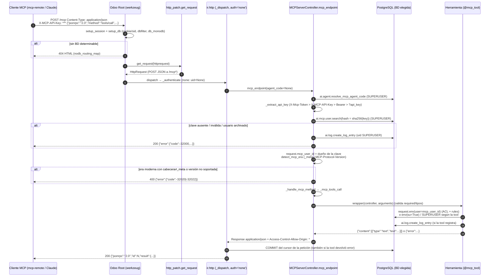

# Análisis pns_ai_mcp — Bloque 4: servidor MCP (Odoo 14.0, rama 14.0-analisis-pns-ai)

Código de terceros (PATANEGRA Soft, `__manifest__.py:25`). **No se diseña ni se propone código**: solo
se documenta qué hace, cómo y con qué riesgos.

Convenciones:
- **HECHO**: comprobado en el código (`archivo:línea`). Las rutas sin prefijo son de `pns_ai_mcp/`;
  las del core son de `/opt/odoo-src/14.0/odoo/` (p. ej. `odoo/http.py:1387`).
- **INFERENCIA**: deducido del código, sin ejecutar.
- **PENDIENTE**: se comprobará con `odoo-dev 14`.
- Referencias a documentos previos: [MAPA] = `analisis_pns_ai_mcp_1_mapa.md`,
  [CONOC] = `analisis_pns_ai_mcp_2_conocimiento.md`, [SECR] = `analisis_pns_ai_mcp_3_conexiones_secretos.md`,
  [BASE] = `analisis_pns_base.md`.
- Especificación MCP consultada (WebFetch, 2026-10-08): `modelcontextprotocol.io/specification/versioning`,
  `/2026-07-28/basic/transports/streamable-http` y `/2026-07-28/basic/versioning`. La revisión
  **vigente es 2026-07-28** (stateless, sin `initialize`, sin sesiones, sin GET); las anteriores
  (`2025-11-25` y previas) son "legacy" con `initialize`.

---

## 1. Implementación del protocolo

### 1.1 Propia, sin librería
HECHO: no hay SDK MCP. Todo es código propio sobre `http.Controller` de Odoo:
- Despacho JSON-RPC a mano: `_handle_mcp_method` (`controllers/main.py:1096-1147`) con un `if/elif`
  por método: `server/discover`, `initialize`, `tools/list`, `tools/call`, `prompts/list`,
  `prompts/get`, `resources/list`, `resources/read`. Cualquier otro → `-32601`.
- Registro de herramientas con un decorador propio `@mcp_tool` que guarda en un diccionario de
  **proceso** `_MCP_TOOLS_REGISTRY` (`controllers/mcp_decorators.py:28, 210-311`).
- Utilidades de protocolo "dual-era" en `utils/mcp_protocol.py`.
- `external_dependencies` no incluye ninguna librería MCP (`__manifest__.py:33`).

### 1.2 Versiones de la especificación
| Era | Qué implementa | Dónde |
|---|---|---|
| Legacy (handshake) | `initialize` acepta `2024-11-05`, `2025-03-26`, `2025-06-18`; **cualquier otra (incluida `2025-11-25`) se rebaja a `2024-11-05`** | `main.py:1172-1174` |
| Moderna (stateless) | `2026-07-28`: `server/discover`, versión en `_meta` (`io.modelcontextprotocol/protocolVersion`), cabecera `MCP-Protocol-Version`, errores `-32020` (HeaderMismatch) y `-32022` (UnsupportedProtocolVersion), `resultType`/`ttlMs`/`cacheScope` | `utils/mcp_protocol.py:6-145`; `main.py:950-977, 1009-1010` |
| Transporte HTTP+SSE (2024-11-05, **deprecado**) | GET `/mcp/sse` → evento `endpoint` + POST `/mcp/message?session=` | `main.py:504-697` |

HECHO: el servidor es **dual-era** en el sentido de la spec (versioning 2026-07-28 "A dual-era
server selects its behavior from how the client opens"): `detect_mcp_era` (`mcp_protocol.py:66-80`)
elige `legacy` si el método es `initialize`/`notifications/initialized` y `modern` si hay `_meta` con
versión o la cabecera vale `2026-07-28`. Los códigos `-32020`/`-32022` y la forma `data.supported/
requested` coinciden con la spec.

Desviaciones respecto a la spec (HECHO del código frente al texto de la spec):
1. **No valida `Origin`** (la spec 2026-07-28 dice "Servers MUST validate the Origin header … MUST
   respond 403"). Ninguna ruta lo mira; además `cors='*'` (§4).
2. Notificaciones → **204** (`main.py:981-984`, `596-597`); la spec pide `202 Accepted`.
3. Método desconocido en era moderna → **HTTP 200** con `-32601` (`main.py:1141-1147, 1013`); la spec
   pide `404`.
4. Era moderna: no exige `MCP-Protocol-Version` (solo compara si viene, `mcp_protocol.py:101-112`) ni
   valida `Mcp-Method`/`Mcp-Name` (la spec los marca REQUIRED y su ausencia como fallo de validación).
5. GET `/mcp` no abre stream ni devuelve 405: devuelve **un único evento** `data:` con un resultado
   de `initialize` de `2024-11-05`, `id: null` y `serverInfo.version 1.0.0` (`main.py:785-792`), distinto
   del `initialize` real (`2.0.0`, `main.py:1186`). No es conforme con ninguna revisión.
6. Errores de herramienta: se devuelven como error JSON-RPC (`main.py:1443-1449` → `996-1007`), no
   como `result` con `isError: true`; la denegación por falta de grupo se devuelve como `content` con
   un JSON de error sin `isError` (`main.py:1365-1380`).
7. Fallo de autenticación → **HTTP 200** con JSON-RPC `-32000` (`main.py:1033-1037`), no 401: un
   cliente que espere OAuth (401 + `WWW-Authenticate`) no inicia el flujo (INFERENCIA).
8. `initialize` con `2025-11-25` responde `2024-11-05` y no la más alta soportada (`2025-06-18`)
   (`main.py:1173-1174`); `mcp_protocol.py:15-20` sí lista `2025-11-25` como legacy: incoherencia
   interna.
9. Legacy Streamable HTTP: emite `Mcp-Session-Id` (`main.py:986-994`) pero no lo exige, no lo valida
   y no existe `DELETE` (no hay ruta). `MCP_SUPPORTED_VERSIONS` (`mcp_protocol.py:23-28`) omite
   `2025-11-25`.

### 1.3 Transportes y endpoints exactos
HECHO (`controllers/main.py`):

| Endpoint | Método | Uso real |
|---|---|---|
| `/mcp`, `/mcp/<agent_code>` | POST | **Streamable HTTP** (legacy y moderno). Respuesta siempre `application/json`, nunca SSE (`main.py:343-355`). Es el camino principal. |
| `/mcp`, `/mcp/<agent_code>` | GET | "Handshake" SSE de un solo evento (ver desviación 5). |
| `/mcp/sse`, `/mcp/<agent_code>/sse` | GET | HTTP+SSE 2024-11-05: abre stream, emite `event: endpoint` con la URL de mensajes y luego `event: message` con las respuestas encoladas, keep-alive cada 15 s (`main.py:481-550`). Comentario: "para Antigravity". |
| `/mcp/sse`, `/mcp/<agent_code>/sse` | POST | JSON-RPC directo con respuesta JSON (`_mcp_sse_post_handler`, `main.py:552-608`), sin comprobaciones de era moderna ni correlación. |
| `/mcp/message`, `/mcp/<agent_code>/message` | POST | Mensajes del transporte SSE: ejecuta y **encola** la respuesta para el stream; devuelve 202 vacío (`main.py:610-697`). |
| todas las anteriores | OPTIONS | Preflight CORS (ver §2.2: en Odoo 14 nunca llega al método). |

`<agent_code>`: segmento opcional que selecciona el agente (`ai.agent`) cuyo conocimiento y skills se
sirven; `sse` y `message` están reservados (`main.py:373-384`). Sin segmento se usa
`pns_ai_mcp` (`utils/ai_agent_registry.py:14`; `models/ai_agent_consumer.py:59-69`), que debe existir
y estar activo o la ruta responde 404 con el mensaje del `UserError`.

---

## 2. Rutas

### 2.1 Tabla de rutas del bloque

Todas las de `main.py` son `type='http'`, `auth='none'`, `csrf=False`, `cors='*'`,
`save_session=False` (HECHO, `main.py:287-339, 504, 610, 699, 803`).

| # | Ruta (línea) | Métodos | Valida | Devuelve |
|---|---|---|---|---|
| 1 | `/mcp` (287) | OPTIONS | nada | Cabeceras CORS propias (nunca se ejecuta, §2.2) |
| 2 | `/mcp/sse` (303) + `/mcp/message` (304) apiladas | OPTIONS | nada | Ídem. **Solo se registra `/mcp/sse`** (§2.3) |
| 3 | `/mcp/<agent_code>` (318) | OPTIONS | nada | Ídem |
| 4 | `/mcp/<agent_code>/sse` (322) + `/…/message` (323) apiladas | OPTIONS | nada | Ídem. Solo se registra `…/sse` |
| 5 | `/mcp/<agent_code>/sse` (327) | GET, POST | agente; luego como 9 | como 9 |
| 6 | `/mcp/<agent_code>/message` (331) | POST | agente; luego como 10 | como 10 |
| 7 | `/mcp/<agent_code>` (335) | GET | agente; luego como 11 | como 11 |
| 8 | `/mcp/<agent_code>` (339) | POST | agente; luego como 12 | como 12 |
| 9 | `/mcp/sse` (504) | GET, POST | agente (511); API key + usuario activo (`_validate_api_key_sse`, 446-479) | GET: `text/event-stream` indefinido; POST: JSON-RPC en JSON. Errores: SSE con 401/404/500 |
| 10 | `/mcp/message` (610) | POST | agente; `session` en query (624); sesión viva en memoria (632-640); JSON parseable (642-651); **la clave enviada == la guardada en la sesión** (653-660). **No** revalida usuario activo ni que la clave siga existiendo (§3.4) | 202 vacío; la respuesta va a la cola SSE |
| 11 | `/mcp` (699) | GET | agente; API key (solo `X-MCP-API-Key` o `?api_key=`, **no** `Authorization`/`X-Mcp-Token`, 716-722) + usuario activo | Un único evento SSE (desviación 5) |
| 12 | `/mcp` (803) | POST | agente; API key (§3.1) + usuario activo; `jsonrpc == '2.0'` (925); en era moderna versión y coherencia cabecera/_meta (954-977) | JSON-RPC 2.0 en `application/json`; `Mcp-Session-Id` tras `initialize` legacy; 204 para notificaciones |
| 13 | `/pns_ai_mcp/verification/{confirm,execute,cancel,pending}` (`verification_ui.py:39,56,66,108`) | POST (`type='json'`) | `auth='user'` (sesión web); dueño de la verificación **o** `group_ai_admin` (16-37) | dict JSON (§9) |
| 14 | `/pns_ai_mcp/choice/{accept,cancel}` (`choice_ui.py:17,27`) | POST (`type='json'`) | `auth='user'`; dueño o `group_ai_admin` (`utils/field_required_plan.py:287, 335`) | dict JSON (§9) |
| 15 | `/pns_ai_mcp/session_file/<int:attachment_id>` (`session_file.py:18-22`) | todos (sin `methods`) | `auth='public'`; `access_token` igual al del adjunto; tipo SVG (24-36) | SVG saneado inline (§9) |

`JSON_ROUTE_TYPE` vale `'json'` en Odoo 14 (`pns_base/utils/compat.py:16`, ver [BASE] §10).

Orden en la ruta 12 (HECHO, `main.py:811-1013`): agente → parseo del cuerpo (si falla, `{}`) →
cabeceras `X-MCP-LLM`/`X-MCP-Agent` → API key → búsqueda del hash → usuario activo → formato
JSON-RPC → correlación → era → método → envoltura. **El agente se resuelve antes que la clave**
(`main.py:811-817`): sin clave se puede distinguir un agente existente (sigue y da "API key required")
de uno inexistente (404) — enumeración de códigos de agente sin autenticar (HECHO, impacto bajo).

### 2.2 Preflight CORS: los métodos OPTIONS propios no se ejecutan en Odoo 14
HECHO (core): `HttpRequest.dispatch` responde él mismo a cualquier OPTIONS cuyo endpoint tenga
`cors` (`odoo/http.py:768-777`) con `Access-Control-Allow-Headers: Origin, X-Requested-With,
Content-Type, Accept, Authorization` y `Max-Age` 24 h, y `Response.set_default` añade
`Access-Control-Allow-Origin: *` y `Access-Control-Allow-Methods` = los `methods` de la ruta, que
aquí es solo `OPTIONS` (`odoo/http.py:1256-1264`). `_authenticate` pasa a `auth='none'` en preflight
(`odoo/addons/base/models/ir_http.py:113-114`).
Consecuencia (INFERENCIA, PENDIENTE con `curl -X OPTIONS -i`): las cabeceras que el módulo quería
permitir (`X-MCP-API-Key`, `Mcp-Session-Id`, `MCP-Protocol-Version`, `Mcp-Method`, `Mcp-Name`,
`main.py:295-298`) **no** se anuncian. Un cliente MCP **de navegador** (p. ej. MCP Inspector web)
solo pasará el preflight si autentica con `Authorization: Bearer` y no envía las cabeceras MCP.
Los clientes de escritorio/CLI no hacen preflight y no se ven afectados.

### 2.3 Decoradores `@http.route` apilados: la ruta interior se pierde
HECHO (core): `route()` asigna `response_wrap.routing = routing` (`odoo/http.py:560`) y
`_generate_routing_rules` solo lee el atributo `routing` del método final (`odoo/http.py:970-984`); el
decorador exterior sobrescribe el `routing` copiado por `functools.wraps`. En `main.py:303-304` y
`322-323` solo quedan registradas `/mcp/sse` y `/mcp/<agent_code>/sse` (OPTIONS).
INFERENCIA: `OPTIONS /mcp/message` acaba casando con `/mcp/<string:agent_code>` (OPTIONS, línea 318)
con `agent_code='message'`, y Odoo responde el preflight igualmente; `OPTIONS
/mcp/<agente>/message` daría 405. Solo afecta a navegadores. PENDIENTE.

### 2.4 `auth='none'`: elección de base de datos con varias BD
HECHO (core 14, `odoo/http.py`):
1. `setup_session` (1370-1385): el `sid` se toma de `?session_id=`, de la cabecera
   `X-Openerp-Session-Id` o de la cookie `session_id`.
2. `setup_db` (1387-1398): si la sesión trae `db` y `db_filter` la admite, se usa; si no,
   `db_monodb` (1566-1589).
3. `db_filter` (1549-1564): aplica `--db-filter` (con `%h`/`%d` del `Host`); si no hay filtro pero hay
   `--database`/`db_name`, expone solo esas BD.
4. `db_monodb`: si tras filtrar queda **una sola** BD, la usa; si no, `None`.

El módulo **no** aporta ningún mecanismo propio (ni cabecera, ni parámetro, ni segmento de ruta para
la BD): HECHO, no hay referencias a `db`/`dbname` en las rutas de `main.py`; el segmento de ruta es el
agente, no la BD.

Qué pasa si no puede elegir (HECHO, `odoo/http.py:1496-1532`): con `db=None` se usa
`nodb_routing_map`, que solo contiene rutas de `server_wide_modules` (`odoo/http.py:1325-1333`);
`pns_ai_mcp` no lo es → **404 HTML** de werkzeug, sin JSON-RPC. Un cliente MCP verá un fallo de
transporte, no un error MCP.

Requisito práctico (INFERENCIA): en un servidor multi-BD hace falta `dbfilter` por nombre de host
(p. ej. `^%d$` con un subdominio por BD) o `db_name`. Un cliente que ya tenga una cookie/`session_id`
de una sesión web de esa BD también la seleccionaría (`?session_id=` es un `explicit_session`), pero
ningún cliente MCP lo hace. PENDIENTE: comprobar qué tiene `odoo-dev 14` (`dbfilter`/nº de BD) —
si conviven `third_party_14` y una copia de producción cargada sin filtro, `/mcp` dará 404.

`save_session=False` (soportado en 14, `odoo/http.py:1436-1438`): no se guarda sesión ni se emite
cookie.

---

## 3. Autenticación

### 3.1 Cómo llega la API key
HECHO. Orden en POST `/mcp` (`main.py:861-872`):
1. Cabecera `X-Mcp-Token` (`lib/llm/utils/mcp_utils.py:99-133`).
2. `_extract_api_key` (`main.py:424-444`): `X-MCP-API-Key` → `Authorization: Bearer …` → las mismas en
   `environ` → parámetro `api_key` (cuerpo de formulario o query).
3. Otra vez `?api_key=` (redundante).

GET/POST `/mcp/sse` y POST `/mcp/message` usan solo `_extract_api_key` (sin `X-Mcp-Token`). GET `/mcp`
solo `X-MCP-API-Key` o `?api_key=` (716-722).

Exposición de la clave (HECHO):
- `?api_key=` en la URL queda en logs de acceso del proxy, historial y `Referer` (INFERENCIA). El
  filtro `APIKeyLogFilter` (`controllers/utils.py:14-59`) solo se añade al logger de
  `controllers/utils.py` y solo enmascara patrones `api_key=…`.
- `main.py:866` y `872` escriben en el log INFO **los 10 primeros caracteres** de la clave
  ("Using X-Mcp-Token: abcdefghij..."), patrón que el filtro no enmascara.
- La sesión SSE guarda la clave **en claro** en memoria (`utils/session_store.py:20-22`).

### 3.2 Cómo se valida
HECHO: `sha256` de la clave y `search([('mcp_api_key_hash','=',hash)], limit=1)` en `ai.mcp.user`
como superusuario (`main.py:887-895`; hash en `utils/api_key.py:35-48`). Detalle del hash, entropía,
ausencia de caducidad y revocación: ver [SECR] §4 (no se repite).

### 3.3 Con qué usuario se ejecuta cada llamada
HECHO:
- `request.mcp_user`/`mcp_user_id` = `ai.mcp.user.user_id` (`main.py:908-922`). El registro
  `res.users` queda ligado a un entorno superusuario, pero `has_group` usa el id del registro
  (core `res_users.py:813-819`), así que las comprobaciones de grupo son las del dueño de la clave.
- Las herramientas obtienen el entorno con `_get_env_for_operation` →
  `request.env(user=request.mcp_user_id)` (`controller_helpers.py:141-164`). En Odoo 14,
  `Environment.__call__` con `user` y sin `su` da `su=False` (core `odoo/api.py:508-523`): **se
  aplican ACL y record rules del dueño de la clave**. No es superusuario.
- Excepciones con elevación (§12): `tool_env(..., sudo=True)` (`controller_helpers.py:167-181`) →
  `env(su=True)` (en 14 `Environment` no tiene `sudo()`, cae al `except AttributeError`); y varias
  ramas de `main.py` que usan `request.env(user=SUPERUSER_ID)` para contextos, recursos y logs.
- Sin `mcp_user_id` el registro de log usa `SUPERUSER_ID` (`main.py:140`): los intentos fallidos
  (sin clave o clave mala) se registran en `ai.log` como del superusuario (`main.py:1015-1031`).
- `search` de `ai.mcp.user` se hace como superusuario; `ai.mcp.user` no tiene campo `active`
  (`models/mcp_user.py:70-181`).

### 3.4 Usuario archivado o clave revocada
HECHO:
- POST `/mcp`: rechaza con `-32000 'Invalid API key: user inactive'` (`main.py:904-905`). GET
  `/mcp`, `/mcp/sse`: también (`main.py:469, 761`).
- **POST `/mcp/message` no lo comprueba**: solo exige que la sesión exista y que la clave enviada sea
  la guardada (`main.py:653-660`). Después vuelve a buscar por hash (667-676) pero, si no encuentra
  nada (clave revocada) o el usuario está archivado, **sigue** con `session.mcp_user_id`
  (`main.py:662-663`).
- Las sesiones creadas por `initialize` legacy en POST `/mcp` (`main.py:986-994`) **nunca se
  cierran**: `SessionStore.cleanup_expired` (`session_store.py:193-209`) no se llama desde ningún
  sitio (HECHO, grep: solo existe su definición) y esas sesiones no tienen stream que las cierre.

INFERENCIA (PENDIENTE de reproducir en modo `workers=0`): quien conserve una clave revocada (o la de
un usuario archivado) **y** un `Mcp-Session-Id` obtenido antes puede seguir **ejecutando
herramientas** con POST `/mcp/message?session=…` hasta que se reinicie Odoo. No verá la respuesta
(se encola en una cola sin lector, que además crece en memoria), pero los efectos se producen: crear
operaciones pendientes con `propose_safe_operations`, `clean_system`, etc. Esto responde al
PENDIENTE de [SECR] §4 ("si una sesión SSE ya abierta se corta al revocar"): **no se corta**.

---

## 4. Implicaciones de `cors='*'` y `csrf=False`

HECHO: todas las rutas `/mcp*` tienen ambas opciones; las respuestas añaden
`Access-Control-Allow-Origin: *` a mano (`main.py:350, 517, 546, 562, …`).

- `csrf=False`: necesario y **correcto** aquí: la identidad no sale de la cookie sino de la clave
  (`auth='none'`, `save_session=False`, y ningún código del bloque usa `request.session.uid` para
  identificar). Una web maliciosa no puede "cabalgar" la sesión de un usuario logado en Odoo.
- `cors='*'` (sin credenciales): cualquier origen puede llamar y **leer** la respuesta. Como la
  clave no viaja sola, el riesgo es acotado, pero:
  1. Contradice el MUST de la spec de validar `Origin` contra DNS rebinding (§1.2-1). Un Odoo de
     desarrollo en `localhost:8169` es alcanzable desde cualquier web que el desarrollador visite;
     sin clave solo obtiene errores, pero ver punto 2.
  2. **Escritura en BD sin autenticar**: cada POST sin clave o con clave mala crea una fila en
     `ai.log` (`main.py:1015-1031`, `_log_mcp_operation` 134-198). Con CORS abierto, cualquier web
     visitada puede inundar la tabla de logs desde los navegadores de los usuarios (INFERENCIA).
  3. Si un cliente MCP de navegador guarda la clave (p. ej. en `localStorage`) o la pone en la URL
     (`?api_key=`), su filtración en otro origen permite usarla desde cualquier sitio.
  4. El preflight lo responde Odoo (§2.2), así que en la práctica solo `Authorization` está permitido
     a navegadores.
- Rutas de interfaz (`verification_ui`, `choice_ui`): `type='json'`, sin `cors`; en Odoo 14 las rutas
  JSON no comprueban CSRF, pero sin CORS un origen ajeno no puede enviar `application/json` con
  cookies sin preflight, que falla (INFERENCIA estándar de navegadores).

---

## 5. Herramientas, recursos y prompts expuestos

### 5.1 Herramientas (`tools/list` / `tools/call`)
HECHO: se registran al importar `controllers/__init__.py:13-22` (dentro de `try/except ImportError`
silencioso) y por los imports de `main.py:38-74`. Total: **10**. `tools/list` publica todas, sin
filtrar por grupo; solo añade a la descripción un texto de permisos (`main.py:1209-1255`).

Puerta común (HECHO, `main.py:1322-1393, 1403-1412`): la comprobación de `group_ai_writer` en
`tools/call` se hace **solo** para los nombres `confirm_write_operation` y `cancel_write_operation`,
que **no están registrados** (darían "Unknown tool"). El flag `is_write` del decorador se lee después
(1408-1409) y **no** dispara ninguna comprobación. Cada herramienta debe protegerse sola.

| Herramienta (archivo:línea) | Qué hace | Parámetros | Modelos | Operación | Entorno / comprobaciones |
|---|---|---|---|---|---|
| `get_context` (`tools_context.py:153-351`) | Devuelve el texto de un contexto (pack de conocimiento) resuelto por `base_code` + idioma; casos especiales: índice, `system://info`, `system_prompt` (bundle del agente con dominio opcional por `query`) | `context_name` (req.), `query` | `ai.context`, `ai.agent` | LEE; **ESCRIBE** `usage_count`/`last_used` con SQL en cursor propio y `commit` (`models/ai_context.py:1400-1426`) | `tool_env(sudo=True)` → **su=True** (205, 227, 246, 293). Sin grupo. Bloquea packs de identidad de otro agente (`refuse_foreign_identity_pack`, 28-41) |
| `get_corporative_terms` (`tools_context.py:354-402`) | Llama a `get_context('corporate_terms_<idioma>')`; el fallback usa otro prefijo, `corporative_terms_` (402) | ninguno | `ai.context` | LEE (+ contador) | como `get_context` |
| `get_context_usage_stats` (`tools_context_analytics.py:15-138`) | Estadísticas de uso de todos los contextos activos | `days`, `include_unused` (sin esquema; no se validan) | `ai.context` | LEE | `tool_env(sudo=True)` → su=True. Sin grupo |
| `search_memory` (`tools_memory.py:31-164`) | Busca texto en el historial de conversaciones Chatboo **del propio usuario** | `query` (req.), `date_from`, `date_to`, `limit` (≤50), `offset` | `chatboo.session` (de `pns_ai_chatboo`, **no** está en `depends`, `__manifest__.py:28`) | LEE | Entorno del usuario (82); dominio `user_id = env.user.id` (86). Si `pns_ai_chatboo` no está instalado → `KeyError` capturado → error -32603 |
| `clean_system` (`tools_system.py:40-157`) | Borra `ir.actions.act_window` cuyo `res_model` empieza por `pns_ai_mcp.` (asistentes del módulo) que no estén en menús ni filtros, no sean `target='new'` y no tengan XML ID **del módulo `pns_ai_mcp`** | ninguno | `ir.actions.act_window`, `ir.ui.menu`, `ir.filters`, `ir.model.data` | LEE + **BORRA** | `_get_env_for_operation('write')` → exige `group_ai_writer` (`controller_helpers.py:133-136`) + ACL del usuario sobre acciones (en core solo administración puede borrarlas, INFERENCIA). INFERENCIA: borraría acciones de **otros módulos** que apunten a asistentes `pns_ai_mcp.*` con `target` distinto de `new` y sin menú |
| `fetch_native_mcp_resource` (`tools_system.py:160-281`) | Lee `system://info|version|locale`, `url_whitelist`, y `odoo://models/<modelo>` (esquema de campos) | `uri` (req.) | `ir.config_parameter`, `ai.url.whitelist`, cualquier modelo (`fields_get`) | LEE | Entorno del usuario; la lista blanca con `sudo` (`utils/mcp_resources.py:49`). `fields_get` filtra campos con `groups` pero **no exige permiso de lectura del modelo** (core `models.py:2894-2902`): revela el esquema de cualquier modelo |
| `audit_translations` (`tools_i18n_audit.py:67-170`) | Compara `.po` de un módulo con los idiomas activos | `module`, `languages`, `max_samples` | `res.lang`; **disco** (`<módulo>/i18n/*.po`) | LEE | Entorno del usuario; sin grupo. Lee ficheros de cualquier módulo del addons path (`get_module_path`, core `modules/module.py:161-179`) |
| `propose_safe_operations` (`safe_plan.py:1708`) | Propone un plan supervisado (CRUD, `fetch_url`, `api_call`, `action`). **Bloque 5** | — | — | CREA propuestas | `is_write=False`; permisos por paso (`controller_helpers.py:82-117`) — bloque 5 |
| `get_safe_operation_status` (`safe_plan.py:1877`) | Estado de una operación propuesta. **Bloque 5** | — | — | LEE | bloque 5 |
| `relaxaicode` (`tools_relaxaicode.py:1504`) | Ejecuta Python del LLM en sandbox ("caja A", cursor READ ONLY). **Bloque 6** | — | — | EJECUTA | `is_write=True` sin efecto en la puerta; bloque 6 |

Detalles HECHO:
- `get_context`: cualquier `context_name` que **contenga** `index`, `list`, `core`, `menu` o
  `directory` devuelve el índice en lugar del contexto (`tools_context.py:199-219`). Un pack con
  código como `pricelist_rules` o `score_…` no se puede cargar por esta herramienta (sí por
  `prompts/get`).
- Validación de argumentos del decorador: comprueba `required` y tipos básicos y deja pasar campos
  extra (`mcp_decorators.py:169-207`); `validate_schema=False` la omite.
- Captura global: cualquier excepción de una herramienta se convierte en error `-32603` con
  `str(e)` (`main.py:1436-1449`), sin `rollback` (ver §12.3).

### 5.2 Recursos (`resources/list` / `resources/read`)
HECHO (`main.py:1743-2113`):

| URI | Contenido | Entorno |
|---|---|---|
| `system://info` | versión Odoo, serie, **nombre de la BD**, URL base, hora, versión Python, `mcp_server_version 1.0.0` (`utils/system_info.py:87-107`) | `SUPERUSER_ID` (1930) |
| `system://version` | `odoo.release.serie/version` | sin BD |
| `system://locale` | idioma resuelto del usuario (cascada usuario → compañía → `en_US`, `main.py:240-272`) | superusuario para `res.lang` |
| `url_whitelist` (alias `system://url_whitelist`, `mcp_resources.py:15-18`) | dominios activos y vigentes con `kind`, `notes` y fechas | `SUPERUSER_ID` + `sudo` |
| `mcp://contexts/<base_code>` | texto del contexto (Markdown) | `SUPERUSER_ID` (2009) |

`resources/read` con URI desconocida → `-32602`. Los métodos `_get_customers_info_resource` y
similares (`main.py:2115-2129`) llaman a funciones **no definidas ni importadas** (`NameError` si se
usaran); hoy no los llama nadie (HECHO por lectura; código muerto).

### 5.3 Prompts (`prompts/list` / `prompts/get`)
HECHO (`main.py:1458-1741`):
- `system_prompt` (argumento opcional `query`): bundle del agente (`ai.agent.get_for_agent` +
  `enrich_with_domain_index`), con el entorno **del usuario** (`_get_mcp_env`, 1569). Detalle de la
  composición: [CONOC] §3.
- `skill.<código>`: una por skill del agente activo (`ai.skill.get_for_agent`), entorno del usuario
  (1490-1505, 1636-1662).
- Un prompt por contexto `core`/`domain` (`get_listable_for_mcp`, `models/ai_context.py:655-681`),
  servido como superusuario (1510-1521, 1665-1719).

### 5.4 Lectura de conocimiento privado de otros usuarios
HECHO: `get_listable_for_mcp` y `get_context_for_country` hacen `search` sin filtro de dueño
(`models/ai_context.py:600-604, 667-670`) y `_search` no añade ninguno (`ai_context.py:1439-1468`). Se
ejecutan como superusuario (`prompts/list`, `prompts/get`, `resources/*`) o con `su=True`
(`get_context`, `get_context_usage_stats`), así que **las record rules de propiedad de `ai.context`
([CONOC] §4.1) no se aplican**. INFERENCIA (PENDIENTE): cualquier usuario con clave MCP lista y lee
los contextos privados (`owner_id` = otro usuario) de tipo `core`/`domain`, y
`get_context_usage_stats` lista los códigos y descripciones de **todos** los contextos activos.

---

## 6. Herramientas de lectura: ACL, límites y campos sensibles

| Herramienta | ¿ACL y record rules del usuario? | Límite | Campos sensibles |
|---|---|---|---|
| `get_context`, `get_corporative_terms`, `get_context_usage_stats`, prompts y recursos de contextos | **No** (su=True / superusuario) | Ninguno: el contenido completo del contexto; el índice sin límite | Solo texto de contextos; incluye privados de otros (§5.4) |
| `search_memory` | Sí (entorno del usuario, `tools_memory.py:82`) | ≤100 sesiones escaneadas, ≤50 resultados (76-77, 91) | Contenido de sus propias conversaciones |
| `fetch_native_mcp_resource` | Sí para `whitelist`/`odoo://models` salvo la lista blanca (sudo); `fields_get` no exige lectura | — | No lee valores; revela nombre de la BD, URL, versiones y el **esquema** de cualquier modelo (sin campos con `groups` que no tenga) |
| `audit_translations` | Sí para `res.lang`; disco sin control | `max_samples` (25 por defecto) | Solo términos de traducción |
| `relaxaicode` (lectura arbitraria del ORM) | Bloque 6 | Bloque 6 | Bloque 6 |

INFERENCIA: ninguna herramienta de este bloque lee valores de campos de negocio, contraseñas ni
tokens; la lectura arbitraria de datos está toda en `relaxaicode` (bloque 6).

---

## 7. Sesiones SSE (`utils/session_store.py`)

HECHO:
- Dónde: **memoria del proceso**. `SessionStore` y `MCPClientRegistry` son singletons de clase con
  `threading.Lock` (`session_store.py:31-59, 90-110`). Cada sesión guarda id (UUID4), clave en claro,
  usuario, correlación, contador de pasos y una `queue.Queue` (17-28).
- Caducidad: **ninguna efectiva**. `cleanup_expired(3600)` existe pero no se llama (§3.4). Las de
  GET `/mcp/sse` se cierran cuando termina el generador (`main.py:499-502`, `finally: store.close`),
  es decir, cuando werkzeug detecta que el cliente se fue o el proceso muere. Las de `initialize`
  legacy no se cierran nunca → fuga de memoria proporcional al número de `initialize` (cada
  reconexión de cliente crea una).
- `MCPClientRegistry` (31-87): nombre del cliente por usuario en memoria + persistido en
  `ai.mcp.user` con `sudo` (`register_mcp_client`).

Con varios workers (INFERENCIA, PENDIENTE):
- Prefork (`workers > 0`): GET `/mcp/sse` y POST `/mcp/message` caen en procesos distintos → "Invalid
  or expired session" (lo admite el propio código: "Requiere sticky sessions",
  `session_store.py:92-93`; con sticky sessions por IP tampoco basta si el proxy reparte por conexión).
- Cada stream SSE ocupa **un worker HTTP entero** mientras dura (el generador bloquea en
  `queue.get(timeout=15)`, `session_store.py:165-182`) y el watchdog lo mata al superar
  `limit_time_real` (120 s por defecto): el stream se corta periódicamente. N clientes SSE pueden
  agotar los workers.
- Puerto de longpolling 8072 (proceso gevent): sirve también todas las rutas HTTP; un stream SSE ahí
  sería cooperativo y no bloquearía, pero su `SessionStore` es **otro proceso** distinto de los
  workers de 8069. Si el proxy envía `/mcp/sse` a 8072 (no lo hace la configuración típica, que solo
  manda `/longpolling`), los POST a `/mcp/message` en 8069 no encontrarán la sesión.
- Modo `workers=0` (threaded, lo habitual en `odoo-dev`): todo funciona en un proceso.
- El transporte recomendado de facto es POST `/mcp` (stateless por petición): funciona con
  cualquier número de workers, porque cada petición se autentica sola y la sesión no es necesaria.

---

## 8. `http_patch.py` en ejecución

HECHO (`http_patch.py:14-35`; análisis de alcance en [MAPA] §3.2): se sustituye
`odoo.http.Root.get_request` en el proceso. **Todas** las peticiones HTTP del proceso pasan por la
función parcheada, pero solo cambia el resultado para: método `POST` + mimetype
`application/json`/`application/json-rpc` (werkzeug quita `; charset=…`) + ruta `/mcp` o
`/mcp/…`. En este bloque eso son las rutas 5, 6, 8, 9 (POST), 10 y 12 de §2.1. Se les crea un
`HttpRequest` en vez de `JsonRequest`, porque son `type='http'` y el core daría
`BadRequest` por tipo (`odoo/http.py:322-328`). Con `HttpRequest`, `params` = query + formulario
(vacío para JSON) y el controlador lee el cuerpo con `get_data()`.

GET, OPTIONS y POST no JSON no se ven afectados (siguen al original). Las rutas de §2.1 13-14
(`/pns_ai_mcp/...`, `type='json'`) no coinciden con el prefijo y siguen siendo `JsonRequest`.

---

## 9. Rutas de interfaz y `session_file`

Corrección al encargo: `verification_ui` y `choice_ui` son `auth='user'`, no `public` (HECHO,
`verification_ui.py:39-108`, `choice_ui.py:17-27`). Solo `session_file` es `auth='public'`.

- `verification_ui` (sesión web): `confirm` marca confirmada, `execute` aplica un plan ya
  confirmado, `cancel` cancela, `pending` lista las tarjetas pendientes del usuario. Busca la
  verificación con `sudo` (24-26) y permite al **dueño o a `group_ai_admin`** (29-36). La lógica de
  `resolve_confirm`/`resolve_execute` es del bloque 5.
- `choice_ui` (sesión web): aceptar/cancelar una lista de elección (`ai.safe.choice`) previa al plan;
  busca con `sudo` y permite al dueño o a `group_ai_admin` (`utils/field_required_plan.py:281-335`).
- `session_file` (`auth='public'`, `session_file.py:18-56`): sirve un `ir.attachment` **SVG** inline.
  Exige `access_token` no vacío e idéntico al guardado (`access_token` existe en 14,
  `odoo/addons/base/models/ir_attachment.py:385`); lee con `sudo`; si el `mimetype` no es SVG ni el
  nombre acaba en `.svg` → 404; sanea (`utils/svg_download.sanitize_svg`, no está en este bloque).
  Odoo añade `Content-Security-Policy: default-src 'none'` a las respuestas `image/*`
  (`odoo/http.py:1461-1474`), lo que neutraliza scripts aunque el saneado fallara.
  - ¿Archivos de otros usuarios? HECHO: no se comprueba dueño ni `res_model`; cualquier adjunto SVG
    con `access_token` se sirve a quien conozca id + token. El token es la credencial (mismo modelo
    que los enlaces de portal de Odoo). INFERENCIA: no enumerable (token aleatorio), pero
    **cualquier SVG con token de cualquier módulo** (no solo los de Chatboo) es accesible por esta
    ruta; la comparación de tokens no es en tiempo constante (riesgo teórico).

---

## 10. Odoo como cliente (`lib/api` + `utils/mcp_client.py`)

HECHO: SPI de drivers por `api_type` de `ai.api.server` (`lib/api/drivers/__init__.py:8-9`,
`registry.py:19-46`; sin fallback para tipos desconocidos). Cada operación crea un driver y un
cliente nuevos (sin estado). Configuración del servidor y credenciales: [SECR] §5.

### 10.1 Driver MCP (`mcp_driver.py` → `MCPClient`)
- `connect()` envía `initialize` con **`protocolVersion: '2024-11-05'`** y `clientInfo
  PNS-AI-Odoo 1.0`, luego `notifications/initialized` (`mcp_client.py:217-246`).
- Transporte `sse` (nombre engañoso): **POST JSON-RPC** al `url` con
  `Accept: application/json, text/event-stream`; si la respuesta es SSE toma el **último** `data:`
  (`mcp_client.py:90-130`). No implementa el transporte HTTP+SSE real (GET + `endpoint`), no guarda
  ni reenvía `Mcp-Session-Id` ni `MCP-Protocol-Version` (71-88). INFERENCIA: servidores Streamable
  HTTP con sesión obligatoria rechazarán las llamadas posteriores a `initialize`; servidores solo
  HTTP+SSE antiguos no funcionan.
- Transporte `stdio`: `Popen` del comando configurado con el entorno completo del proceso Odoo y
  lectura bloqueante sin timeout ([SECR] §5.4). Además (INFERENCIA): `connect()` envía
  `notifications/initialized` por `_stdio_send`, que **espera una línea de respuesta** que un servidor
  conforme nunca envía → bloqueo indefinido del worker en el primer uso.
- `call_tool`: si `isError`, lanza error con el texto; si no, devuelve `content` (294-321); el driver
  extrae binarios o concatena los bloques `text` (`mcp_driver.py:68-93`).
- Auth: cabecera según `auth_type` (`bearer`/`api_key`/`custom_header`) con el token por llamada o
  el del servidor (`mcp_client.py:71-88`, `base.py:25-42`).

### 10.2 Driver OpenAPI (`openapi_driver.py`)
- Spec: pegada (`spec_manual`) o descargada de `spec_url` con `requests.get` y las cabeceras de auth
  **del servidor** (65-90). Cada operación con `operationId` (o `metodo_ruta`) es una "tool"
  (143-192).
- Llamada: sustituye parámetros de ruta (con `quote`), añade query declarada, cuerpo en `body`,
  `requests.request` con timeout `(5, timeout)` (323-405). Respuestas binarias → dict `_binary`.
- URL base (268-281): `server.base_url` → **`servers[0].url` de la spec** → origen de `spec_url`.
  INFERENCIA: con `base_url` vacío, una spec remota manipulada decide el host destino y recibe las
  cabeceras de autenticación (fuga de credenciales/SSRF dirigido por la spec).
- Ni `MCPClient` ni los drivers consultan `ai.url.whitelist` (HECHO por lectura completa); `requests`
  sigue redirecciones por defecto. El control de salida, si existe, está en quien llama (bloque 5 /
  [SECR] §6.1).

### 10.3 Utilidades
- `tools_prompt_block.py`: texto del catálogo de APIs que se inyecta al prompt (máx. 40 tools
  detalladas por servidor; omite inactivos).
- `validate_tool_args.py`: validación recursiva mínima (`required` y tipos) de los argumentos de
  `api_call` contra el `inputSchema`.
- `utils/api_call_result.py`: recorta a 10 240 caracteres la respuesta que ve el LLM, con paginación
  sugerida, y clave de caché SHA-256 (servidor + tool + argumentos canónicos).

---

## 11. Conexión de un cliente MCP real a `http://localhost:8169`

Según el código (pasos HECHO salvo donde se indica):
1. **BD seleccionable**: `localhost` sin `dbfilter` y con más de una BD → 404 (§2.4). PENDIENTE: ver
   la configuración de `odoo-dev 14`.
2. **Agente**: debe existir y estar activo `ai.agent` con código `pns_ai_mcp` (ruta `/mcp`) o el de la
   ruta `/mcp/<código>`.
3. **Clave**: un administrador IA crea el registro `ai.mcp.user` del usuario y genera la clave (se ve
   una vez) ([SECR] §4). El usuario debe estar activo; para escribir, `group_ai_writer`.
4. **Configurar el cliente**. Claude Desktop no admite cabeceras en conectores remotos propios
   (INFERENCIA, no verificado; además la conexión a `localhost` desde un conector remoto no está
   garantizada). La vía local es el puente `mcp-remote` (stdio ↔ HTTP) en
   `claude_desktop_config.json`, p. ej.
   `{"mcpServers": {"odoo14": {"command": "npx", "args": ["-y", "mcp-remote",
   "http://localhost:8169/mcp", "--header", "X-MCP-API-Key:${ODOO_MCP_KEY}"], "env":
   {"ODOO_MCP_KEY": "<clave>"}}}}`. Alternativas soportadas por el servidor: `Authorization: Bearer`,
   `X-Mcp-Token` o `?api_key=` (desaconsejada, §3.1). Claude Code: `claude mcp add --transport http
   … --header "X-MCP-API-Key: …"`.
5. **Handshake** (POST `/mcp`, `Content-Type: application/json`): el parche §8 lo convierte en
   `HttpRequest`; se valida la clave; `initialize` → `protocolVersion` igual a la del cliente si es
   2024-11-05/2025-03-26/2025-06-18, si no `2024-11-05` (§1.2-8); capacidades `tools/prompts/resources`
   sin `listChanged`; cabecera `Mcp-Session-Id`; se registra el nombre del cliente
   (`_register_mcp_client`, `main.py:1069-1094`).
6. `notifications/initialized` → 204 (la spec dice 202; INFERENCIA: los SDK aceptan cualquier 2xx).
7. INFERENCIA: un cliente Streamable HTTP 2025-03-26+ puede abrir GET `/mcp` para mensajes del
   servidor y recibirá un único evento con `id: null` y el cierre del stream; según el SDK puede
   registrar un error o reintentar en bucle. PENDIENTE de observar en `odoo-dev 14 log`.
8. `tools/list` (10 herramientas), `prompts/list`, `resources/list`; el cliente debería pedir
   `prompts/get system_prompt` (lo sugiere `instructions`, `main.py:1188`). Claude Desktop no carga
   prompts automáticamente (INFERENCIA): el modelo usará `get_context('system_prompt')`.
9. `tools/call` → ejecución con el usuario de la clave (§3.3) y respuesta JSON.

Cliente moderno (2026-07-28): sin `initialize`; cada POST lleva `_meta` y `MCP-Protocol-Version`; el
servidor valida versión y coherencia y envuelve el resultado (§1.2).

### 11.1 Diagrama de una llamada `tools/call` (Streamable HTTP, POST `/mcp`)

---

## 12. `sudo()`, compatibilidad y riesgos

### 12.1 Usos de `sudo()` / superusuario en los archivos del bloque
Ninguno lleva comentario de justificación salvo los indicados.

| Archivo:línea | Qué | Efecto |
|---|---|---|
| `main.py:380` | `env(user=SUPERUSER_ID)` para resolver el agente | Antes de autenticar |
| `main.py:460-468, 746-759, 887-895, 668-670` | Búsqueda de `ai.mcp.user` por hash | Necesario (el usuario aún no se conoce); sin comentario de justificación |
| `main.py:140, 225` | Fallback `SUPERUSER_ID` si no hay `mcp_user_id` | Logs de peticiones no autenticadas a nombre del superusuario |
| `main.py:254, 276` | `request.env.user.sudo()`, `company.sudo()` para idioma | Lectura inocua |
| `main.py:360` | `ir.config_parameter.sudo()` `web.base.url` | Lectura inocua |
| `main.py:1264, 1511, 1666, 1785, 1887, 1930, 1973, 2009` | Contextos, recursos, idioma y lista blanca como superusuario | **Salta las record rules de propiedad de `ai.context`** (§5.4) |
| `main.py:1091` | Registro del cliente MCP | Escritura en `ai.mcp.user` con `sudo` (`session_store.py:68-71`) |
| `controller_helpers.py:39, 64` | Búsquedas de `ai.mcp.user`/`res.users` | Comentado "solo para buscar" |
| `controller_helpers.py:167-181` (`tool_env(sudo=True)`) | `env(su=True)` en `get_context` (4 veces) y `get_context_usage_stats` | Igual que arriba |
| `utils/mcp_resources.py:49` | `ai.url.whitelist.sudo()` | Expone dominios, notas y fechas a cualquier usuario con clave |
| `session_file.py:27` | `ir.attachment.sudo()` | Protegido por `access_token` |
| `verification_ui.py:24`, `field_required_plan.py:283, 331` | Búsqueda de verificaciones/elecciones | Protegido por dueño o `group_ai_admin` |
| `system_info.py:38` | `web.base.url` | Inocuo |

### 12.2 Compatibilidad
Odoo 14 (HECHO):
- `type='http'` + parche `get_request` imprescindible para POST JSON (§8).
- `JSON_ROUTE_TYPE='json'`; `save_session` existe en 14; `env(su=True)` en lugar de `env.sudo()`
  (ok, `odoo/api.py:508-523`); `request.env(user=…)` con `uid=None` funciona; `ir.attachment.
  access_token` y `datas` existen.
- Decoradores apilados pierden rutas (§2.3); preflight del core (§2.2).
- `werkzeug.wrappers.Response` (no `odoo.http.Response`) → el core no añade CORS ni CSP; lo hace el
  código a mano. Streaming con `direct_passthrough` funciona en modo threaded; en prefork ver §7.

Python 3.7.3 (HECHO): no hay sintaxis posterior a 3.7 en los archivos del bloque (grep de `:=`,
`removeprefix`, genéricos `list[…]`: solo aparecen en cadenas/comentarios). `from __future__ import
annotations` es 3.7+. `typing.get_origin/get_args` (3.8) tienen polyfill (`mcp_decorators.py:12-23`).
`get_type_hints(..., include_extras=True)` es **3.9+** (`mcp_decorators.py:103`): en 3.7 lanza
`TypeError`, que se captura y devuelve esquema vacío; solo afecta a herramientas con parámetros
explícitos y sin `input_schema`, y **ninguna** de las 10 actuales lo es (todas usan
`(controller, arguments)`), así que hoy no tiene efecto.

### 12.3 Riesgos (de mayor a menor)
1. **Ejecución con clave revocada o usuario archivado** vía `/mcp/message` con una sesión antigua,
   y sesiones que no caducan nunca (§3.4, §7). INFERENCIA fuerte; PENDIENTE.
2. **Conocimiento privado expuesto**: contextos con dueño visibles para cualquier usuario con clave
   (§5.4). PENDIENTE.
3. **Sin control de `Origin` + `cors='*'` + log antes de autenticar**: cualquier web puede generar
   filas en `ai.log` desde el navegador de los usuarios; contradice el MUST de la spec (§4).
4. **Commit de efectos parciales**: `_mcp_tools_call` convierte toda excepción en un dict de error
   (`main.py:1436-1449`) y la petición termina sin excepción, así que Odoo hace **COMMIT** del cursor
   (core `odoo/http.py:274-282`): lo que una herramienta escribiera antes de fallar queda guardado
   (INFERENCIA; afecta a `clean_system` y a la creación de propuestas del bloque 5).
5. **Puerta de escritura no centralizada**: `is_write` no se aplica en `tools/call`; la seguridad
   depende de cada herramienta (§5.1). Hoy `clean_system` sí se protege; `relaxaicode` → bloque 6.
6. **Cliente saliente**: spec OpenAPI remota decide el host y recibe credenciales; `stdio` puede
   bloquear el worker en `notifications/initialized`; sin `Mcp-Session-Id` (§10).
7. **Transporte SSE inviable en producción con workers** y fuga de memoria de sesiones (§7).
8. **Fugas menores de la clave**: prefijo de 10 caracteres en el log INFO; clave en claro en memoria;
   `?api_key=` en URLs (§3.1).
9. **Conformidad MCP parcial** (§1.2): GET `/mcp` raro, 204, 200 en errores de auth, sin `isError`,
   rebaja de `2025-11-25` a `2024-11-05`. Puede romper clientes estrictos.
10. Errores construidos con f-strings dentro de JSON (`main.py:477, 513-515, 707, 750, 777, 796`): un
    mensaje con comillas produce JSON inválido en el stream SSE (HECHO; impacto bajo).
11. `get_context` no puede cargar packs cuyo código contenga `list`/`core`/`menu`/`index`/`directory`
    (§5.1); `search_memory` depende de un módulo que no está en `depends`.
12. `clean_system` puede borrar acciones de otros módulos (§5.1, INFERENCIA).

---

## Resumen del bloque

- **Protocolo**: implementación propia (sin SDK) de MCP sobre controladores `type='http'`,
  `auth='none'`. Es **dual-era**: legacy con `initialize` (acepta 2024-11-05, 2025-03-26, 2025-06-18;
  rebaja 2025-11-25 a 2024-11-05) y moderna 2026-07-28 (vigente) con `server/discover`, `_meta` y
  errores -32020/-32022. Transportes: Streamable HTTP por POST `/mcp` (siempre respuesta JSON) y el
  HTTP+SSE deprecado de 2024-11-05 (`/mcp/sse` + `/mcp/message`). Variante por agente
  `/mcp/<código>`.
- **Conformidad**: no valida `Origin` (MUST), 204 en vez de 202, 200 en errores de auth y métodos
  desconocidos, GET `/mcp` devuelve un evento suelto, errores de tool sin `isError`.
- **BD**: no tiene selector propio; depende de `dbfilter`/`db_name`/BD única. Sin BD → 404 HTML.
- **Autenticación**: clave por `X-Mcp-Token`, `X-MCP-API-Key`, `Bearer` o `?api_key=`; hash SHA-256
  buscado como superusuario; usuario activo obligatorio en `/mcp` y `/mcp/sse`. Las herramientas
  corren **como el dueño de la clave** (ACL y reglas aplicadas), salvo las de contextos/recursos, que
  usan superusuario o `su=True`.
- **Hallazgos principales**: (1) `/mcp/message` no revalida clave ni usuario y las sesiones no
  caducan → una clave revocada con un id de sesión antiguo sigue ejecutando herramientas;
  (2) contextos privados de otros usuarios legibles por MCP; (3) CORS abierto + log de peticiones no
  autenticadas → inundación de `ai.log` desde cualquier web; (4) errores de tool hacen COMMIT de
  efectos parciales; (5) la puerta `group_ai_writer` de `tools/call` no se aplica por `is_write`.
- **Herramientas**: 10 (`get_context`, `get_corporative_terms`, `get_context_usage_stats`,
  `search_memory`, `clean_system`, `fetch_native_mcp_resource`, `audit_translations`, y las de
  bloques 5-6: `propose_safe_operations`, `get_safe_operation_status`, `relaxaicode`). Solo
  `clean_system` borra (requiere Writer). Recursos: `system://info|version|locale`, `url_whitelist`,
  `mcp://contexts/*`. Prompts: `system_prompt`, `skill.*`, uno por contexto.
- **Lectura**: ninguna herramienta de este bloque lee valores de negocio ni secretos; sí nombre de
  BD, URL, esquema de cualquier modelo (`fields_get` sin permiso de lectura) y conocimiento ajeno.
- **Sesiones SSE**: en memoria de proceso; incompatibles con prefork salvo afinidad estricta; cada
  stream ocupa un worker hasta `limit_time_real`. POST `/mcp` es el camino viable con workers.
- **`http_patch`**: solo POST JSON a `/mcp*` pasa a `HttpRequest`; imprescindible en Odoo 14.
- **Interfaz**: `verification_ui`/`choice_ui` son `auth='user'` con control dueño/admin;
  `session_file` es `public` y sirve cualquier SVG con `access_token` (con CSP del core).
- **Cliente saliente**: MCP por POST JSON (no SSE real), `initialize` 2024-11-05, sin
  `Mcp-Session-Id`; `stdio` puede colgarse; OpenAPI deja que la spec elija host y le envía la auth;
  los drivers no consultan la lista blanca.
- **Claude Desktop**: vía `mcp-remote` con cabecera `X-MCP-API-Key` contra
  `http://localhost:8169/mcp`, con BD única o `dbfilter`, agente `pns_ai_mcp` activo y clave generada.
- **Compatibilidad**: Odoo 14 y Python 3.7.3 sin bloqueos; `include_extras` (3.9) sin efecto hoy;
  decoradores apilados pierden dos rutas OPTIONS; preflight lo responde el core.

## Tabla de cobertura

| Archivo | Líneas | Lectura |
|---|---|---|
| `controllers/main.py` | 2170 | Entero (dos lecturas: 1-1481 y 1482-2170) |
| `controllers/mcp_decorators.py` | 348 | Entero |
| `controllers/utils.py` | 79 | Entero |
| `controllers/controller_helpers.py` | 272 | Entero |
| `controllers/tools_context.py` | 402 | Entero |
| `controllers/tools_context_analytics.py` | 139 | Entero |
| `controllers/tools_memory.py` | 164 | Entero |
| `controllers/tools_system.py` | 294 | Entero |
| `controllers/tools_i18n_audit.py` | 170 | Entero |
| `controllers/session_file.py` | 56 | Entero |
| `controllers/choice_ui.py` | 29 | Entero |
| `controllers/verification_ui.py` | 112 | Entero |
| `lib/api/__init__.py` | 9 | Entero |
| `lib/api/drivers/__init__.py` | 20 | Entero |
| `lib/api/drivers/base.py` | 91 | Entero |
| `lib/api/drivers/registry.py` | 46 | Entero |
| `lib/api/drivers/mcp_driver.py` | 93 | Entero |
| `lib/api/drivers/openapi_driver.py` | 405 | Entero |
| `lib/api/tools_prompt_block.py` | 103 | Entero |
| `lib/api/validate_tool_args.py` | 143 | Entero |
| `utils/mcp_client.py` | 341 | Entero |
| `utils/mcp_correlation.py` | 56 | Entero |
| `utils/mcp_identity.py` | 27 | Entero |
| `utils/mcp_logging.py` | 47 | Entero |
| `utils/mcp_protocol.py` | 145 | Entero |
| `utils/mcp_resources.py` | 90 | Entero |
| `utils/mcp_tool_payload.py` | 390 | Entero |
| `utils/mcp_ui.py` | 286 | Entero |
| `utils/session_store.py` | 209 | Entero |
| `utils/system_info.py` | 107 | Entero |
| `utils/api_call_result.py` | 130 | Entero |
| Apoyo: `http_patch.py`, `__init__.py`, `controllers/__init__.py`, `__manifest__.py` | — | Enteros |
| Apoyo parcial: `controllers/safe_plan.py` (1708-1723), `controllers/tools_relaxaicode.py` (1504-1517), `models/ai_context.py` (568-608, 655-681, 1176-1199, 1400-1468), `models/ai_agent_consumer.py` (59-69), `models/mcp_user.py` (solo campos), `utils/api_key.py` (35-48), `utils/field_required_plan.py` (grep), `lib/llm/utils/mcp_utils.py` (95-154), `pns_base/utils/compat.py` (grep) | — | Parcial (fuera del bloque) |
| Core 14: `odoo/http.py` (444-562 grep, 760-800, 945-985, 1245-1270, 1320-1590), `odoo/api.py:508-523`, `addons/base/models/ir_http.py:94-119`, `res_users.py:813-837`, `models.py:2882-2912`, `modules/module.py:161-179`, `ir_attachment.py:385-390` | — | Parcial (verificación) |
| No leídos (bloques 5 y 6): resto de `safe_plan.py`, `tools_relaxaicode.py`, `safe_operation.py`, `validators.py`, `context_builder.py`, `formatters.py`, `write_verification.py`, `moe_controller.py` (no se importa en `controllers/__init__.py`) | — | No |

No se abrió ninguna librería incluida (`*.min.js`, `showdown.js`, `jspdf`, `xlsx`).

## Preguntas abiertas

1. ¿Cómo se despliega el VPS del cliente: `workers > 0`, proxy, `dbfilter`? Con prefork el transporte
   SSE (`/mcp/sse`) no es viable; ¿se usará solo POST `/mcp`?
2. ¿`odoo-dev 14` tiene `dbfilter` o una sola BD? Con una copia de producción cargada junto a
   `third_party_14` y sin filtro, `/mcp` dará 404 (PENDIENTE).
3. ¿Qué cliente se va a usar (Claude Desktop con `mcp-remote`, Claude Code, Cursor, otro)? Determina
   qué desviaciones de la spec importan (GET `/mcp`, 204, versión 2025-11-25).
4. Reproducir con `odoo-dev 14` (modo threaded): clave revocada + `Mcp-Session-Id` antiguo +
   POST `/mcp/message` → ¿se ejecuta la herramienta? (§3.4).
5. Reproducir: usuario A crea un contexto privado `domain`; usuario B con clave MCP hace
   `prompts/list` y `prompts/get` → ¿lo ve? (§5.4).
6. ¿Es aceptable que cualquier web pueda crear filas en `ai.log` contra un Odoo accesible desde el
   navegador del usuario (§4)? ¿Hay proxy delante que filtre `Origin` o limite `/mcp`?
7. ¿Se van a dar de alta servidores externos OpenAPI con `base_url` vacío o MCP `stdio`? (§10).
8. ¿Hay módulos del cliente con acciones de ventana sobre asistentes `pns_ai_mcp.*` que
   `clean_system` pudiera borrar? (§5.1).
9. ¿Se quiere exponer `fetch_native_mcp_resource` con `odoo://models/<modelo>` (esquema de cualquier
   modelo) y `system://info` (nombre de BD) a todos los usuarios con clave?
10. Comprobar con `curl -X OPTIONS -i` qué cabeceras CORS devuelve realmente Odoo 14 en `/mcp`,
    `/mcp/message` y `/mcp/<agente>/message` (§2.2-2.3), solo si se van a usar clientes de navegador.
