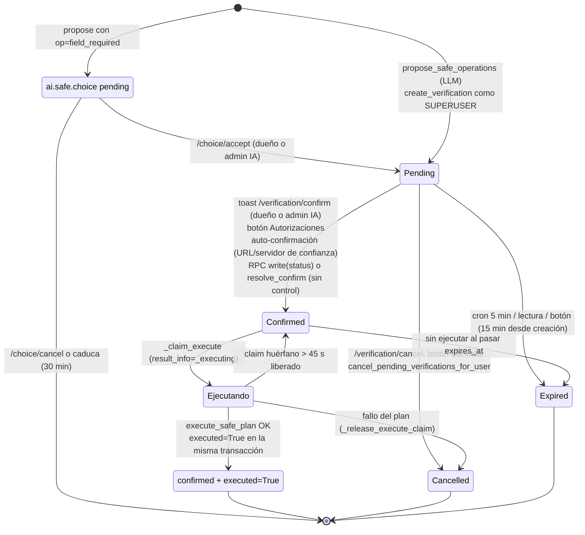

# Análisis pns_ai_mcp — Bloque 5: "Caja B" (operaciones supervisadas y acciones de sistema) (Odoo 14)

> Documento de análisis, **no** de diseño. `pns_ai_mcp` es código de terceros (Patanegra Soft) y
> no se modifica. Versión 14.0 (`CLAUDE.md` del repo); manifest `version: 3.1.486`
> (`pns_ai_mcp/__manifest__.py:7`), `depends: base, web, mail, bus, pns_base` (28).
> Se analiza la copia de trabajo `./pns_ai_mcp/`. Core de referencia: `/opt/odoo-src/14.0/odoo/`.
>
> Etiquetas: **HECHO** (archivo:línea leída), **INFERENCIA** (deducción razonada del código),
> **PENDIENTE** (se comprobará con `odoo-dev 14`).
> Referencias a documentos previos: [MAPA] = `analisis_pns_ai_mcp_1_mapa.md`,
> [CONOC] = `_2_conocimiento.md`, [CONEX] = `_3_conexiones_secretos.md`, [MCP] = `_4_servidor_mcp.md`.
> Rutas relativas a `pns_ai_mcp/` salvo que se indique otra cosa.

---

## 0. Piezas del bloque

| Pieza | Archivo | Papel |
|---|---|---|
| `ai.safe.operation` | `models/mcp_safe_operation.py` | La "autorización": plan JSON, estado, ejecución, caducidad. |
| Safe Plan | `controllers/safe_plan.py` | Herramientas `propose_safe_operations` y `get_safe_operation_status`; validación, descripción, ejecución de pasos (`execute_safe_plan`), `fetch_url`, `api_call`. |
| Endpoints del toast | `controllers/verification_ui.py` (leído 1-66) | `/pns_ai_mcp/verification/confirm`, `/execute`, `/cancel` (`auth='user'`). |
| `ai.trusted.action` | `models/ai_trusted_action.py` | Registro de acciones `op='action'` (modelo + nombre de método). |
| `ai.system.action` | `models/ai_system_action.py` | Implementación de las acciones de sistema (vistas, campo obligatorio, módulos, grupos). |
| `ai.view.policy` | `models/ai_view_policy.py` | Rastro de las vistas heredadas creadas por la IA (para deshacerlas). |
| `ai.safe.choice` | `models/ai_safe_choice.py` + `utils/field_required_plan.py` | Borrador de elección de vistas antes del toast (`op='field_required'`). |
| Utilidades | `utils/fetch_url_safe.py`, `utils/module_update_heal.py`, `utils/view_policy_arch.py` | Métodos HTTP permitidos; "curación" tras recarga de registro; XML de las vistas heredadas. |
| Legado | `controllers/write_verification.py` | Detección de "operaciones masivas" del sistema antiguo (casi todo código muerto, §9). |
| `utils/orm_domain.py` | — | **No pertenece a la Caja B**: utilidades de dominios del filtro "Mi idioma" (`locale`) para listas de contextos/skills (HECHO, 1-221). Sin efecto en este flujo. |

---

## 1. Flujo completo y estados

### 1.1 Estados reales

HECHO: `status` tiene cuatro valores `pending`, `confirmed`, `cancelled`, `expired`
(`models/mcp_safe_operation.py:156-168`). "Ejecutada" **no es un estado**: es `status='confirmed'`
+ booleano `executed=True` (141-146) + `result_info` (149-153). Durante la ejecución, `result_info`
contiene el "claim" `{"_executing": true}` (1129-1154).

### 1.2 Propuesta (Caja A → Caja B)

1. El LLM llama a la herramienta `propose_safe_operations` (HECHO, `controllers/safe_plan.py:1708-1724`,
   `is_write=False`). El entorno es el del usuario MCP sin `sudo` (`controller_helpers.py:164`,
   `request.env(user=request.mcp_user_id)`; en Odoo 14 `env(user=…)` pone `su=False`,
   `/opt/odoo-src/14.0/odoo/odoo/api.py:522`).
2. `create_pending_safe_operation` (1593-1705):
   - `validate_safe_plan` (150-273): vocabulario cerrado `ALLOWED_OPS` (59-62), campos obligatorios
     por verbo, bloqueo de CRUD sobre `ir.ui.view` e `ir.model.fields` (114-127), acción registrada en
     `ai.trusted.action` y con sus grupos (196-211), `preview()` sin errores (215-221), servidor
     `api_call` activo y esquema de argumentos (246-272), `fetch_url` con método seguro (241-244).
   - Si hay `field_required` y no viene de una elección: crea un `ai.safe.choice` y devuelve
     `pending_choice` (1607-1612) — ver §1.3.
   - `check_safe_plan_permissions` (`controller_helpers.py:82-117`): CRUD/`action`/`field_required`
     → `group_ai_writer`; `fetch_url` → `group_ai_external_url`; `api_call` → `group_ai_external_api`.
   - `check_fetch_url_steps` (política de URL, §6).
   - Reutiliza una pendiente idéntica del mismo usuario (huella JSON, 1631-1654).
   - Calcula **la descripción** (`describe_safe_plan`, 444-563) y el semáforo
     (`compute_danger_level`, 294-335) **una sola vez**, y los guarda dentro de `operation_data`
     junto con `plan_steps` (1676-1680).
   - Crea el registro en **un cursor propio como SUPERUSER** (1673-1696) con
     `user_id = env.uid`, `status='pending'`, `expires_at = ahora + 15 min`
     (`PIN_EXPIRY_MINUTES = 15`, `constants.py:17`; `mcp_safe_operation.py:471-472`).
3. Si **todos** los pasos son auto-confirmables (`_all_steps_auto_confirmable`, 338-370: `fetch_url` a
   dominio de confianza o `api_call` a servidor `trusted`), el propio `propose` lo pasa a
   `confirmed` y lo ejecuta con `with_user(user_id)` (1759-1786). **Sin toast ni humano.**
4. Si no, devuelve `pending_confirmation` y el plan/semáforo para que el cliente pinte el toast
   (1855-1871).

### 1.3 Elección (`ai.safe.choice`, solo `op='field_required'`)

HECHO (`utils/field_required_plan.py`): `create_field_required_choice` (227-278) lista las vistas
primarias que muestran el campo, guarda un borrador como SUPERUSER (257-267) con
`payload = {steps, title, items, model, field}` y caducidad 30 min (253). `accept_choice`
(281-327, ruta `/pns_ai_mcp/choice/accept`, `controllers/choice_ui.py:17`) comprueba dueño o admin
IA (287), que las vistas elegidas estén en `items` (295-303), fija `view_ids` en los pasos y llama
a `create_pending_safe_operation(..., views_locked=True)`, que vuelve a validar y a comprobar
permisos con el entorno del que acepta. `cancel_choice` (330-342).

### 1.4 Confirmación

| Vía | Quién | Código | Usuario con el que queda `confirmed_by_uid` |
|---|---|---|---|
| Toast `/verification/confirm` | dueño **o cualquier admin IA** | `verification_ui.py:16-54` → `resolve_confirm` (`mcp_safe_operation.py:579-704`) | el de la sesión |
| Botón "Confirm" de Autorizaciones | dueño o admin IA (`_can_resolve`, 312-319) | `action_confirm_and_execute` (1621-1710) | el de la sesión |
| Auto-confirmación en `propose` | **el sistema, a petición del LLM** | `safe_plan.py:1759-1786` | el solicitante |
| RPC `write({'status': 'confirmed'})` | el dueño (ACL 1,1,0,0 + regla) | sin `write()` propio (§3) | lo que escriba |
| RPC `resolve_confirm(confirmed_uid=X)` / `confirm_by_user(X)` | el dueño (métodos públicos) | 527-553, 579-704 | **X, elegido por quien llama** (§3) |

`resolve_confirm` solo confirma (cursor propio, `lock_timeout 2s`, `FOR UPDATE NOWAIT`, commit),
caduca si `now > expires_at` (660-670) y, si es `fetch_url`, puede añadir el dominio a la lista
blanca (680-681, §6).

### 1.5 PIN

No existe. Ver §7.

### 1.6 Ejecución y diario de cambios

- `resolve_execute` (706-803) → `_execute_plan_with_timeouts` (820-890): cursor nuevo con
  `lock_timeout 5s` / `statement_timeout 15s` y **`api.Environment(cr2, uid, ...)` con el `uid`
  recibido** → `execute_plan_now` (1235-1425).
- `execute_plan_now`: claim atómico en cursor aparte (`_claim_execute`, 1107-1176), `commit()` del
  cursor del llamador (1337), timeouts otra vez (30s/120s si hay `module.update`, 1341-1348), contexto
  con datos del diario (1352-1362), `execute_safe_plan` (`safe_plan.py:598-743`), `flush` y
  `UPDATE ... SET executed = true` en la misma transacción (1367-1380), `commit()`.
- Fallo: `rollback`, intento de "curación" de `module.update` (1392-1407), si no se cura la op pasa a
  `cancelled` (`_release_execute_claim`, 1178-1214), se anota el fallo en `ai.change.journal`
  (1412-1419) y se relanza la excepción.
- Diario: cada paso CRUD/`action`/`field_required` llama a
  `ai.change.journal.sudo().record_executed_step` **en la misma transacción** (`safe_plan.py:753-759`;
  llamadas en 667, 686, 702, 712, 723, 732). `fetch_url` y `api_call` **no** se anotan en el diario
  (solo en `ai.log`, `_log_safe_plan_execution`, 1542-1602). El modelo del diario está en [CONEX] §8.

### 1.7 Quién puede pasar cada transición (resumen)

| Transición | Usuario dueño | Admin IA | LLM |
|---|---|---|---|
| crear `pending` | indirectamente (vía LLM) | igual | **sí** (`propose`) |
| `pending → confirmed` | sí (toast, botón, RPC) | sí, también las ajenas | **sí** si todos los pasos son de confianza (auto-confirmación) |
| `confirmed → ejecutada` | sí (`/execute`, botón, RPC) | sí, también las ajenas | **sí**: `get_safe_operation_status` ejecuta las `confirmed` (1936-1952) |
| `pending → cancelled` | sí | sí | no (salvo `cancel_pending_verifications_for_user` cuando le falta el grupo Writer, `main.py:1359`) |
| `→ expired` | automático (cron, lectura) | — | — |

---

## 2. Operaciones admitidas y vetos

### 2.1 Verbos

HECHO (`safe_plan.py:59-62`): `create`, `write`, `copy`, `unlink`, `fetch_url`, `api_call`,
`action`, `field_required` (`mcp_call` es alias de `api_call`, 66). Formas en `_PROPOSE_SCHEMA`
(1517-1560).

| Verbo | Sobre qué | Grupo IA exigido | Semáforo | Ejecución |
|---|---|---|---|---|
| `create` | cualquier modelo, `values` libres (también x2many) | Writer | verde | `Model.create` con el env de ejecución (692-702) |
| `write` | cualquier modelo, `ids` o `domain` **libre** | Writer | ámbar | `_select_records` → `search(domain)` sin límite (566-574) |
| `copy` | cualquier modelo | Writer | verde | `browse(id).copy(overrides)` (713-723) |
| `unlink` | cualquier modelo, `ids` o `domain` | Writer | rojo | (724-732) |
| `field_required` | modelo/campo existentes | Writer + **admin IA** (183-187) | ámbar | `ai.system.action` (644-668) |
| `action` | `action_code` registrado en `ai.trusted.action` | Writer + grupos de la acción (`group_ai_admin` en las del sistema) | el de la acción | `action.apply(**args)` (669-687) |
| `fetch_url` | URL `http(s)` | External URL + política | verde/ámbar | §6 |
| `api_call` | servidor `ai.api.server` activo | External API | verde si `trusted` | driver MCP/OpenAPI ([CONEX] §5) |

### 2.2 Lo único que está vetado

- HECHO: CRUD sobre **`ir.ui.view`** e **`ir.model.fields`** (`_meta_crud_block_error`, 114-127;
  comprobado al validar, 226-228, y al ejecutar, 689-691).
- HECHO: `action_code` `view.set_field_required` y `field.set_required` vía `op='action'` (deben ir
  por `field_required`; `field_required_plan.py:24-31`; `safe_plan.py:194-195, 673-676`).
- HECHO: desinstalar `base`, `web`, `pns_base`, `pns_ai_mcp` (`ai_system_action.py:38-40, 610-611, 634-635`).
- **No hay** lista de modelos o campos sensibles: `res.users` (incl. `groups_id`, `password`),
  `res.groups`, `ir.model.access`, `ir.rule`, `ir.config_parameter`, `ir.cron` y
  `ir.actions.server` (ambos con `code` Python), `ir.module.module`, `ai.safe.operation`,
  `ai.trusted.action`, `ai.url.whitelist`, `ai.api.server` (comando `stdio`)… son proponibles por
  CRUD. INFERENCIA: la única barrera es la ACL/reglas del usuario **con el que se ejecuta** (§4) — que
  no siempre es el solicitante y a veces va en `sudo`.
- HECHO: el comentario de cabecera dice que el CRUD "se permite sobre cualquier modelo (las ACL de
  Odoo siguen aplicando al ejecutar como el usuario humano)" (49-50).

### 2.3 Descripción del toast

HECHO: el texto que ve el humano lo genera el servidor desde los pasos (no el LLM) en
`describe_safe_plan` (444-563) y marca con ⚠️ las tuplas x2many destructivas (373-384). Pero:
- solo agrega "Modificar N registros en «Modelo»" por paso (548-561): **no muestra campos ni valores**
  de `create`/`write` ni el `domain`; `_describe_values` (428-441) existe pero no se usa en la
  descripción (INFERENCIA de lectura completa del archivo: no hay llamada).
- `_names_for` lee `display_name` con `sudo` (387-396) — no se invoca desde `describe_safe_plan`
  (solo desde `_describe_value`, sin uso). Sin fuga efectiva hoy (INFERENCIA).
- Se guarda como texto (`operation_data['plan']`) y la tarjeta de Chatboo lo vuelve a leer de ahí
  (`chatboo_card_payload`, `mcp_safe_operation.py:2162-2188`): si `operation_data` se modifica
  después, **descripción y pasos pueden divergir** (§3).

---

## 3. ¿Se puede saltar la Caja B? (riesgo [MAPA] §4.5-3)

### 3.1 `write()` de `ai.safe.operation`

- HECHO: el modelo **no sobrescribe `write()`** (lectura completa de los 2253 líneas; solo
  `search_read`, `web_search_read` y `read`, 2128-2145). Los campos son `readonly=True`
  (49-229), lo que en Odoo 14 solo afecta a la interfaz: `write()` del ORM comprueba ACL, grupos de
  campo y reglas (`/opt/odoo-src/14.0/odoo/odoo/models.py:3593-3595`), no `readonly`.
- HECHO: ACL `base.group_user` = 1,1,0,0 (`security/ir.model.access.csv:5`) y regla
  `[('user_id','=',user.id)]` con `perm_write` (`security/security.xml:92-101`).
- INFERENCIA (PENDIENTE): cualquier usuario interno puede, por RPC, escribir en **sus**
  operaciones `status`, `executed`, `result_info`, `operation_data` (el plan **y** su descripción),
  `expires_at`, `confirmed_by_uid` y **`user_id`**. En Odoo 14 la regla de escritura se evalúa sobre
  los registros **antes** de escribir (`models.py:3595`); no se ve recomprobación posterior, así que
  puede **regalar** la operación a otro usuario.
- Consecuencias:
  1. Marcar `executed=True` o `status='cancelled'`: solo afecta a sí mismo.
  2. Marcar `confirmed` sin pulsar el toast: se salta su propia confirmación (el dueño ya podía
     confirmar), pero **lo hace accesible a `get_safe_operation_status`**, que ejecuta en `sudo`
     (§3.3).
  3. **Cambiar `plan_steps` dejando la descripción** y reasignar `user_id` a un admin, o simplemente
     dejarla pendiente para que un admin IA la confirme desde Autorizaciones: el admin confirma un
     texto inocuo y se ejecuta **con los permisos del admin** (§4). INFERENCIA, PENDIENTE.

### 3.2 Métodos públicos que aceptan un `uid`

HECHO: `resolve_confirm(confirmed_uid)`, `resolve_execute(confirmed_uid)`,
`resolve_confirm_and_execute(confirmed_uid)` y `confirm_by_user(confirmed_uid)` son públicos
(sin `_`) y **no comprueban** ni la propiedad ni que `confirmed_uid` sea el usuario de la sesión
(579-818; la comprobación de dueño solo está en el controlador, `verification_ui.py:16-37`, y en los
botones, 1631, 1719). `_execute_plan_with_timeouts` crea `api.Environment(cr2, uid, …)` con ese uid
(831). En Odoo 14, `uid == SUPERUSER_ID` activa `su=True` (`/opt/odoo-src/14.0/odoo/odoo/api.py:450-451`).

**INFERENCIA grave (PENDIENTE reproducir):** un usuario interno con al menos una operación propia
(basta haber propuesto alguna vez algo con cualquier grupo IA) puede por RPC:
`write({'operation_data': <plan propio>, 'status': 'confirmed', 'executed': False, 'result_info': False, 'expires_at': <futuro>})`
y luego `resolve_execute(confirmed_uid=2)` (admin) o `=1` (superusuario). El plan se ejecuta como
ese usuario: `check_safe_plan_permissions` y `user_has_required_groups` se evalúan sobre el uid
elegido (`safe_plan.py:606, 677`), así que pasan si el admin es admin IA. Con
`op='action', action_code='user.add_group', args={'user_id': <yo>, 'group': 'base.group_system'}`
→ **escalada a administrador de Odoo desde un usuario interno**.

### 3.3 `get_safe_operation_status`: ejecución en `sudo` disparada por el LLM

HECHO (`safe_plan.py:1894-1952`): `Model = env['ai.safe.operation'].sudo()` (1907); busca por
`verification_id` **sin filtrar por usuario** (1909-1911); si está `confirmed` y no `executed`,
llama a `verif.execute_plan_now()` sobre el registro `sudo` (1936-1942). En `execute_plan_now`,
`exec_env = self.env(context=…)` conserva `su=True` (`api.py:522`: `su = (user is None and self.su)`),
y `execute_safe_plan(exec_env, steps)` hace `env[model].create/write/unlink` **en modo
superusuario: sin ACL ni reglas de registro**.

Consecuencias (INFERENCIA, PENDIENTE):
- Un plan que el toast confirmó pero cuya fase `/execute` no se ha lanzado o ha devuelto `busy`
  se ejecuta en `sudo` si el LLM consulta su estado antes (carrera habitual: el prompt le dice que
  lo consulte cuando el usuario diga "ya he confirmado", 1880-1884).
- Combinado con §3.1 (RPC `status='confirmed'`), un usuario **Writer** ejecuta CRUD en `sudo` sobre
  cualquier modelo (p. ej. `res.users.groups_id`) pidiendo al LLM "consulta el estado de XXX".
- Sin filtro de usuario: el LLM de cualquier usuario puede leer el `result_info` de operaciones
  ajenas (cuerpos de `fetch_url`/`api_call`, ids creados) **y disparar su ejecución** si están
  `confirmed`, conociendo el `verification_id` (secuencial y predecible: `FURL00000003`, 364-422).
- Además `execute_plan_now` hace `commit()` del cursor de la petición MCP (1337).

### 3.4 `ai.safe.choice` ajenas

HECHO: ACL 1,1,1,1 para `base.group_user` (`ir.model.access.csv:69`) y **ninguna** regla
(`security.xml` no la menciona). Un usuario interno puede leer, modificar, crear y borrar elecciones
de todos por RPC. INFERENCIA:
- Puede reescribir el `payload.steps` de una elección pendiente de otro usuario; cuando la víctima
  acepta, se crea una operación con esos pasos **a nombre de la víctima**. Mitigación real: la
  operación se vuelve a validar y la descripción del toast se calcula desde los pasos
  (`safe_plan.py:1603, 1657`), y luego hace falta Confirmar. El ataque depende de que la víctima
  confirme sin leer.
- Puede añadir ids de vista arbitrarios a `items` (la comprobación de 295-303 usa el `payload`
  editable).
- Puede marcar elecciones ajenas `cancelled`/`accepted` (molestia).

### 3.5 ¿Escriben otras herramientas sin pasar por la Caja B?

- HECHO: en `controllers/tools_*.py` solo hay una llamada directa de escritura: `clean_system`
  borra `ir.actions.act_window` con el env del usuario Writer (`tools_system.py:40-46, 130`), ver
  [MCP] §5.1.
- HECHO: `relaxaicode` corre en cursor `READ ONLY` y su AST marca como escritura los métodos de esta
  caja (`controllers/validators.py:926-944`). No incluye `apply_*` de `ai.system.action`,
  `ai.trusted.action.apply`, `send_execution_summary`, `cron_execute_confirmed_pending`,
  `refresh_expiry_statuses` ni `action_add_to_whitelist`. INFERENCIA: el `READ ONLY` los frena si
  escriben en ese cursor, pero `resolve_*` abren **cursores nuevos** (`registry.cursor()`), que no
  son de solo lectura; dependen de que el sandbox no llegue a `env.registry` ([CONOC] §7.1, reglas
  AST). Bloque 6.
- HECHO: auto-confirmación de `fetch_url` y `api_call` de confianza (§1.2-3): legítima por diseño,
  pero sin humano.
- HECHO: `ai.trusted.action` es editable por cualquier admin IA (`ir.model.access.csv:66`) y guarda
  **modelo + nombre de método** libres (`ai_trusted_action.py:58-74, 93-122`). INFERENCIA: el
  "vocabulario cerrado" lo abre cualquier admin IA registrando, p. ej.,
  `ir.config_parameter.set_param` o `res.users.write`: el LLM puede entonces proponer cualquier
  llamada `env[modelo].<método>(**args)` (con `self` vacío, con los permisos del ejecutor).

---

## 4. Ejecución: usuario, atomicidad, savepoints y commits

### 4.1 ¿Con qué usuario?

| Camino | Usuario | `sudo` | Cita |
|---|---|---|---|
| Toast `/execute` | **el que pulsa** (dueño o admin IA), no el solicitante | no | `verification_ui.py:63`; `mcp_safe_operation.py:831` |
| Botón Autorizaciones | el que pulsa | no | 1660, 1698 |
| Auto-confirmación | solicitante | no (`with_user` pone `su=False`, `models.py:5100-5109`) | `safe_plan.py:1777` |
| `get_safe_operation_status` (LLM) | usuario MCP | **sí** | `safe_plan.py:1907-1941` |
| RPC `resolve_execute(confirmed_uid=X)` | **X arbitrario** | si X=1 | §3.2 |
| `_retry_confirmed_not_executed` | `confirmed_by_uid` / `user_id` / SUPERUSER | si cae a 1 | 929-967 (**sin llamadas**: `cleanup_stuck_state` solo lo usan tests) |
| Pasos `action`/`field_required` de sistema | internamente **`sudo`** siempre | sí | §5 |

HECHO: el docstring de `execute_safe_plan` promete ejecutar "con el `env` del usuario HUMANO de la
sesión… sus permisos y reglas siguen aplicando" (`safe_plan.py:603-604`). INFERENCIA: es cierto
solo en los caminos de toast/botón; no en `get_safe_operation_status`, no en RPC con `confirmed_uid`
y nunca en las acciones de sistema. Además, cuando confirma un admin IA una operación de otro, **se
ejecuta con los permisos del admin**, no del solicitante.

### 4.2 Atomicidad

- HECHO: CRUD + diario + `executed=True` en una transacción (`mcp_safe_operation.py:1242-1267, 1363-1380`).
  Sin `savepoint` por paso: un paso que falla revierte todo (no hay ejecución parcial de CRUD).
- Excepciones (HECHO/INFERENCIA):
  - **`module.update`**: `button_immediate_*` hace `commit()` y `Registry.new` dentro del paso
    (`/opt/odoo-src/14.0/odoo/odoo/addons/base/models/ir_module.py:569-573`): los pasos anteriores
    quedan confirmados aunque falle uno posterior; la "curación" (1427-1526) marca `executed` desde
    otro cursor como SUPERUSER.
  - **`field.set_required`**: cambia `fld.required` en el registro **en memoria** del worker
    (`ai_system_action.py:401-403`); un `rollback` posterior no lo deshace; los demás workers no se
    enteran (lo avisa la propia nota, 404-406).
  - `fetch_url`/`api_call`: efectos externos irreversibles; el alta en lista blanca (`_ensure_fetch_url_whitelist`, 577-595) sí va en la transacción.
- `commit()` explícitos en este bloque: `execute_plan_now` 1337 (cursor del **llamador**) y 1380;
  `_claim_execute` 1171; `_release_execute_claim` 1211; `_clear_stale_execute_claims` 1231;
  `resolve_confirm` 664, 682, 684; `_execute_plan_with_timeouts` 843; `action_confirm_and_execute`
  1684 (cursor de la petición web); auto-confirmación 1776, 1782, 1786; propuesta 1696; elección
  `field_required_plan.py:267`; curación 1525. El docstring reconoce el commit temprano (1258-1267).
- Bloqueos: `FOR UPDATE NOWAIT` (555-577), `SKIP LOCKED` en el refresco de caducidad (2091),
  timeouts PG por `SET LOCAL` (605-606, 829-830, 1344-1348).
- SQL crudo: todo parametrizado salvo el nombre de tabla y un entero (`% self._table`,
  `% (self._table, secs)`, 1226) — no controlables por el usuario (HECHO).

---

## 5. Acciones de sistema

Registro: `data/trusted_actions_system.xml:7-95` (sin `noupdate`), todas con
`group_ids = group_ai_admin`. Implementación: `models/ai_system_action.py`.

| Código | Qué hace (HECHO) | Límites reales | Deshacer |
|---|---|---|---|
| `view.set_field_readonly/invisible/domain` (y `view.set_field_required` solo vía `field_required`) | Crea/actualiza con `sudo` una vista heredada `priority=99` con `<xpath … position="attributes">` sobre las vistas que ya muestran el campo (o las indicadas), con xmlid `pns_ai_mcp.vp_<modelo>_<campo>_<mod>_<vista>` `noupdate=True`, y una fila `ai.view.policy` (211-307; arch en `utils/view_policy_arch.py:95-121`). | Modelo y campo validados por regex y existencia (123-134; `view_policy_arch.py:16-35`); la vista debe ser del modelo y mostrar el campo (146-185). Dominio: cadena libre que empiece por `(` o `[` (`view_policy_arch.py:76-92`), escapada para XML. Cualquier modelo, incluidos `res.users`, `ir.*`. | `view.reset_field_modifiers` (496-540): borra las `ai.view.policy` del campo, y su `unlink` borra xmlids e inherits con `sudo` (`ai_view_policy.py:42-52`). Marcado como **no reversible** en el diario (521-522). |
| `field_required` → `field.set_required` | `ir.model.fields.sudo().write({'required'})` y `self.env[model]._fields[field].required = …` (380-413). | En Odoo 14, `ir.model.fields.write` **rechaza** campos que no son `manual` (`/opt/odoo-src/14.0/odoo/odoo/addons/base/models/ir_model.py:924-929`); la excepción se captura (397-400) y **solo** se cambia el registro en memoria del worker. INFERENCIA: en campos de módulo, el "obligatorio" es efímero y distinto por worker. | No hay acción inversa específica; proponer `required=False`. Sin entrada `before` en el diario (row sin `change_journal`, 655-667). |
| `module.update` | `install`/`upgrade`/`uninstall` con `ir.module.module.sudo().button_immediate_*` (544-668). | Solo veta desinstalar `base, web, pns_base, pns_ai_mcp` (38-40). `sudo` **salta `assert_log_admin_access`** (`ir_module.py:58-73`; `env.is_admin()` = `su or …`, `api.py:533-536`): no hace falta ser administrador de Odoo. INFERENCIA: desinstalar `mail` o `bus` (dependencias de `pns_ai_mcp`, manifest 28) arrastra a `pns_ai_mcp` y a casi todo lo demás (`button_uninstall` desinstala dependientes, `ir_module.py:607-608`). Se puede instalar cualquier módulo disponible en el `addons_path`. | **Irreversible** (`reversible: False`, 661-667). |
| `user.add_group` / `user.remove_group` | `res.users.sudo().browse(user_id)` y `write({'groups_id': [(4/3, id)]})` (672-763; `pns_base/utils/compat.py:113-122`). | Cualquier usuario (incluidos `admin` y `__system__`) y **cualquier grupo** por id o xmlid, **incluido `base.group_system`**. No comprueba que el que propone o confirma tenga ese grupo. INFERENCIA: un admin IA puede hacerse administrador de Odoo, o quitar `base.group_system`/`base.group_user` al administrador. | **Irreversible** en el diario (`reversible: False`, 729-731); se deshace con la operación contraria. |

Respuesta directa: **sí, puede añadir `base.group_system`** (a sí mismo o a otro) y **no puede
desinstalar `base`**, pero sí módulos de los que depende todo (p. ej. `mail`). Confirma lo
apuntado en [MAPA] §4.5-5. PENDIENTE reproducir ambos en `odoo-dev 14`.

---

## 6. `fetch_url` y `api_call`

### 6.1 Política (HECHO, `models/url_whitelist.py`)

| Situación | `whitelist_only` (defecto, 147-151) | `open` |
|---|---|---|
| Dominio en lista blanca activa (exacto o subdominio, 118-144) | auto-confirma y ejecuta | igual |
| Dominio fuera de la lista, usuario normal | **bloqueado en propose** (`denied`, 195; 214-224) | **auto-confirma**, lo añade a la lista y ejecuta (191-192; `safe_plan.py:584-589`) |
| Dominio fuera de la lista, admin IA | toast; al confirmar se añade a la lista (`_maybe_auto_whitelist`, `mcp_safe_operation.py:1035-1057`) | auto |
| Fila desactivada | admin: toast y reactivación; resto: bloqueado (186-190) | igual |

Lista blanca inicial: `api.open-meteo.com`, `geocoding-api.open-meteo.com`
(`data/url_whitelist_data.xml:8,15`).

### 6.2 Métodos y protección

- HECHO: métodos `GET`, `HEAD`, `OPTIONS`, `QUERY` (`utils/fetch_url_safe.py:16`), esquema
  `http://`/`https://` (36-39); `QUERY` exige `body` y `content_type` (52-66). Doble comprobación al
  ejecutar (`safe_plan.py:1199-1210`).
- HECHO: **sin protección SSRF**: no se resuelve DNS ni se comprueban IP privadas, `localhost`,
  `169.254.169.254` ni el puerto; `allow_redirects=True` (`safe_plan.py:1237-1244`) y solo se valida
  el host inicial. Coincide con [CONEX] §6.1.
  INFERENCIA: con la política `open`, el LLM puede leer **sin humano** `http://localhost:8069/…`,
  `http://db:5432`, metadatos de la nube, etc.; con `whitelist_only`, vía redirección desde un
  dominio permitido, o un admin IA confirmando una IP interna. Se aceptan URLs con IP literal (el
  "dominio" de la lista blanca sería la IP).
- HECHO: timeouts `(3, 12)` (1240) — el de lectura es por operación de socket, no total
  (INFERENCIA: un servidor que gotea datos puede superar 12 s; el `statement_timeout` de PG no
  aplica a HTTP).
- HECHO: **sin límite de tamaño**: `resp.content` descarga entero (1248); al LLM se le pasan
  10 240 caracteres (1285, 1316); binarios se guardan enteros en la sesión de Chatboo (1059-1100).
  INFERENCIA: riesgo de memoria del worker.
- HECHO: caché por cabeceras del origen (`ai.fetch.cache`, 1011-1044, 1218-1226), legible por todos
  ([MAPA] §4.5-2).
- HECHO: `User-Agent: PNS-AI-SafePlan/1.0`; sin cabeceras de autenticación.

### 6.3 `api_call`

HECHO (`safe_plan.py:1369-1496`): servidor activo por `code`, validación del `inputSchema`, caché
de resultados, credencial por usuario o la del servidor (`_resolve_auth_token(env.user)`, 1425).
Auto-confirmación si el servidor es `trusted` (362-367). Métodos HTTP y transporte: los que defina
la operación OpenAPI o el servidor MCP (incluido `stdio` = comando local) — ver [CONEX] §5.3-5.5. No
hay restricción de verbos mutantes en `api_call`: es el canal previsto para POST/PUT/DELETE
(`fetch_url_safe.py:13-15`).

---

## 7. PIN

HECHO: **no hay PIN**. Restos:
- `PIN_EXPIRY_MINUTES = 15` se usa como caducidad de la operación (`constants.py:17`;
  `mcp_safe_operation.py:246-250, 471-472`).
- Comentario: "La confirmación es por sesión (toast + endpoint auth='user'), NO por PIN: la IA puede
  leer la BD (relaxaicode), así que ningún secreto persistido es seguro" (466-467). La descripción de
  la herramienta dice "NO hay PIN ni confirmación por chat" (`safe_plan.py:1716-1717`).
- `_create_trust_token` y `get_valid_trust_token` están desactivados (1983-2020); `import random`
  sin uso (20); textos "igual que en el PIN" en `send_execution_summary` (1869, 1907).
- Canal, intentos y almacenamiento: no aplican. La "prueba de humano" es la **cookie de sesión de
  Odoo** en `/pns_ai_mcp/verification/*` (`auth='user'`). INFERENCIA: un cliente MCP externo con
  API key no puede confirmar (no tiene sesión web), salvo la auto-confirmación y
  `get_safe_operation_status`.
- `danger_level` es solo informativo; el "enfriamiento" de 5 s para `unlink` es del cliente JS
  (`safe_plan.py:276-281`; no verificado en JS).

---

## 8. Cron `cleanup_expired` (cada 5 minutos)

HECHO: `ir_cron_ai_safe_operation_expire`, `model.cleanup_expired()`, 5 minutos, `numbercall=-1`,
`noupdate="1"` (`data/safe_operation_cron.xml:6-16`). `cleanup_expired` → `refresh_expiry_statuses(limit=None)`
(2147-2150, 2062-2108):
- `SELECT id … WHERE status IN ('pending','confirmed') AND executed = false AND expires_at < now
  FOR UPDATE SKIP LOCKED` y `sudo().write({'status': 'expired', 'resolved_at': now})`.
- También caduca las **`confirmed` no ejecutadas** pasados 15 min desde la **creación** (no desde
  la confirmación).
- El mismo refresco (hasta 100 filas, con *throttle* de 15 s por proceso en un atributo de clase,
  2059-2077) se ejecuta en cada `search_read`, `web_search_read` y `read` del modelo (2128-2145) y
  al crear una propuesta (456-464). INFERENCIA: un `read` dentro de un cursor `READ ONLY` (sandbox)
  fallaría con `FOR UPDATE`; está capturado solo en `create_verification`.
- No borra registros; no hay purga de `ai.safe.operation` ni de `ai.safe.choice` (las elecciones
  solo caducan al aceptarlas, `field_required_plan.py:291-293`).
- El antiguo cron "execute confirmed" se desactiva por SQL desde un método público
  (`cron_execute_confirmed_pending`, 1000-1022) que cualquier usuario podría invocar por RPC
  (INFERENCIA, efecto inocuo).

---

## 9. `sudo()`, compatibilidad y riesgos

### 9.1 Usos de `sudo()` / SUPERUSER en el bloque

| Dónde | Para qué | Valoración |
|---|---|---|
| `safe_plan.py:1907` | `get_safe_operation_status` busca y **ejecuta** en `sudo` | **Crítico** (§3.3) |
| `ai_system_action.py:568-654` | `ir.module.module` en `sudo` | **Crítico**: salta `assert_log_admin_access` |
| `ai_system_action.py:677-696` | `res.users`/`res.groups` en `sudo` | **Crítico**: cualquier grupo |
| `ai_system_action.py:137-209, 228, 364, 386, 487, 500` | vistas, xmlids, políticas, `ir.model.fields` | Alto: un admin IA modifica vistas de cualquier modelo |
| `safe_plan.py:1673-1696`, `field_required_plan.py:257-267` | crear op/elección como SUPERUSER | Correcto (usuario sin ACL de creación); el `user_id` lo fija el servidor |
| `mcp_safe_operation.py:1471-1525` | curación de `module.update` como SUPERUSER | Medio |
| `mcp_safe_operation.py:983, 1650, 2098` | caducar/cancelar | Bajo |
| `mcp_safe_operation.py:291, 1045-1095`; `safe_plan.py:577-595` | lista blanca | Medio: en `open`, cualquier usuario con External URL **añade dominios globales** |
| `safe_plan.py:258-266, 321, 355, 394, 500, 1394` | leer `ai.api.server` | Bajo |
| `safe_plan.py:750, 757`; `mcp_safe_operation.py:1413` | diario | Correcto |
| `mcp_safe_operation.py:1861, 1962-1975` | nombres y canal de `mail` en `send_execution_summary` (público) | Bajo; parece sin uso |
| `write_verification.py:66, 225, 246, 276` | `request.env(user=SUPERUSER_ID)` | Bajo |

### 9.2 Compatibilidad Odoo 14 / Python 3.7.3

- HECHO: Python: f-strings, `from __future__ import annotations` (válido desde 3.7) en
  `fetch_url_safe.py:11`, `module_update_heal.py:10`, `view_policy_arch.py:11`, `orm_domain.py:5`.
  Sin `:=`, `match` ni genéricos `list[str]`. Compatible con 3.7.3.
- HECHO: Odoo 14: `self.env['base'].flush()` (1371), `with_user`, `mail.channel.channel_get`
  (1962), `read_combined`/`fields_view_get` (`field_required_plan.py:64-83`), `hasclass()` en xpath
  (`view_policy_arch.py:51-53`; existe en 14, `ir_ui_view.py:150, 196`). `web_search_read` cae a
  `search_read` (2133-2140).
- HECHO (bug): `write_verification.check_massive_operation` consulta la tabla
  `pns_ai_mcp_safe_operation` (94), pero la del modelo es `ai_safe_operation` (sin `_table`,
  `mcp_safe_operation.py:43`). Fallaría y caería al `search` alternativo (128-139). Sin impacto: la
  función, `has_recent_operations` y `record_direct_operation` **no tienen llamadas** (solo los
  envoltorios de `main.py:2151-2165`). Comentarios con *mojibake* UTF-8 (18-45).
- `field.set_required` en campos de módulo: no persiste en Odoo 14 (§5).
- `cleanup_stuck_state` y `_retry_confirmed_not_executed`: código sin llamadas fuera de tests.

### 9.3 Riesgos (orden de gravedad)

1. **Escalada desde usuario interno con una operación propia**: escritura RPC del plan +
   `resolve_execute(confirmed_uid=<admin o 1>)` (§3.1-3.2). INFERENCIA, PENDIENTE.
2. **Ejecución en `sudo` disparada por el LLM** con `get_safe_operation_status`, sin filtro de
   usuario (§3.3). HECHO de código; PENDIENTE reproducir.
3. **Admin IA = administrador de Odoo**: `user.add_group` con cualquier grupo y `module.update` con
   `sudo` (§5). HECHO.
4. **Confirmación cruzada**: el admin IA confirma operaciones ajenas y se ejecutan con **sus**
   permisos; el dueño puede alterar pasos y descripción por separado (§3.1, §4.1).
5. **SSRF** sin protección; en política `open` sin humano (§6). HECHO.
6. **Vocabulario "cerrado" editable** (`ai.trusted.action`, modelo + método libres) (§3.5).
7. **Descripción del toast pobre** (sin campos, valores ni dominio) y CRUD sin lista de modelos
   vetados (§2).
8. **`ai.safe.choice` sin reglas** (§3.4).
9. Atomicidad rota en `module.update` y registro en memoria con `field.set_required` (§4.2).
10. Sin límite de tamaño en `fetch_url` (§6.2).

---

## 10. Contraste con el prompt de sistema ([CONOC] §7.1)

El prompt pide no rechazar `module.update` ni `user.add_group/remove_group` ("Authorization is the
Confirm toast plus AI Administrator") y agrupar peticiones externas porque "auto-confirm and execute
together". Barreras **reales en el código**, independientes del prompt:

| Petición | Barrera de código | ¿Suficiente? |
|---|---|---|
| Instalar/desinstalar módulos | `group_ai_writer` + `group_ai_admin` del solicitante al proponer (`safe_plan.py:206-211`) y al ejecutar (677-680, sobre el **ejecutor**); toast humano; veto de 4 módulos | No: no exige ser administrador de Odoo (`sudo`), y el ejecutor puede no ser el solicitante |
| Cambiar grupos | Igual; cualquier grupo y usuario | No: escalada a `base.group_system` |
| CRUD | Writer + ACL/reglas del ejecutor; veto de `ir.ui.view`/`ir.model.fields` | Depende del ejecutor; roto en `sudo` (§3.3) |
| Peticiones a la lista blanca | Ninguna humana: se auto-confirman (HECHO, 338-370, 1759-1786) | Correcto si la lista es estricta; sin SSRF ni límites de tamaño |
| Peticiones fuera de la lista | `whitelist_only`: solo admin IA con toast; `open`: **ninguna** | En `open`, el prompt + el LLM deciden solos |
| `api_call` de confianza | Ninguna humana (flag `trusted` por servidor) | Un servidor `trusted` con verbos mutantes ejecuta escrituras externas sin humano |

Conclusión (INFERENCIA): el prompt no es la barrera, pero las barreras de código tampoco son las que
dice el prompt: el "toast + admin IA" no impide la escalada a administrador de Odoo, y hay dos
caminos (§3.2, §3.3) que ejecutan sin el toast del solicitante.

---

## Resumen del bloque

- La Caja B guarda el plan del LLM como `ai.safe.operation` (`pending`), lo confirma un humano por
  sesión web (toast o Autorizaciones) y lo ejecuta con código fijo en una transacción, con diario de
  cambios en la misma transacción. No hay PIN: la "prueba de humano" es la cookie de sesión.
- Estados: `pending → confirmed → (executed=True)`; `cancelled`; `expired` a los 15 min desde la
  creación (cron cada 5 min y en cada lectura). Ejecutar no es un estado sino un booleano.
- Verbos: CRUD sobre **cualquier** modelo (solo se vetan `ir.ui.view` e `ir.model.fields`),
  `field_required`, `action` (acciones registradas), `fetch_url` (GET/HEAD/OPTIONS/QUERY) y `api_call`.
- Grupos: Writer para CRUD/acciones, External URL, External API; admin IA para acciones de sistema y
  `field_required`.
- **Saltos de la Caja B** encontrados:
  1. `ai.safe.operation` no protege `write()`: el dueño cambia por RPC estado, plan, descripción y
     hasta `user_id`.
  2. `resolve_execute/resolve_confirm(confirmed_uid=X)` son públicos y ejecutan como el uid que se
     les pase (incluido el superusuario) → escalada desde un usuario interno con una operación propia.
  3. `get_safe_operation_status` (herramienta del LLM) busca en `sudo` sin filtrar por usuario y
     ejecuta las `confirmed` en modo superusuario.
  4. Auto-confirmación sin humano de `fetch_url` de confianza (todas con la política `open`) y de
     `api_call` a servidores `trusted`.
  5. `ai.safe.choice` sin reglas: cualquier interno altera elecciones ajenas.
- Ejecución: con el usuario que **pulsa** (dueño o admin IA), no con el solicitante; `sudo` en el
  camino del LLM y siempre dentro de las acciones de sistema.
- Acciones de sistema: `user.add_group` admite `base.group_system` y cualquier usuario;
  `module.update` usa `sudo` y salta la comprobación de administrador de Odoo; solo veta desinstalar
  `base`, `web`, `pns_base`, `pns_ai_mcp` (no `mail`/`bus`, cuya desinstalación arrastra a todo).
  Las vistas se deshacen con `view.reset_field_modifiers` (`ai.view.policy`); módulos y grupos son
  irreversibles en el diario; `field.set_required` en campos de módulo solo cambia la memoria del worker.
- `fetch_url`: sin SSRF (ni IP privadas, ni metadatos, ni redirecciones), sin límite de tamaño,
  timeouts (3, 12) por socket.
- Atomicidad correcta para CRUD; rota por `module.update` (commit y recarga de registro) y por el
  cambio en memoria de `field.set_required`. Varios `commit()` sobre el cursor del llamador.
- Python 3.7.3 y Odoo 14: compatibles. Código muerto: `write_verification.py` (con tabla errónea),
  `cleanup_stuck_state`, tokens de confianza.
- El prompt ([CONOC] §7.1) empuja a instalar módulos y cambiar grupos; las barreras de código no
  impiden la escalada a administrador de Odoo ni los dos caminos de ejecución sin toast.

### Tabla de cobertura

| Archivo | Líneas | Leído entero |
|---|---|---|
| `controllers/safe_plan.py` | 1998 | sí (dos lecturas) |
| `controllers/write_verification.py` | 298 | sí |
| `models/mcp_safe_operation.py` | 2253 | sí (dos lecturas) |
| `models/ai_trusted_action.py` | 136 | sí |
| `models/ai_system_action.py` | 763 | sí |
| `models/ai_view_policy.py` | 52 | sí |
| `models/ai_safe_choice.py` | 49 | sí |
| `utils/fetch_url_safe.py` | 67 | sí |
| `utils/module_update_heal.py` | 141 | sí |
| `utils/field_required_plan.py` | 342 | sí |
| `utils/view_policy_arch.py` | 133 | sí |
| `utils/orm_domain.py` | 221 | sí (ajeno a la Caja B) |
| `security/ir.model.access.csv` | 69 | sí |
| `security/security.xml` | 194 | sí |
| `data/safe_operation_cron.xml` | 21 | sí |
| `data/trusted_actions_system.xml` | 96 | sí |
| `controllers/verification_ui.py` | — | no (1-66: endpoints confirm/execute/cancel) |
| `models/url_whitelist.py` | — | no (95-254: política y coincidencia) |
| `controllers/controller_helpers.py` | — | no (82-216: permisos y entornos) |
| `controllers/tools_system.py` | — | no (40-139: `clean_system`) |
| `controllers/validators.py` | — | no (905-964: AST de escrituras) |
| `views/mcp_safe_operation_views.xml` | — | no (grep de botones y grupos) |
| `controllers/choice_ui.py`, `pns_base/utils/compat.py`, `data/url_whitelist_data.xml`, `data/external_server*.xml`, `__manifest__.py` | — | no (grep puntual) |
| Core 14: `models.py` (3590-3629, 5066-5110), `api.py` (450, 508-541), `ir_module.py` (55-74, 585-619), `ir_model.py` (905-934), `ir_config_parameter.py` (76-99), `ir_ui_view.py` (grep `hasclass`) | — | no (fragmentos citados) |

### Preguntas abiertas

1. ¿Se reproduce en `odoo-dev 14` la escalada de §3.2 (usuario interno con una operación propia:
   `write` por RPC del plan + `resolve_execute(confirmed_uid=2)`)? ¿Y con `confirmed_uid=1`?
2. ¿Se reproduce la ejecución en `sudo` de §3.3 (op `confirmed` sin ejecutar + LLM llama a
   `get_safe_operation_status`)? ¿Ve el LLM de un usuario el `result_info` de operaciones ajenas?
3. En Odoo 14, ¿se puede escribir `user_id` de una operación propia a otro usuario (sin recomprobación
   de la regla tras el `write`)?
4. ¿Qué política de URL (`pns_ai_mcp.url_access_policy`) tendrá el cliente? Con `open`, el LLM accede
   sin humano a cualquier URL interna.
5. ¿Quién será admin IA en producción? Con el código actual equivale a administrador de Odoo
   (`user.add_group` + `module.update` en `sudo`). ¿Se acepta?
6. ¿Habrá servidores `api_call` con `trusted=True`? Sus escrituras externas no pasan por humano.
7. ¿Se usa el toast de Chatboo (dos HTTP `confirm` + `execute`) o el botón de Autorizaciones? La
   ventana `confirmed`-sin-ejecutar del toast es la que aprovecha §3.3.
8. ¿El JS del toast aplica de verdad el enfriamiento de 5 s para `unlink` y muestra algo más que el
   texto agregado (campos, valores, dominio)? Pendiente de revisar en el bloque de interfaz.
9. ¿Puede el sandbox de `relaxaicode` invocar `ai.system.action.apply_*`, `ai.trusted.action.apply`
   o abrir cursores nuevos (`resolve_*`)? Bloque 6.
10. ¿Qué ocurre en la práctica al desinstalar por `module.update` un módulo del que depende
    `pns_ai_mcp` (p. ej. `bus`) en una base de pruebas? (Solo en local, con copia desechable.)
