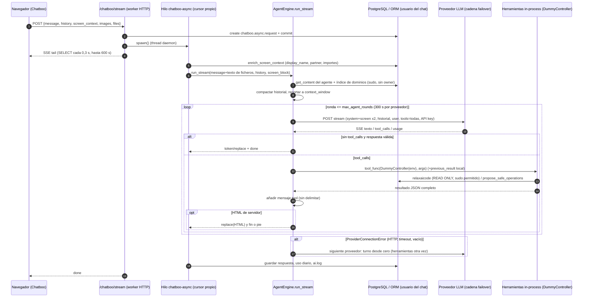

# Análisis pns_ai_mcp — Bloque 7: motor del agente y llamadas al LLM (Odoo 14.0)

> Análisis de código de terceros (Patanegra Soft, Apache-2.0). **No se diseña ni se propone
> código.** Rama `14.0-analisis-pns-ai`, copia de trabajo `./pns_ai_mcp/`. Core de referencia:
> `/opt/odoo-src/14.0/odoo/` (el clon tiene el paquete en `/opt/odoo-src/14.0/odoo/odoo/`).
>
> Clasificación: **HECHO** (archivo:línea), **INFERENCIA** (deducido del código, no ejecutado),
> **PENDIENTE** (comprobar con `odoo-dev 14`). Rutas sin prefijo = `pns_ai_mcp/`.
> Referencias a otros bloques: [MAPA]=`analisis_pns_ai_mcp_1_mapa.md`,
> [CONOC]=`..._2_conocimiento.md`, [SECR]=`..._3_conexiones_secretos.md`,
> [MCP]=`..._4_servidor_mcp.md`, [CAJAB]=`..._5_caja_b.md`, [CODE]=`..._6_ejecucion_codigo.md`.

---

## 0. Dónde vive cada cosa (aclaración previa importante)

- **HECHO**: el bucle de Chatboo (`utils/agent_engine.py`) **no usa los drivers de `lib/llm/`**.
  Construye las peticiones HTTP él mismo con `urllib` (`agent_engine.py:2250-2263, 2507-2758`) para
  OpenAI-compatible y Anthropic. Los drivers (`lib/llm/drivers/*`) solo se usan desde
  `ai.provider.action_fetch_models` (`models/ai_provider.py:373-442`),
  `_probe_temperature_support` (456-488), `test_connection` (490-…) y
  `ai.execution.engine.chat_completion` (`models/ai_execution_engine.py:246-275, 533-600`), al que no
  llama ningún otro archivo de este repositorio (grep de `chat_completion(`; solo el docstring
  `ai_execution_engine.py:83`). Consecuencia: hay **dos implementaciones** de cada protocolo con
  comportamientos distintos (§2.4).
- **HECHO**: el único llamador de `AgentEngine.run_stream` es `pns_ai_chatboo`
  (`pns_ai_chatboo/models/chatboo_async_request.py:483-505`), que lo ejecuta en un **hilo daemon con
  cursor propio** (`chatboo_async_request.py:223-274`), no dentro de la petición HTTP. El otro uso de
  `AgentEngine` es `ai.agent.domain_index_runtime_tail` (`models/ai_agent.py:376-391`) para el
  `system_prompt` servido por MCP.
- **HECHO**: `ai.provider.protocol` solo admite `openai` y `anthropic` (`ai_provider.py:85-88`);
  el `OllamaDriver` registrado (`lib/llm/drivers/__init__.py:11`) es inalcanzable desde un registro
  `ai.provider` (Ollama se usa como `openai`).

---

## 1. Bucle del agente (ReAct)

### 1.1 Entrada y casos que no llaman al LLM

`run_stream` (`agent_engine.py:1051-1819`):

1. `_begin_turn` fija usuario y correlación del turno (382-410) y mete `user_message`,
   `chatboo_session_id` y `file_label_by_id` en el contexto (1074-1081).
2. Resuelve el agente (`resolve_inference_agent_code`, 1085).
3. **Comandos `/`** (1095-1709): `/skills|/help|/ayuda|/?` (lista local, 1116-1132); ejes de
   presentación `/painter-*`, `/foot-*`, `/show-*` (1133-1208; `formatting_mode_policy.py:36-43`);
   skills: ayuda/rechazo/pedir argumentos sin LLM (1222-1270); skill con `code_body` → ejecución
   determinista (`bootstrap_skill_code_body`, `try_skill_fast_path`, 1359-1376) y, si el skill es
   *painter-free* con filas, **traspaso de los datos al LLM** dentro del mensaje de usuario
   (1481-1578); skill sin código → el procedimiento entero se envía como mensaje (1703-1709).
   Un skill con `param_schema` puede hacer una **llamada LLM corta extra** para extraer parámetros
   (`_normalize_skill_params` → `llm_json_completion`, 486-629 y 179-239).
4. Cascada de proveedores (1722-1819), §2.5.

### 1.2 Rondas, tiempos y fin

| Parámetro | Valor | Dónde |
|---|---|---|
| Rondas máximas | `ai.agent.max_agent_rounds` (por defecto 10; ≤0 → 10) | `agent_engine.py:2270`, `models/ai_agent.py:104-106` |
| Tiempo sin datos del stream | `link.llm_idle_timeout` o 45 s (`timeout` de `urlopen`, por operación de socket) | 26, 2035-2039, 2643; `ai_agent.py:1539-1541` |
| Tiempo máximo por ronda | `link.llm_round_timeout` o 120 s; se comprueba **solo entre líneas** del stream | 27, 2040-2044, 2645-2649 |
| Tiempo máximo del turno | 300 s, comprobado **solo al empezar cada ronda**; el reloj se crea **por proveedor** | 28, 2284, 2496-2501 |
| Fallback no-stream | 45 s fijos por intento (hasta 2 intentos) | 128, 157-176 |
| Tokens de salida | 4096 (8192 en *painter-free*) | 2019, 2562, 2593 |

INFERENCIA (peor caso de un turno): 300 s + una ronda que empieza en el segundo 299 (120 s +
ejecución de herramientas + 2×45 s de fallback) **por cada proveedor de la cadena**, porque
`agent_started` se reinicia en cada `_run_stream_with_provider` (2284). Con 3 proveedores, más de
25 minutos.

**Cómo termina** (HECHO):
- Respuesta sin `tool_calls` que supera los filtros "progreso no es respuesta" y "ronda 1 sin
  herramienta no es respuesta" (`agent_stream_text.py:83-94, 183-217`; uso 2868-2931). Si los
  filtros la rechazan, se añade un mensaje de usuario de "empujón" (`NO_TOOL_FINAL_NUDGE`,
  `error_ux.retry_nudge_after_tool_error`) y se gasta otra ronda.
- HTML renderizado en servidor con `stop_after_direct`, modo lacónico o última ronda (4055-4086).
- Exportación de fichero adjuntada (4123-4135).
- Rondas agotadas: aviso humanizado (4177-4193, `error_ux.humanize_exhausted_tool_error`).
- `ProviderConnectionError` (HTTP, timeouts, respuesta vacía) → siguiente proveedor.
- Cancelación: el job comprueba `cancel_requested` entre eventos y hace `break`
  (`chatboo_async_request.py:506-508`); el generador del motor se cierra en el siguiente `yield`,
  no a mitad de una herramienta o de una lectura HTTP (INFERENCIA).

### 1.3 Qué herramientas ve el modelo

- **HECHO**: `get_tools_schema` envía **todas** las herramientas del registro global del decorador
  (`agent_engine.py:868-886`; `controllers/mcp_decorators.py:314-327`), sin filtrar por usuario,
  grupo ni agente. Inventario (10) en [MCP] §4.
- **HECHO**: además, el catálogo de herramientas de servidores MCP externos va como texto en el
  prompt de sistema (`ai.api.server.get_tools_prompt_block`, 686-694; [SECR]).
- **HECHO**: el modelo elige libremente (`tool_choice: "auto"` en OpenAI, 2599-2602; en Anthropic no
  se envía `tool_choice`, 2574-2583). Si el modelo escribe la llamada en texto, se recupera con
  `_extract_from_content` (`lib/llm/utils/tool_utils.py:43-221`) y solo se aceptan nombres de
  herramientas existentes (2769-2794). INFERENCIA: el formato "nombre en la primera línea + JSON"
  (`tool_utils.py:48-76`) convierte en llamada cualquier respuesta cuyo primer renglón sea
  `relaxaicode` o empiece por `propose_`/`get_`/…; un texto inyectado que el modelo repita tal cual
  se ejecutaría como herramienta.
- **HECHO**: las herramientas se ejecutan en proceso con un `DummyController` (3381-3441) cuyo
  `_check_mcp_permissions` devuelve siempre `True` (3392-3393) y cuyo `_get_env_for_operation`
  devuelve el entorno del usuario **sin** la comprobación de `group_ai_writer` que sí hace el camino
  MCP (`controllers/controller_helpers.py:120-164`). INFERENCIA: `clean_system`, que se protege con
  `_get_env_for_operation('write')` ([MCP] §4, tabla), se ejecutaría en Chatboo sin exigir AI Writer
  (quedan las ACL del usuario). `propose_safe_operations` no se ve afectado: aplica
  `check_safe_plan_permissions` propio ([CAJAB] §1). PENDIENTE.
- **HECHO** (fallo menor): en la primera herramienta del turno, `_payload` se usa (3492) antes de
  asignarse (3500); el `try` lo absorbe (`UnboundLocalError`) y deja `_render_ctx=None`; en las
  siguientes usa el payload de la herramienta anterior.

---

## 2. Comunicación con los proveedores

### 2.1 Bucle de Chatboo (`agent_engine.py`)

| Aspecto | OpenAI-compatible (incluye Ollama, vLLM, OVH, OpenRouter…) | Anthropic |
|---|---|---|
| Endpoint | `ai.provider.endpoint` tal cual; si no empieza por `http` se antepone `https://` (1962-1964). Sin validación ni lista de destinos | igual |
| Autenticación | `Authorization: Bearer <api_key>` si hay clave (2262-2263) | `x-api-key`, `anthropic-version: 2023-06-01`, `anthropic-beta: prompt-caching-2024-07-31` (2258-2261) |
| Clave | `provider._api_key_for_inference()` = `self.sudo().api_key` (`ai_provider.py:109-117`, campo `groups=group_ai_admin`, 103-107) | igual |
| Cuerpo | `model`, `messages` (todos los `system` fundidos al principio, 1888-1911), `temperature`, `stream: true`, `max_tokens`, `stream_options.include_usage`, `tools` + `tool_choice:"auto"`; `chat_template_kwargs.enable_thinking=false` en *foot-laconic* (2588-2607) | `system` (un bloque con `cache_control: ephemeral`), `messages` convertidos, `max_tokens`, `temperature`, `stream`, `tools` con `input_schema` (2508-2583) |
| Streaming | SSE o JSON por línea (`_sse_payload_from_line`, 42-51); texto de `delta.content`, nunca `reasoning_content` (62-83); `tool_calls` por índice (86-104) | `content_block_start/delta`, `input_json_delta`, `message_start`/`message_delta` para tokens (2664-2702) |
| Reintentos | Uno solo, sin `stream_options`, si el 400 lo menciona (2728-2743). Si el stream llega vacío: hasta 2 llamadas no-stream (con y sin herramientas, 2798-2813), salvo `skip_sync_fallback` | Ninguno |
| 429 / 5xx | Sin espera ni reintento: `ProviderConnectionError` → siguiente proveedor (2744-2758) | igual |
| Cabeceras extra | `config` nunca lleva `extra_headers` (2025-2046), así que 2265-2266 no hace nada | igual |

Contrastes con la documentación oficial:
- Anthropic: `anthropic-version: 2023-06-01` sigue siendo la versión vigente y `tool_result.content`
  admite cadena; el caché de prompt ya no necesita la cabecera beta (INFERENCIA, documentación de la
  skill `claude-api`, `curl/examples.md`; inocua). Los modelos Claude recientes rechazan
  `temperature` con 400 (misma fuente, tabla "Thinking & Effort"): en este bucle eso provoca
  failover, porque aquí no existe el reintento sin `temperature` que sí tiene el driver
  (`anthropic_driver.py:371-387`). Además `provider.temperature or 0.7` (2029) convierte una
  temperatura configurada a 0 en 0.7 (HECHO).
- OpenAI: `max_tokens` está obsoleto y no es compatible con los modelos de razonamiento de la serie
  o (requieren `max_completion_tokens`) ([foro OpenAI](https://community.openai.com/t/why-was-max-tokens-changed-to-max-completion-tokens/938077)):
  con esos modelos el bucle recibiría 400 → failover (INFERENCIA, PENDIENTE).
- Azure OpenAI autentica con cabecera `api-key`; el bucle solo envía `Bearer` (INFERENCIA,
  PENDIENTE si se usa Azure).
- Imágenes: se envían como partes `image_url` estilo OpenAI (2213-2229, 2175-2195). En el camino
  Anthropic esos mensajes de usuario se copian tal cual (2548-2558), formato que la Messages API no
  acepta (INFERENCIA: 400 → failover).

### 2.2 Drivers `lib/llm/` (usados por pruebas de conexión y `ai.execution.engine`)

- `OpenAIDriver` (`openai_driver.py`): `requests.post` con `Bearer` (125-149), `timeout`
  `LLM_HTTP_DEFAULT`=240 s (`utils/timeouts.py:32`), sin stream, sin reintentos, `RuntimeError` con
  el error normalizado (151-198). **Envía `Authorization: Bearer ` aunque no haya clave** (127).
- `AnthropicDriver` (`anthropic_driver.py`): conversión de mensajes y herramientas (237-366),
  `max_tokens` fijo 4096 (315), reintento único sin `temperature` (371-387), traducción a forma
  OpenAI (443-479), sonda `probe_temperature` (180-225).
- `OllamaDriver`: subclase con endpoint `http://localhost:11434/...` y clave ficticia `ollama`
  (`ollama_driver.py:59-88`).
- `registry.py`: protocolo desconocido → `openai` (73-81).
- `LLM_HTTP_RETRY` (90 s) y las constantes `MCP_*` de `timeouts.py` no se usan en estos archivos.
- Los dos drivers hacen `headers.update(self.extra_headers)` (`openai_driver.py:129`,
  `anthropic_driver.py:234`): todo lo que un llamador ponga en `extra_headers` sale hacia el
  proveedor (ver §3.3).

### 2.3 `llm_json_completion` (`agent_engine.py:179-239`)

Llamada corta sin herramientas ni stream (parámetros de skills y sinónimos de detección en
`models/external_server.py:630`). Mismas cabeceras; `temperature: 0`; 45 s; errores → cadena vacía
(registrados solo en `debug`). Su consumo de tokens **no se contabiliza** (no devuelve `usage`).

### 2.4 Diferencias entre las dos implementaciones (HECHO)

| | Bucle Chatboo | Drivers |
|---|---|---|
| HTTP | `urllib` (comentario "evita deadlocks gevent/httpx", 2636) | `requests` |
| Temperatura rechazada (Anthropic) | failover | reintento sin ella |
| `temperature_support='no'` del proveedor | ignorado | respetado (`send_temperature`) |
| Ollama | protocolo `openai` | `OllamaDriver` (inalcanzable) |
| Timeout | 45/120/300 s | 240 s |

### 2.5 Cascada de proveedores (`agent_engine.py:1722-1819`)

- Orden: failovers del agente (`Engine.get_failovers`, 1741-1745) o proveedores autoasignados; el
  elegido en la UI va primero solo si pertenece a la cadena (1754-1759).
- Se pasa al siguiente **solo** con `ProviderConnectionError`; se registra en `ai.log`
  (1765-1772). Si ya se había emitido texto, se manda un `replace` vacío para evitar duplicados
  (1796-1802).
- Mensaje final al usuario con el error de **cada** proveedor (1803-1813). Ese texto incluye el
  endpoint cuando la causa es "sin contenido" o "rechazó la petición" (2853-2864), pese al
  comentario "NUNCA exponemos endpoint ni infra" (4197). HECHO.
- **Riesgo de efectos repetidos** (INFERENCIA, PENDIENTE): el siguiente proveedor reinicia el turno
  desde cero con el mismo mensaje (1775-1782). Las herramientas que el proveedor anterior ya ejecutó
  (p. ej. `propose_safe_operations` con pasos de bajo riesgo **autoconfirmados**, [CAJAB]) se
  pueden volver a ejecutar. El caso típico es un desbordamiento de contexto o un timeout en la
  ronda 2, después de las herramientas de la ronda 1. La deduplicación de propuestas pendientes
  idénticas ([CAJAB] §1, 1631-1654) no cubre las ya confirmadas.

---

## 3. Qué se envía en cada petición

### 3.1 Composición de `messages` (HECHO, `_run_stream_with_provider` 2054-2236)

1. **Sistema** (`get_system_prompt`, 631-723): `ai.agent.get_content(user_locale)` (caché compilada
   del agente: contextos, identidad, conocimiento de usuario, skills; [CONOC] §3 y §6) + cola de
   datos en tiempo de ejecución (717-722): fecha del **servidor** (`date.today()`, no la zona del
   usuario), dominios de `fetch_url` de confianza, catálogo de herramientas MCP externas,
   `screen_context_block` y cuerpos del índice de dominios del mensaje (768-854).
2. **Historial** del navegador, compactado (§3.2) y recortado a la ventana (§5).
3. *Painter-free*: `REMOTE_FORMAT_SYSTEM_HINT` (2089-2095).
4. Reutilización: aviso `[DATOS REUTILIZABLES]` (sin filas, 2117-2140) **o** el **código Python**
   de la última consulta (2141-2166).
5. `screen_context_block` **otra vez**, como mensaje `system` (2167-2174). Va dos veces en cada
   petición (1 y 5).
6. Imágenes de turnos anteriores en base64 (2175-2195).
7. Mensaje del usuario + texto extraído de ficheros adjuntos (lo añade el job:
   `chatboo_async_request.py:394`) + imágenes del turno + protocolo de ficheros (2213-2236).
8. Esquema de **todas** las herramientas (2064).

Dentro del turno se añaden el texto y `tool_calls` del asistente (3147-3151) y el resultado de cada
herramienta como JSON completo (`tool_result_json_for_llm`, `utils/mcp_tool_payload.py:287-292`;
3969-3974). El `previous_result` que el motor inyecta en los argumentos **no** sale hacia el modelo:
se añade al diccionario ya parseado, no a la cadena `arguments` guardada en el mensaje
(3322-3365; HECHO). Solo cuando se pinta una tabla y se pide un pie al modelo, el **último**
resultado se sustituye por una nota sin datos (4095-4120). Con varias herramientas en la misma
ronda, los resultados anteriores siguen enteros.

### 3.2 Compactación del historial (`utils/history_compact.py`)

- Quita mensajes `system` y `tool` y los del asistente que solo traían `tool_calls` (59-84).
- Usuario: recorte a 4000 caracteres (28, 75). Asistente: si parece artefacto (tabla, mapa,
  imagen) o pasa de 2500 caracteres → **stub** sin valores de celdas: tipo, filas×columnas,
  **nombres de columnas** (máx. 12), título (máx. 160) y referencias de imagen (100-122, 206-239);
  si no, texto sin HTML recortado a 1500 (121-122).
- El historial lo manda el **navegador** (`pns_ai_chatboo/controllers/chatboo.py:675`) y se guarda
  en el job (`chatboo_async_request.py:144-145, 213`). INFERENCIA: el usuario puede fabricar turnos
  "assistant" anteriores; el servidor no contrasta con lo que realmente respondió.

### 3.3 ¿Sale alguna credencial de Odoo hacia el proveedor? (revisión de `mcp_utils.py`)

- `extract_user_token_from_request` (`lib/llm/utils/mcp_utils.py:99-133`) lee la cabecera
  `X-Mcp-Token` de la **petición entrante**; solo la usa la autenticación del servidor MCP
  (`controllers/main.py:861`, [MCP] §3).
- `build_mcp_extra_headers` (184-215) construiría `extra_headers` con `X-Mcp-Token`,
  `X-MCP-LLM` y cabeceras de idioma. **No se llama desde ningún archivo** (grep, HECHO).
  `get_locale_settings` y `should_load_mcp_tools` tampoco se usan fuera de `lib/llm/utils`.
- El bucle no pone `extra_headers` (2025-2046) y lo documenta (2048-2052); `test_connection` lo deja
  vacío (`ai_provider.py:511-513`); `ai.execution.engine` no reenvía el token ([CODE] §5,
  `ai_execution_engine.py:257-260`).
- **Conclusión de cabeceras** (HECHO): hacia el proveedor solo va la **API key del propio
  proveedor**. No van la sesión de Odoo, `X-Mcp-Token` ni la clave MCP del usuario. Riesgo latente:
  si algún módulo llamara a `build_mcp_extra_headers` y pasara el resultado a un driver, el token MCP
  del usuario saldría hacia el LLM (los drivers copian `extra_headers` sin filtrar).
- **Conclusión de contenido** (INFERENCIA, grave): las credenciales sí pueden salir **dentro de los
  resultados de herramientas**. `relaxaicode` permite `env.sudo()` y solo bloquea `ai.context` y
  `ai.api.server` (`controllers/context_builder.py:56-102`; [CODE] §4). Un código como
  `env.sudo()['ai.provider'].search([]).mapped('api_key')` o
  `env.sudo()['ir.config_parameter'].get_param('database.secret')` devolvería el valor y el motor lo
  enviaría al proveedor en el siguiente mensaje `tool`. El código lo escribe el LLM y puede
  inducirlo un texto inyectado (§6). PENDIENTE: comprobar si el AST de `validators.py` lo impide.

---

## 4. Datos de Odoo que salen hacia el proveedor y si se pueden limitar

**Qué sale** (HECHO salvo indicación):
- Resultados de `relaxaicode`: el `result` serializado entero, hasta 50 000 filas y ~2 MB de texto
  (`controllers/tools_relaxaicode.py:31-32`); solo se sustituyen los blobs base64 de imagen
  (124-142, 2706).
- Resultados de `api_call` (recortados a 10 240 caracteres, `utils/api_call_result.py:9, 73`) y de
  `fetch_url` ([CAJAB] §6).
- Datos del skill en modo informe (`data_json` en el mensaje, 1497-1559).
- Registro abierto en pantalla (§9), ficheros adjuntos e imágenes (§3.1).
- Código de la consulta anterior (2141-2166) y nombres de columnas y títulos de turnos anteriores
  (§3.2).
- Conocimiento de usuario y cuerpos de contextos (también privados de otros usuarios, §10).

**Controles que existen**:
- ACL y reglas del usuario del chat en las lecturas (entorno del usuario, [CODE] §4), pero el
  sandbox permite `sudo()` (§3.3).
- `is_on_premise` del proveedor **solo** cambia el coste mostrado (`llm_usage.py:51-63`;
  `ai_provider.py:167-170`). No impide enviar datos a proveedores externos.
- Elección de proveedor por agente y cadena de failover (`get_providers_for_agent`). INFERENCIA:
  para que nada salga de la casa, toda la cadena del agente (incluidos los failovers) tiene que ser
  local; si no, un fallo del local pasa los mismos datos al externo.

**No existe** (búsqueda de `redact|sensitive|denylist|blocked_models` en `pns_ai_mcp/**/*.py`; el
único redactado es el del diario de cambios, `utils/change_journal.py:30-86`): lista de modelos o
campos que no se envían, filtro por empresa, anonimización ni límite de filas hacia el LLM
distinto del de la herramienta.

---

## 5. Tokens y coste

- **Recuento** (HECHO): por ronda, `usage` del chunk final OpenAI (`include_usage`, 2706-2708) o de
  `message_start`/`message_delta` de Anthropic (2689-2702). Se suma con `add_usage`
  (`llm_usage.py:123-135`; normaliza en 91-120). Coste solo si el proveedor lo envía (`cost`,
  `total_cost`, `cost_usd`, `cost_in_usd_ticks`, 30-48). En on-premise, si no viene, 0 (51-63).
- **Registro**: `ai.provider.usage.day.increment_for_turn` (4215-4230), `ai.log` de cierre con
  tokens (4233-4242) y evento `done` (4276-4303).
- **No se cuentan** (HECHO): las llamadas no-stream de respaldo (157-176 descarta `usage`), las de
  `llm_json_completion` (179-239) y, en Anthropic, los tokens de creación de caché. En Anthropic
  `prompt_tokens` es `input_tokens`, que no incluye los leídos de caché (2690-2696; INFERENCIA según
  la semántica de la API).
- **Límites** (HECHO): **ninguno** corta la conversación por tokens o coste (búsqueda de
  `quota|budget|max_cost|daily_limit` en `pns_ai_*`: sin resultados). Solo se recorta el
  **historial previo** para la ventana `ai.provider.context_window` (por defecto 32768,
  `ai_provider.py:218-221`) con una estimación de 4 caracteres por token, reservando
  `_gen_max_tokens` + 512 (`_fit_history_to_context`, 1831-1886).
  Ese recorte se hace **una vez, antes del bucle** (2083-2085). Los resultados de herramientas que
  se acumulan dentro del turno no se recortan: un resultado grande desborda la ventana → HTTP 400
  → `ProviderConnectionError` → failover y repetición (INFERENCIA).
- Caché de prompt: el comentario de 710-716 diseña un prefijo estable, pero en Anthropic todo el
  `system` (incluidos fecha, pantalla y paquetes de dominio) forma un único bloque con
  `cache_control` (2563-2569). Si cambia la pantalla o el mensaje activa otro paquete, no hay
  acierto de caché (INFERENCIA).

---

## 6. Prompt injection

**Fuentes de texto no confiable que llegan al modelo** (HECHO salvo indicación):

| Fuente | Cómo llega | Rol | Tratamiento |
|---|---|---|---|
| Campos del registro en pantalla (nombre, partner, comercial…) | `screen_context_block` (§9) | **system** (dos veces) | ninguno |
| Filas de `relaxaicode` (descripciones, notas, correos…) | resultado `tool` | tool | JSON sin delimitar ni marcar |
| Respuestas de `fetch_url` y `api_call` | resultado `tool` | tool | recorte de `api_call` a 10 KB; sin marcado |
| Descripciones de herramientas de servidores MCP externos | `get_tools_prompt_block` | **system** | ninguno en el motor ([SECR]) |
| Contextos y skills de usuarios, filas `discovery` | `get_content` / índice de dominios | **system** | ninguno (§10) |
| Ficheros adjuntos e imágenes | mensaje de usuario | user | ninguno |
| Historial enviado por el navegador | user/assistant | — | compactación (§3.2) |

**Defensas que sí hay**:
- Las escrituras pasan por la Caja B con confirmación humana, salvo los pasos autoconfirmables
  (`fetch_url` en lista blanca, `api_call` de confianza) ([CAJAB], [CODE] §6). `relaxaicode` lee con
  cursor READ ONLY ([CODE] §4).
- Solo el HTML marcado por la plataforma (`__fmt_type__` de confianza) se pinta directamente en el
  chat (`agent_engine.py:262-309`; `direct_return_policy.py:6-8, 22-66`). Protege la interfaz, no al
  modelo.
- Entre turnos, los resultados de herramientas no se reenvían y las tablas pasan a stubs sin valores
  (§3.2). Eso limita que un texto inyectado persista entre turnos, pero el título y los nombres de
  columna sí pasan.
- La recuperación de llamadas desde texto solo acepta herramientas registradas (2776-2785).

**Defensas que no hay** (HECHO por ausencia en el código leído):
- Ningún delimitador o etiqueta de "datos no confiables" en los resultados de herramientas. El
  envoltorio `<dynamic_context_read_only>` de `format_tool_result_for_model`
  (`tool_utils.py:224-280`) **no se usa** (grep).
- El texto del registro en pantalla entra con rol `system`, el de máxima autoridad, y con la
  instrucción "assume implicit references target this screen"
  (`pns_ai_chatboo/utils/screen_context.py:157-160`).
- No hay separación entre el contenido de datos y las instrucciones del agente, ni filtro de
  patrones, ni límite de herramientas por turno (aparte de `MAX_ROUNDS`).
- Canales de exfiltración posibles (INFERENCIA, PENDIENTE): `fetch_url` autoconfirmado hacia un
  dominio de la lista blanca con datos en la URL ([CAJAB] §6); imágenes o enlaces Markdown/HTML en la
  respuesta final si el cliente Chatboo los carga (no revisado en este bloque); y el propio
  proveedor LLM, que recibe todos los resultados (§3.3).

---

## 7. Rendimiento y workers

- **HECHO**: el turno corre en un hilo `daemon` (`chatboo-async-<id>`) con **su propio cursor**
  abierto durante todo el turno (`chatboo_async_request.py:239-274`), más cursores cortos para
  latido, registros y caché.
- **HECHO**: la petición `/chatboo/stream` no termina: hace *tail* del job con un `SELECT` cada
  0,3 s hasta 600 s, con *keepalive* cada 15 s (`pns_ai_chatboo/controllers/chatboo.py:747-830`).
- **HECHO (core 14)**: en modo prefork el padre mata con `SIGKILL` al worker cuyo `watchdog_time`
  supere `limit_time_real` (`/opt/odoo-src/14.0/odoo/odoo/service/server.py:779-788`), y el worker
  solo hace ping entre peticiones (1014-1020, 1038-1054).
  **INFERENCIA**: un turno largo ocupa un worker HTTP con el *tail* y, al llegar a
  `limit_time_real` (120 s por defecto), se mata el **proceso**, incluido el hilo del motor que se
  creó dentro de él (`spawn` corre en el worker que atendió `/chatboo/stream`). El latido y el
  *reclaim* del job (`chatboo_async_request.py:604-640, 1701`) cubrirían la recuperación. PENDIENTE
  de reproducir con `workers>0`.
- **HECHO (core 14)**: en modo multihilo (`workers=0`), `process_limit` solo aplica
  `limit_time_real` a hilos no daemon o de cron (`server.py:376-390`): el hilo del motor queda
  **fuera** de ese límite y solo lo acotan los tiempos del §1.2.
- **HECHO (core 14)**: si el worker alcanza `limit_request` o `limit_memory_soft`, sale al terminar la
  petición en curso (`server.py:940-952, 995-1001`). INFERENCIA: ese `exit` también mata los hilos
  daemon de turnos que sigan vivos.
- `dataset_cache_max_bytes` (HECHO, 30-39, 1821-1829): tope de **8 MB** serializados para guardar
  las filas del turno (no para lo que va al LLM). Con `0` o negativo no hay límite. Para medir se
  hace `json.dumps` del dataset entero en cada resultado (3709-3716, 3804-3811, 3887-3894), y las
  filas se copian a `turn_query_data`, al evento `query_data` y a la sesión. INFERENCIA: con
  datasets cerca del tope, varios MB por turno en RAM y CPU del hilo, que cuenta en el
  `RLIMIT_CPU` del proceso (`server.py:956-960`).
- Llamadas HTTP síncronas: todo el bucle es bloqueante (`urllib`), pero en el hilo del job. Sí van
  dentro de una petición HTTP de usuario: `llm_json_completion` desde
  `models/external_server.py:630` (45 s) y las acciones de proveedor (`action_fetch_models` 10 s,
  sonda de temperatura 8-15 s en un `onchange`, `ai_provider.py:444-448`).

---

## 8. `sudo()`, Odoo 14, Python 3.7.3 y riesgos

### 8.1 `sudo()` en los archivos del bloque (HECHO)

| Línea | Uso | Justificación en comentario |
|---|---|---|
| `agent_engine.py:432` | crear `ai.log` | no |
| 441 | leer idioma de la empresa | no |
| 728, 1826 | leer ICP (`domain_index_inject`, `dataset_cache_max_bytes`) | no |
| 738, 743, 749 | leer filas `discovery` y cuerpos de `ai.context` **sin reglas de propiedad** | no (§10) |
| 1971 | leer enlaces agente↔proveedor (timeouts) | sí, indirecta (1966-1969) |
| `formatting_mode_policy.py:128, 134-135` | escribir `chatboo.session` en cursor propio con `commit` | docstring (118-122) |
| fuera del bloque, usado aquí: `ai_provider.py:117` | API key del proveedor | sí (110-115) |

`SUPERUSER_ID` se importa sin usarse (`agent_engine.py:10`).

### 8.2 Compatibilidad

- Odoo 14 (HECHO): APIs usadas existen en 14 (`env.company`, `env(context=…)`,
  `registry.cursor()`); `Environment(cr, uid, ctx)` en `formatting_mode_policy.py:131` se ejecuta en
  el hilo del job, que ya tiene `_env_manage()` (`chatboo_async_request.py:249`).
- Python 3.7.3 (HECHO, grep de `:=`, `removeprefix`, `match`, genéricos): sin sintaxis posterior a
  3.7. `from __future__ import annotations` (3.7+) en cinco archivos; `zoneinfo` protegido con
  `try` y paso a `pytz` (`user_time.py:14-27`); `datetime.fromisoformat` (3.7+). `except:` sin tipo en
  `agent_engine.py:2522`, `anthropic_driver.py:269`, `tool_utils.py:69, 98, 136, 165, 183, 188, 219`.
- No se han abierto los `__pycache__/*.cpython-312.pyc` (binarios; indican que se probaron con 3.12).

### 8.3 Riesgos (de mayor a menor)

1. **Credenciales y datos sin filtrar hacia el proveedor** a través de resultados de herramientas
   con `sudo()` en el sandbox (§3.3, §4). Sin control por modelo, campo o empresa, y
   `is_on_premise` no restringe nada.
2. **Prompt injection sin defensas en el motor** (§6), con texto de registros en rol `system`
   (§9) y contextos y skills de otros usuarios en el prompt (§10).
3. **Repetición de efectos al hacer failover** tras ejecutar herramientas (§2.5).
4. **Workers**: el *tail* ocupa un worker HTTP hasta 10 min y `limit_time_real` puede matar el
   proceso con el turno dentro (§7).
5. **Herramientas sin filtrar por usuario** y `DummyController` sin la puerta de AI Writer (§1.3).
6. Errores con endpoint visibles al usuario final (§2.5); resultados grandes que desbordan la
   ventana dentro del turno (§5).
7. Incompatibilidades de protocolo que acaban en failover: `temperature` en Claude recientes,
   `max_tokens` en modelos de razonamiento OpenAI, imágenes en Anthropic, temperatura 0 → 0.7
   (§2.1).

---

## 9. `screen_context_block` (`agent_engine.py:672-722` y 2167-2174)

- **Origen** (HECHO): el navegador envía `screen_context` (modelo, `res_id`, `active_ids`, tipo de
  vista, nombre de acción, `url_hash`, dominio) en `/chatboo/stream`
  (`pns_ai_chatboo/controllers/chatboo.py:676, 735`). El job lo enriquece con
  `enrich_screen_context(self.env, raw)` (`chatboo_async_request.py:452-480`) en el entorno del
  **usuario** del job (uid del `spawn`, 232-253).
- **Contenido** (`pns_ai_chatboo/utils/screen_context.py`):
  - Siempre: `[Active screen]`, nombre de la acción, tipo de vista, modelo técnico, id y XML ID de la
    vista (123-130, 164-183).
  - Con registro abierto: `Record: #<id> "<display_name>"` y `Summary:` con hasta 8 de estos campos
    si existen: `state`, `stage_id`, `partner_id`, `user_id`, `amount_total`, `amount_untaxed`,
    `date_order`, `date`, `invoice_date` (14-25, 136-147). Los many2one van con su `display_name`
    (47-48): **nombre del cliente o proveedor, nombre del comercial e importes** del documento.
  - Con selección: número de registros e ids (148-152).
  - En lista o kanban sin registro: `search_count` del dominio de la acción (199-222).
  - Si el modelo no existe en el entorno: bloque mínimo con `res_id`, hasta 20 ids y `url_hash`
    (79-96, 113-116).
  - Nota final con la instrucción "assume implicit references target this screen" (157-160).
- **Acceso** (INFERENCIA): las lecturas usan el usuario del chat, así que se aplican ACL y reglas.
  Si `display_name` falla por permisos, la excepción la recoge el `try` del job y no se envía bloque
  (`chatboo_async_request.py:476-480`); los campos sueltos que fallan se omiten
  (`screen_context.py:41-44`). No hay `sudo`.
- **Envío** (HECHO): el bloque va **dos veces** en cada petición de cada ronda: al final del prompt
  de sistema (697-698, 717-722) y como mensaje `system` justo antes del mensaje del usuario
  (2167-2174). En OpenAI se funden en el primer `system` (1888-1911); en Anthropic, en `system`
  (2512-2514). Se envía aunque la pregunta no tenga que ver con la pantalla, y al proveedor que toque
  en la cadena, también si es externo.
- **Persistencia**: el `screen_context` crudo se guarda en `chatboo.session.last_screen_context`
  con `sudo` (`chatboo_async_request.py:464-470`).

---

## 10. Contraste con [CONOC] §4.3 y §4.4

- **Contextos y skills convertidos en globales por un Writer** ([CONOC] §4.3, escenarios 1 y 2):
  el motor **no aplica ninguna defensa**. El prompt de sistema es `agent.get_content(...)` tal cual
  (`agent_engine.py:645-655`), sin comprobar `owner_id`, origen, `is_system`/`core` ni contenido. Un
  contexto con `owner_id=False` o `context_type='core'` entra en el prompt de todos los usuarios del
  agente o de todos los agentes. Una skill global se ejecuta o se envía como procedimiento
  (1276-1709) con la misma confianza que una de fábrica.
- **Cuerpos de `discovery` de otros usuarios** ([CONOC] §4.4): confirmado (HECHO).
  `_domain_index_entries`, `_domain_index_indexed_codes` y `_domain_index_inject_bodies` usan
  `sudo()` (734-766). `get_discovery_entries` busca todas las filas `discovery` activas sin filtro
  de propietario (`models/ai_context.py:899-902`), y `get_context_for_country` /
  `assemble_context_parts` resuelven el cuerpo por `base_code` sin filtrar
  (`ai_context.py:568-607, 827-835`). Existe `filter_visible_for_user` (`ai_context.py:350-352`),
  pero el motor no lo llama. El cuerpo se inyecta en el **system** del turno de cualquier usuario
  cuyo mensaje contenga el disparador (format_inject_header + body, 846-848). El primer fragmento
  del mensaje de ese usuario queda registrado en `ai.log` (823-839).
- No hay sanitización, firma ni marca de procedencia del texto inyectado en ninguno de los dos
  casos.

---

## 11. Diagrama: petición al LLM con herramientas

---

## Resumen del bloque

- El motor de Chatboo (`agent_engine.py`, 4440 líneas) implementa su propio cliente HTTP (`urllib`)
  para OpenAI-compatible y Anthropic. Los drivers de `lib/llm/` solo sirven para probar conexión,
  listar modelos y `ai.execution.engine`, que nadie llama en este repo.
- Bucle ReAct: hasta `max_agent_rounds` (10) rondas, 45 s sin datos, 120 s por ronda y 300 s por
  turno **y por proveedor**. Fin por respuesta final, HTML de servidor, exportación o rondas
  agotadas.
- El modelo ve **todas** las herramientas registradas, sin filtro por usuario ni agente. El
  `DummyController` se salta la comprobación de AI Writer del camino MCP.
- Cada petición lleva: prompt del agente, fecha, lista blanca, catálogo MCP externo, bloque de
  pantalla (dos veces, como `system`), cuerpos del índice de dominios, historial compactado, código
  de la consulta anterior, imágenes, texto de ficheros y resultados completos de herramientas (hasta
  ~2 MB y 50 000 filas).
- **Credenciales**: en cabeceras solo va la API key del proveedor. `X-Mcp-Token` y la sesión de Odoo
  no salen: `build_mcp_extra_headers` no se usa. Pero el sandbox permite `sudo()` y solo bloquea dos
  modelos, así que una API key de proveedor, `database.secret` u otros secretos pueden salir dentro
  de un resultado de herramienta (PENDIENTE confirmar contra el AST).
- **Datos**: no hay ningún control por modelo, campo o empresa sobre lo que sale. `is_on_premise`
  solo afecta al coste mostrado; una cadena con un failover externo envía los mismos datos fuera.
- **Prompt injection**: ninguna defensa en el motor. Los resultados de herramientas van sin
  delimitar. El registro en pantalla (nombre, partner, comercial, importes) entra como `system`. El
  envoltorio `<dynamic_context_read_only>` existe pero no se usa. Defensas indirectas: Caja B, cursor
  READ ONLY, stubs en el historial y HTML de confianza solo para la interfaz.
- Contextos y skills globalizados por un Writer y cuerpos `discovery` de otros usuarios entran tal
  cual en el `system` (confirmado `sudo` sin filtro de propietario). [CONOC] §4.3/§4.4 se confirman
  desde el lado del motor.
- **Tokens**: se suman los de las rondas en streaming. No se cuentan los de los respaldos no-stream,
  `llm_json_completion` ni la creación de caché de Anthropic. Ningún límite de tokens o coste corta
  la conversación; solo se recorta el historial previo, una vez, con 4 caracteres por token.
- **Failover**: tras ejecutar herramientas repite el turno desde cero, con riesgo de repetir
  operaciones autoconfirmadas. El mensaje de error final muestra el endpoint al usuario.
- **Rendimiento**: el turno corre en un hilo daemon con cursor propio, pero `/chatboo/stream` ocupa
  un worker HTTP hasta 10 min. En prefork, `limit_time_real` mata el proceso con el hilo dentro
  (INFERENCIA). En multihilo el hilo escapa de `limit_time_real`. `dataset_cache_max_bytes` = 8 MB
  (0 = sin límite) solo limita la caché local, con `json.dumps` completo para medir.
- **Protocolo**: `temperature` siempre (`0` pasa a `0.7`) y sin reintento en Anthropic. `max_tokens`
  en lugar de `max_completion_tokens`. Imágenes `image_url` enviadas a Anthropic. Todo ello acaba en
  failover.
- **Compatibilidad**: Python 3.7.3 y Odoo 14 sin bloqueos en estos archivos. Hay `except:` sin tipo
  y un uso de variable antes de asignarla absorbido por `try` (3492).

## Tabla de cobertura

| Archivo | Líneas | Leído entero |
|---|---|---|
| `utils/agent_engine.py` | 4440 | sí (en 4 tramos) |
| `utils/agent_identity.py` | 182 | sí |
| `utils/agent_stream_text.py` | 218 | sí |
| `utils/ai_agent_registry.py` | 25 | sí |
| `utils/llm_usage.py` | 136 | sí |
| `utils/history_compact.py` | 460 | sí |
| `utils/error_ux.py` | 93 | sí |
| `utils/model_name_suggest.py` | 84 | sí |
| `utils/user_time.py` | 67 | sí |
| `utils/direct_return_policy.py` | 67 | sí |
| `utils/formatting_mode_policy.py` | 243 | sí |
| `lib/llm/__init__.py` | 3 | sí |
| `lib/llm/drivers/__init__.py` | 22 | sí |
| `lib/llm/drivers/base.py` | 439 | sí |
| `lib/llm/drivers/registry.py` | 93 | sí |
| `lib/llm/drivers/openai_driver.py` | 201 | sí |
| `lib/llm/drivers/anthropic_driver.py` | 480 | sí |
| `lib/llm/drivers/ollama_driver.py` | 89 | sí |
| `lib/llm/utils/__init__.py` | 22 | sí |
| `lib/llm/utils/mcp_utils.py` | 217 | sí |
| `lib/llm/utils/timeouts.py` | 35 | sí |
| `lib/llm/utils/tool_utils.py` | 281 | sí |
| `lib/llm/**/__pycache__/*.pyc` (11) | — | no (binarios compilados) |

Consultados parcialmente, fuera del bloque: `pns_ai_chatboo/utils/screen_context.py` (entero,
223), `pns_ai_chatboo/models/chatboo_async_request.py` (100-314, 380-539),
`pns_ai_chatboo/controllers/chatboo.py` (654-842), `controllers/mcp_decorators.py` (280-347),
`controllers/controller_helpers.py` (120-181), `controllers/context_builder.py` (56-110),
`controllers/tools_relaxaicode.py` (31-32, 120-157, 2690-2729), `models/ai_provider.py` (55-129,
366-515), `models/ai_context.py` (340-359, 568-627, 827-961), `models/ai_agent.py` (376-399),
`models/ai_execution_engine.py` (20-109), `utils/mcp_tool_payload.py` (287-347), core
`odoo/service/server.py` (365-394, 775-788, 940-1066).

## Preguntas abiertas

1. ¿El AST de `controllers/validators.py` impide leer campos de secretos con `env.sudo()`
   (`ai.provider.api_key`, `ir.config_parameter`, `ai.mcp.user`, `res.users.apikeys`)? Prueba con
   `odoo-dev 14 shell` (en savepoint) o un test de `relaxaicode`.
2. Con `workers>0`, ¿un turno de más de `limit_time_real` mata el proceso con el hilo del motor? ¿Qué
   `workers`, `limit_time_real` y `limit_request` tiene el VPS del cliente?
3. Si falla el proveedor en la ronda 2, después de un `propose_safe_operations` autoconfirmado, ¿se
   ejecuta dos veces la operación? Reproducir con un proveedor que devuelva 400 en la segunda
   llamada.
4. ¿Qué proveedores y cadenas de failover hay configurados en producción? ¿Alguno es externo en el
   agente `pns_ai_chatboo`? Determina si los datos de §4 y §9 salen de la casa.
5. ¿El cliente Chatboo carga imágenes o enlaces externos de la respuesta del modelo? Sería un canal
   de exfiltración ante prompt injection (bloque de Chatboo).
6. ¿Algún módulo externo llama a `build_mcp_extra_headers` o a `ai.execution.engine.chat_completion`
   con `extra_headers`? En este repo no; comprobar en los repos del cliente.
7. ¿Se usan modelos Claude recientes, modelos de razonamiento OpenAI o Azure OpenAI? Afecta a
   `temperature`, `max_tokens` y la cabecera de autenticación (§2.1).
8. ¿Se confirma que `clean_system` se puede ejecutar desde Chatboo sin AI Writer (§1.3)?
9. ¿Qué valor tiene `pns_ai_mcp.dataset_cache_max_bytes` en producción? ¿Está a 0 (sin límite)?
10. ¿Es aceptable para el cliente (RGPD) que el registro abierto (cliente, comercial, importes) se
    envíe en cada turno aunque la pregunta no tenga que ver con la pantalla?
