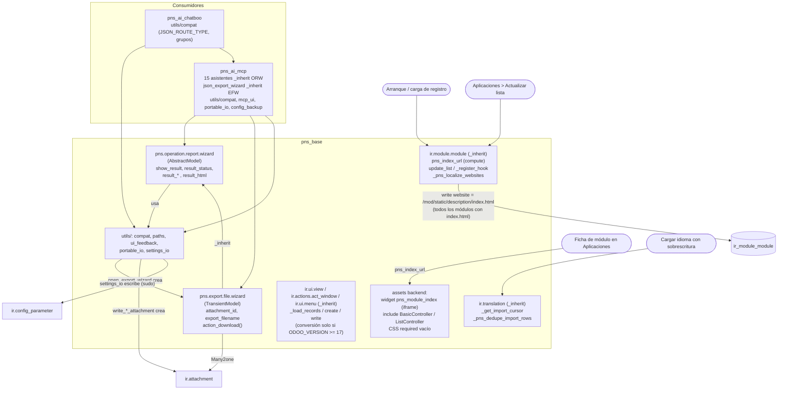

# Análisis: pns_base (Odoo 14.0, rama 14.0-analisis-pns-ai)

> Documento de análisis, **no** es una especificación de diseño. `pns_base` es código de
> terceros (PATANEGRA Soft) y no se modifica.
>
> - Fuente analizada: copia de trabajo `/home/soporte/GitHub/third_party/pns_base/` (29 archivos,
>   todos leídos). No se ha consultado `/opt/odoo-src/14.0/third_party`.
> - Referencia del core: `/opt/odoo-src/14.0/odoo/` (rutas citadas en cada punto).
> - Notación: **HECHO** = verificado en código, con `archivo:línea`. **INFERENCIA** = deducción
>   no comprobada en ejecución. **PENDIENTE** = se comprobará con `odoo-dev 14`.
> - Las rutas `pns_base/...` son relativas a `/home/soporte/GitHub/third_party/`. Las rutas
>   `core:` son relativas a `/opt/odoo-src/14.0/odoo/`.

### Inventario de archivos

| Archivo | Tipo | Cargado por |
|---|---|---|
| `__manifest__.py`, `__init__.py`, `models/__init__.py` | Python | Odoo |
| `models/ir_module_module.py` | Herencia de `ir.module.module` | `models/__init__.py:7` |
| `models/ir_translation.py` | Herencia de `ir.translation` | `models/__init__.py:8` |
| `models/ir_ui_view_patch.py` | Herencia de `ir.ui.view`, `ir.actions.act_window`, `ir.ui.menu` | `models/__init__.py:9` |
| `models/operation_report_wizard.py` | AbstractModel nuevo | `models/__init__.py:10` |
| `models/export_file_wizard.py` | TransientModel nuevo | `models/__init__.py:11` |
| `utils/__init__.py`, `compat.py`, `paths.py`, `ui_feedback.py`, `portable_io.py`, `settings_io.py` | Librería Python (sin modelos) | **No** se importa desde `__init__.py` del módulo; se carga cuando otro código hace `from odoo.addons.pns_base.utils ...` (p. ej. `models/operation_report_wizard.py:9`) |
| `security/ir.model.access.csv` | ACL | manifest `data` |
| `views/assets.xml`, `operation_report_wizard_views.xml`, `export_file_wizard_views.xml`, `ir_module_views.xml` | XML | manifest `data` |
| `static/src/js/pns_module_index.js`, `pns_invalid_fields_dedupe.js` | JS legacy | `views/assets.xml` |
| `static/src/css/pns_module_index.css`, `pns_required_readonly.css` | CSS | `views/assets.xml` |
| `static/description/index.html`, `icon.png`, `banner.png`, `LICENSE` | Documentación Apps | servidos como estáticos |
| `i18n/es.po`, `i18n/ar_001.po` | Traducciones | Odoo al cargar idioma |
| `LICENSE` | Apache 2.0 | — |

No hay `tests/`, `controllers/`, `data/`, `demo/`, `wizards/`, `report/`, `readme/` ni `README.rst` (HECHO: listado completo de `pns_base/**`).

---

## 1. Manifest

HECHO (`pns_base/__manifest__.py`):

| Clave | Valor | Línea | Observación |
|---|---|---|---|
| `name` | `PNS Base` | 8 | |
| `version` | `1.2.10` | 9 | No sigue `14.0.x.y.z`. Odoo 14 lo adapta a `14.0.1.2.10` (core: `odoo/modules/module.py:441-445`, `adapt_version` antepone la serie si no empieza por `14.0.`). Funciona, pero indica que el mismo código se distribuye para varias versiones. |
| `category` | `Technical` | 10 | |
| `summary` | inglés, "13-19+" | 11 | |
| `author` | `PATANEGRA Soft` | 37 | |
| `website` | `/pns_base/static/description/index.html` | 38 | URL relativa local (ver §2.1). |
| `license` | `Other OSI approved licence` | 40 | Valor válido en 14 (core: `odoo/addons/base/models/ir_module.py:300`). El archivo `LICENSE` es Apache 2.0 (`pns_base/LICENSE:1-2`). |
| `depends` | `['base', 'web']` | 41 | Transitivas: `web` → `base`. Nada más. |
| `external_dependencies` | — | — | No declara. Solo usa la biblioteca estándar (`ast`, `html`, `re`, `json`, `zipfile`, `base64`, `io`, `datetime`, `os`, `logging`). |
| `data` | `security/ir.model.access.csv`, `views/assets.xml`, `views/operation_report_wizard_views.xml`, `views/export_file_wizard_views.xml`, `views/ir_module_views.xml` | 42-48 | Orden correcto (ACL antes que vistas). |
| `qweb` | — | — | No hay plantillas QWeb de cliente. |
| `demo` | — | — | No hay. |
| assets | por plantilla `inherit_id="web.assets_backend"` | `views/assets.xml:3` | Forma correcta en 14 (`web.assets_backend` existe en core: `addons/web/views/webclient_templates.xml:190`). |
| `installable` / `application` / `auto_install` | `True` / `False` / `False` | 49-51 | |
| hooks | ninguno | — | No hay `pre_init_hook`, `post_init_hook` ni `uninstall_hook`. |

---

## 2. Modelos nuevos y heredados

### 2.1 `ir.module.module` (herencia `_inherit`) — `models/ir_module_module.py`

**Función de módulo** `_has_local_index(module_name)` (líneas 28-44): intenta `from odoo.tools import file_path` (Odoo 17+); en 14 esa función **no existe** (HECHO: no hay `def file_path` en `core: odoo/tools/`), así que cae en `get_module_resource(module, 'static', 'description', 'index.html')` (alias de `get_resource_path`, core: `odoo/modules/module.py:209-230`). Devuelve `True` si el módulo trae `static/description/index.html` en disco.

**Campo nuevo**

| Campo | Tipo | compute | store | required | default | groups | Línea |
|---|---|---|---|---|---|---|---|
| `pns_index_url` | Char ("Index") | `_compute_pns_index_url` | No | No | — | — | 50-54 |

**Métodos**

| Método | Decorador | super | Qué hace | Quién lo llama |
|---|---|---|---|---|
| `_compute_pns_index_url` (56-62) | `@api.depends('name')` | — | `'/<modulo>/static/description/index.html'` si existe en disco, si no `False`. Recorre `for rec in self` y asigna en todas las ramas. | ORM, al leer el campo en la ficha del módulo (vista §3.3). |
| `update_list` (64-73) | `@api.model` | Sí, primero, y devuelve su resultado | Tras refrescar la lista de Apps, llama a `_pns_localize_websites()`; cualquier excepción se registra como WARNING y no se propaga. | Botón "Actualizar lista de aplicaciones" y `-u`/`-i` (core: `odoo/modules/loading.py:418`). El core sigue protegido por `@assert_log_admin_access` (core: `odoo/addons/base/models/ir_module.py:722-724`). |
| `_register_hook` (75-85) | — | Sí, primero | Llama a `self.env['ir.module.module'].sudo()._pns_localize_websites()`, con excepciones capturadas (WARNING). | Core al terminar de cargar el registro (core: `odoo/modules/loading.py:566-573`) y cada vez que se reconfigura un registro ya listo (core: `odoo/modules/registry.py:281-285`, p. ej. al crear campos manuales). Es decir, **en cada arranque de Odoo/worker**. |
| `_pns_localize_websites` (87-105) | `@api.model` | — | `sudo().with_context(active_test=False).search([])` sobre **todos** los registros de `ir.module.module`; para cada uno que tenga `index.html` local, si `website` ≠ URL local, hace `write({'website': local})`. Devuelve el número de cambios y lo registra (INFO). | `update_list` y `_register_hook`. |

**Efecto funcional (HECHO + INFERENCIA)**
- HECHO: en 14 el kanban de Apps muestra "Learn More" con `t-att-href="record.website.raw_value" target="_blank"` y "Module Info" solo si `website` está vacío (core: `odoo/addons/base/views/ir_module_views.xml:182,197-198`). El core reescribe `website` desde el manifest en cada `update_list` (core: `ir_module.py:697,737-748`).
- INFERENCIA: el cambio afecta a **todos los módulos de la base de datos que traen `static/description/index.html`**, no solo a los `pns_*`: prácticamente todos los módulos OCA (su `index.html` lo genera `oca-gen-addon-readme`), muchos del core y los propios de Seges. Para todos ellos "Learn More" pasará a abrir el `index.html` crudo en una pestaña nueva y desaparecerá el botón "Module Info" del kanban.
- INFERENCIA: el ciclo es idempotente: cada `update_list` restaura la URL del manifest y `pns_base` la vuelve a sobrescribir inmediatamente después.

### 2.2 `ir.translation` (herencia `_inherit`) — `models/ir_translation.py`

| Método | Decorador | super | Qué hace |
|---|---|---|---|
| `_get_import_cursor(self, overwrite=False)` (39-51) | `@api.model` | Sí, y devuelve el cursor del core | Si `overwrite` es verdadero, sustituye en la **instancia** del cursor el método `finish` por un cierre que primero llama a `_pns_dedupe_import_rows(cursor)` y después al `finish` original. |
| `_pns_dedupe_import_rows(cursor)` (53-119) | `@api.model` | — | Recorre `cursor._rows` (buffer en memoria) y elimina filas duplicadas que harían fallar el `ON CONFLICT DO UPDATE` de PostgreSQL ("cannot affect row a second time"). Claves: `code` → (lang, src); `model` → (lang, name, module, imd_name); `model_terms` → (lang, name, module, imd_name, src); el resto no se deduplica. Se queda con la **última** fila; registra WARNING por cada descarte y un resumen. |

Verificación en el core 14 (HECHO):
- `IrTranslationImport.__init__` crea `self._rows = []` (core: `odoo/addons/base/models/ir_translation.py:42`); `push` añade tuplas `(name, lang, res_id, src, type, imd_model, module, imd_name, value, state, comments)` (líneas 57-60): coinciden con los índices `_IDX_*` de `pns_base/models/ir_translation.py:28-33`.
- `finish()` inserta `self._rows` y hace los `ON CONFLICT` para `code` (`(type, lang, md5(src))`, línea 111), `model` (línea 123) y `model_terms` (línea 134).
- El core llama `Translation._get_import_cursor(overwrite)` posicional y luego `irt_cursor.finish()` (core: `odoo/tools/translate.py:1218,1241`): la sustitución en la instancia funciona.
- Alcance: afecta a **toda** importación de PO con sobrescritura (Ajustes > Traducciones > Cargar idioma con "Sobrescribir", o `--i18n-overwrite`), de cualquier módulo, no solo `pns_*`.

### 2.3 `ir.ui.view`, `ir.actions.act_window`, `ir.ui.menu` (herencia `_inherit`) — `models/ir_ui_view_patch.py`

Propósito declarado (líneas 7-18): permitir que el XML de los `pns_*` se escriba siempre en sintaxis 13-16 (`attrs`, `<tree>`) y convertirlo en tiempo de carga en Odoo 17+.

| Clase / método | Línea | super | Comportamiento en **Odoo 14** |
|---|---|---|---|
| `IrUiView._load_records(data_list, update=False)` | 280-294 | Sí | Llama a `_alias_groups_vals` para cada registro (no-op en 14, ver abajo). El bloque de conversión está bajo `if ODOO_VERSION >= 17` (línea 287): **no se ejecuta**. |
| `IrUiView.create(vals_list)` | 296-306 | Sí (`@api.model_create_multi`, igual que el core: `ir_ui_view.py:464-465`) | Solo alias de grupos; conversión desactivada (línea 302). |
| `IrUiView.write(vals)` | 308-317 | Sí | Igual: conversión solo si `ODOO_VERSION >= 17` (línea 312). |
| `IrUiView._auto_convert_attrs(arch)` | 319-363 | — | Transformador por regex: `attrs` → `invisible/readonly/required/column_invisible="expr"`, `<tree>` → `<list>`, `invisible="1"` en lista → `column_invisible`, y ajuste de xpath de ajustes en 19+. **Nunca se invoca en 14.** |
| `IrActionsActWindow._load_records / create / write` | 366-399 | Sí | Alias de grupos; normalización `tree→list` solo en 17+. |
| `IrUiMenu._load_records / create / write` | 402-419 | Sí | Solo alias de grupos. |

Funciones auxiliares de módulo (líneas 40-267): `_module_from_xmlid`, `_is_pns_module`, `_hint`, `_record_is_pns`, `_view_vals_look_pns`, `_action_vals_look_pns`, `_normalize_act_window_view_modes`, `_leaf_to_expr`, `_domain_to_expr`, `_normalize_domain_tokens`, `_convert_attrs_match`, `_convert_attribute_attrs_tag`, `_convert_arch_fields`, `_alias_groups_vals`.

`_alias_groups_vals` → `compat.apply_groups_field_alias` (`utils/compat.py:74-85`): renombra `groups_id`↔`group_ids` solo si la clave no existe en `_fields`. HECHO: en 14 los tres modelos tienen `groups_id` (core: `ir_ui_view.py:240`, `ir_actions.py:233`, `ir_ui_menu.py:34`), luego es **no-op**. Se ejecuta para todas las vistas, acciones y menús de todos los módulos (coste despreciable, INFERENCIA).

Conclusión para 14 (HECHO por las guardas `ODOO_VERSION >= 17`): este archivo no altera ninguna vista ni acción en Odoo 14; solo añade una capa de `super()` en seis métodos muy usados.

### 2.4 `pns.operation.report.wizard` (nuevo, `models.AbstractModel`) — `models/operation_report_wizard.py`

Mixin para asistentes que muestran el resultado de una operación masiva. Sin tabla (abstracto).

| Campo | Tipo | Parámetros | Línea |
|---|---|---|---|
| `show_result` | Boolean | `default=False` | 16 |
| `result_status` | Selection `success/warning/danger` | `readonly=True` | 17-24 |
| `result_created`, `result_updated`, `result_skipped`, `result_removed`, `result_linked` | Integer | `readonly=True` | 25-29 |
| `result_manifest` | Char | `readonly=True` | 30 |
| `result_errors`, `result_warnings`, `result_detail` | Text | `readonly=True` | 31-33 |
| `result_html` | Html | `readonly=True, sanitize=False` | 36 |

Ningún campo tiene `compute`, `related`, `store` explícito, `required` ni `groups`.

| Método | Línea | Qué hace |
|---|---|---|
| `_apply_operation_result(*, view_xmlid, errors, warnings, success_count, created, updated, skipped, removed, linked, manifest, detail, title)` | 38-75 | `ensure_one`; calcula estado con `ui_feedback.derive_result_status`; escribe contadores y textos (errores/avisos unidos por `\n`); devuelve `_reopen_result_view`. |
| `_reopen_result_view(view_xmlid, title=None)` | 77-87 | Acción `ir.actions.act_window` modal (`target='new'`) sobre el propio registro con la vista `env.ref(view_xmlid)`. |
| `_reopen_operation_wizard(title=None)` | 89-99 | Igual, con la vista de formulario por defecto (`[[False, 'form']]`). |
| `_show_operation_report(html, title=None)` | 101-105 | "Legacy": escribe `result_html` y reabre el asistente. |

No sobrescribe `create`/`write`/`unlink`.

### 2.5 `pns.export.file.wizard` (nuevo, `models.TransientModel`, `_inherit = ['pns.operation.report.wizard']`) — `models/export_file_wizard.py`

| Campo | Tipo | Parámetros | Línea |
|---|---|---|---|
| `attachment_id` | Many2one `ir.attachment` | `readonly=True` | 13 |
| `export_filename` | Char | `readonly=True` | 14 |

| Método | Línea | Qué hace |
|---|---|---|
| `action_download()` | 16-24 | `ensure_one`; `UserError` si no hay adjunto; devuelve `ir.actions.act_url` a `/web/content/<id>?download=true`, `target='self'`. Botón de la vista §3.2. |

### 2.6 Librería `utils/` (sin modelos)

**`utils/compat.py`** (constantes calculadas al importar con `odoo.release.version_info[0]`, que en 14 vale `14`: core `odoo/release.py:15`):

| Símbolo | Línea | Valor / efecto en 14 |
|---|---|---|
| `ODOO_VERSION` | 13 | `14` |
| `JSON_ROUTE_TYPE` | 16 | `'json'` |
| `NEEDS_ROOT_GET_REQUEST_PATCH` | 20 | `True` |
| `USER_GROUPS_FIELD` / `USER_ALL_GROUPS_FIELD` | 23-24 | ambos `'groups_id'` |
| `GROUP_CATEGORY_FIELD` / `GROUP_USERS_FIELD` | 27-28 | `'category_id'` / `'users'` |
| `locale_field_separator(env)` | 37-43 | `'; '` para es/de/fr/it/pt/ca/gl/eu, si no `', '` |
| `format_login_name_line(env, login, name)` | 46-51 | `login; nombre` (usa f-string, válido desde 3.6) |
| `invalidate_recordset_fields(recordset, field_names)` | 54-61 | En 14 → `recordset.invalidate_cache(field_names)` (firma core `invalidate_cache(self, fnames=None, ids=None)`, `odoo/models.py:5773`) |
| `user_has_group(user, group)` | 64-66 | `group in user.groups_id` |
| `user_has_group_direct(user, group)` | 69-71 | también `group in user.groups_id` |
| `apply_groups_field_alias(vals, fields)` | 74-85 | ver §2.3 |
| `normalize_res_users_write_values` / `normalize_model_write_values` | 88-110 | En 14 devuelven copia sin cambios útiles |
| `user_add_group` / `user_remove_group` | 113-122 | `write({'groups_id': [(4, id)]})` / `[(3, id)]` |
| `search_users_with_group(env, group)` | 125-127 | `res.users.sudo().search([('groups_id','in',id)])` |
| `get_odoo_admin_groups(env)` / `user_is_odoo_admin(user, env)` | 130-138 | `base.group_system` |

Nota (HECHO, core `odoo/addons/base/models/res_users.py:1077-1109`): en 14 `groups_id` ya incluye los grupos implicados (el core los añade en `create`/`write`), así que `user_has_group` y `user_has_group_direct` son **equivalentes** en 14. INFERENCIA: `user_remove_group` puede no tener efecto si el grupo lo implica otro grupo del usuario, porque el `write` del core vuelve a añadir los implicados (líneas 1101-1108).

**`utils/paths.py`**: `addon_subpath(module, *parts)` (12-25, `FileNotFoundError` si no está en el addons path; usa `get_module_path`, core `odoo/modules/module.py:161`) y `addon_subpath_or_cwd(...)` (28-34, con respaldo en `os.getcwd()`).

**`utils/ui_feedback.py`**: `derive_result_status` (14-22), `derive_operation_status` (25-40), `build_operation_report_html` (59-112, HTML con Bootstrap/FontAwesome; escapa todo con `html.escape`, salvo `footer_html` que se inserta tal cual, línea 108-109), `build_plain_operation_message` (115-126), `client_notification` (129-150: acción `display_notification`, `sticky=True` por defecto, `next` = recarga opcional). HECHO: `display_notification` existe en 14 y acepta `title, message, links, type, sticky, next` (core `addons/web/static/src/js/core/misc.js:190-201`); el mensaje se escapa y se pasa por `sprintf`.

**`utils/portable_io.py`**: exportación/importación JSON/ZIP genérica.
- `export_record_dict(record, skip_fields, extra, only_fields)` (83-123): vuelca campos no relacionales, no binarios y no computados no almacenados; fechas a texto; `False` → `''`.
- `import_vals_from_dict(model_env, data, skip_fields, key_aliases)` (126-172): construye `vals` ignorando relacionales, related, computados sin inverse y binarios; claves desconocidas → avisos.
- `build_export_filename(env, artifact, ext, tag, style)` (178-204).
- `extract_json_from_upload(raw_bytes, *, expect_list)` (210-267): JSON o ZIP de JSON (ignora miembros que empiezan por `__`).
- `write_export_attachment` / `write_json_attachment` / `pack_zip_members` / `write_zip_attachment` (273-320): crean `ir.attachment` binario (sin `res_model` si no se pasa).
- `build_json_export_report`, `open_export_wizard`, `open_export_empty_wizard` (326-377): crean un registro de `pns.export.file.wizard` (o del modelo hijo que se pase) y lo abren.

**`utils/settings_io.py`**: copia/restauración portable de `res.config.settings` basada en `config_parameter`.
- Descubre campos por prefijo de ICP o por módulo propietario usando atributos internos del campo `_module`/`_modules`/`config_parameter`/`automatic` (46-99). HECHO: existen en 14 (core `odoo/fields.py:232-237,311-330`; `config_parameter` se usa en core `odoo/addons/base/models/res_config.py:477-480`).
- `is_secret_field` (70-76): Char cuyo nombre/ICP contiene `_key`, `api_key`, `secret`, `token`, `password`.
- `export_settings(env, module, icp_prefix, include_secrets=True, ...)` (335-357): **por defecto incluye secretos**.
- `import_settings(...)` (360-415) y `persist_settings_overlay(...)` (276-314): escriben **directamente** en `ir.config_parameter` (`sudo()`, línea 406), clave a clave, sin pasar por `res.config.settings.set_values()`.

---

## 3. Vistas, menús y acciones

No hay menús ni `ir.actions.*` declarados (HECHO: ningún `<menuitem>` ni `<record model="ir.actions...">` en `pns_base/views/`).

### 3.1 `pns_base.view_pns_operation_result_form` — `views/operation_report_wizard_views.xml:3-43`
Formulario sobre el modelo **abstracto** `pns.operation.report.wizard`: alertas según `result_status` (con `attrs`), contadores, mensajes y botón Cerrar. HECHO: ningún módulo del repo la usa ni la hereda (búsqueda de `pns_base.` en XML/JS/CSV de `pns_ai_*`: sin resultados; los asistentes de `pns_ai_mcp` usan sus propias vistas, p. ej. `pns_ai_mcp/wizard/operation_result_views.xml:171`). Es, en la práctica, una plantilla de referencia. PENDIENTE: confirmar que 14 la valida sin error al ser de un modelo abstracto (INFERENCIA: sí, el modelo está en el registro).

### 3.2 `pns_base.view_export_file_wizard_form` — `views/export_file_wizard_views.xml:3-19`
Modal con `result_html`, botón "Download" (`action_download`, visible si hay adjunto) y "Close". Solo se usaría si alguien llama a `open_export_wizard` con el modelo por defecto `pns.export.file.wizard`. HECHO: `pns_ai_mcp` usa su modelo hijo `pns_ai_mcp.json_export_wizard` (`pns_ai_mcp/wizard/json_export_wizard.py:8-9`, `pns_ai_mcp/utils/mcp_ui.py:16,105-119`) con su propia vista (`pns_ai_mcp/wizard/json_export_wizard_views.xml:3-5`). Esta vista de `pns_base` no se usa en este repo.

### 3.3 `pns_base.view_module_form_pns_index` — `views/ir_module_views.xml:3-17`
- Hereda `base.module_form` (verificada: core `odoo/addons/base/views/ir_module_views.xml:59`).
- xpath `//field[@name='description_html']` (existe en la línea 137 de esa vista): le añade `attrs` invisible si hay `pns_index_url`, y después inserta `pns_index_url` con `widget="pns_module_index"`.
- Qué ve el usuario: en Aplicaciones > ficha de cualquier módulo que traiga `index.html`, en lugar de la descripción saneada del core (`_get_desc`, core `ir_module.py:181-210`, que pasa por `html_sanitize`) ve un **iframe** con el `index.html` original sin sanear. Visible para quien pueda abrir Aplicaciones (administradores; INFERENCIA: el menú Apps es de `base.group_system`).

### 3.4 Assets — `views/assets.xml:3-10`
Añade a `web.assets_backend` dos CSS y dos JS (ver §8). Se cargan para **todos** los usuarios internos en **todas** las pantallas del backend.

---

## 4. Seguridad

- **Grupos**: no define ninguno.
- **Record rules**: no define ninguna.
- **`ir.model.access.csv`** (`security/ir.model.access.csv`):

| Línea | id | Modelo | Grupo | R | W | C | D | Comentario |
|---|---|---|---|---|---|---|---|---|
| 2 | `access_pns_export_file_wizard` | `pns.export.file.wizard` | `base.group_user` | 1 | 1 | 1 | 1 | Tiene grupo. No hay ninguna línea de escritura sin `group_id`. |

`pns.operation.report.wizard` es abstracto y no necesita ACL; cada hijo concreto (en `pns_ai_mcp`) debe declarar la suya.

- **Usos de `sudo()`** (HECHO):
  - `models/ir_module_module.py:81` y `:90`: búsqueda y escritura sobre todos los `ir.module.module` en `_register_hook`/`update_list`. Sin comentario justificativo; en `_register_hook` el entorno ya es superusuario (core `loading.py:571`), así que es redundante.
  - `utils/compat.py:127`: `search_users_with_group` busca usuarios como superusuario.
  - `utils/settings_io.py:406`: escribe parámetros del sistema como superusuario. La comprobación de quién puede invocar la importación queda en manos del llamador (`pns_ai_mcp`).
- **Observaciones de seguridad (INFERENCIA, a confirmar)**:
  1. El iframe de §3.3 sirve el `index.html` de cualquier módulo **sin sanear**, en el mismo origen y con la sesión del administrador: si algún módulo instalado o simplemente presente en el addons path trae JavaScript en su `index.html`, se ejecutaría con privilegios de administrador al abrir su ficha. El core, en cambio, lo sanea.
  2. `result_html` es `Html(sanitize=False)` (`models/operation_report_wizard.py:36`) y `pns.export.file.wizard` permite crear/escribir a cualquier usuario interno. En 14 no hay restricción implícita de registros transitorios por `create_uid` (HECHO: no aparece en `core: odoo/models.py` ni en `ir_rule.py`), así que un usuario podría guardar HTML arbitrario y enviar el enlace al registro a otro. Riesgo bajo, pero real.
  3. Los adjuntos exportados sin `res_model` solo los puede leer su creador o un administrador (core `ir_attachment.py:434`): correcto. No se borran nunca (no hay limpieza), y con `include_secrets=True` por defecto (`utils/settings_io.py:336`) una copia de ajustes puede dejar claves de API en el filestore.

---

## 5. Controladores HTTP

Ninguno (HECHO: no existe `controllers/` ni ningún `@http.route` en `pns_base`). `compat.JSON_ROUTE_TYPE` y `NEEDS_ROOT_GET_REQUEST_PATCH` solo son constantes para que los usen `pns_ai_mcp` y `pns_ai_chatboo` (ver §10).

Los únicos recursos HTTP que intervienen son estáticos del core: `/<modulo>/static/description/index.html` (servido por `SharedDataMiddleware`, core `odoo/http.py:1367`, sin autenticación) y `/web/content/<id>?download=true` (core).

---

## 6. Datos que crea al instalar

- `ir.config_parameter`: ninguno.
- Crons: ninguno.
- Secuencias: ninguna.
- Plantillas de correo: ninguna.
- Registros por defecto: solo los técnicos (`ir.model`, `ir.model.fields`, 3 vistas, 1 plantilla de assets, 1 ACL).
- **Efecto secundario en datos existentes (HECHO)**: en la instalación y en cada arranque reescribe `ir_module_module.website` de todos los módulos con `index.html` local (§2.1). No se revierte al desinstalar (no hay `uninstall_hook`); se restauraría con el siguiente "Actualizar lista de aplicaciones" (INFERENCIA, por `update_list` del core).

---

## 7. Integraciones externas

Ninguna. No hay llamadas de red, ni `requests`/`urllib`/`http.client`, ni credenciales, ni endpoints, ni timeouts (HECHO: lectura completa de los archivos Python). Solo accede al sistema de archivos local (`get_module_path`, `get_module_resource`, `os.getcwd()` en `utils/paths.py:34`).

El `index.html` enlaza a `https://patanegra.com` (`static/description/index.html:200`). Fuente web consultada (separada del código): la web del fabricante, [patanegra.com](https://patanegra.com), describe a PATANEGRA Soft como empresa española de servicios informáticos y no documenta los módulos PNS.

---

## 8. JS / CSS / QWeb

No hay QWeb de cliente ni de website. Todo es JS legacy de 14 (`odoo.define`).

### 8.1 `static/src/js/pns_module_index.js`
Widget de campo `pns_module_index` (`AbstractField`, tipos `char`) que pinta un `<iframe src="{valor}">` (líneas 7-26). Módulos requeridos verificados en 14: `web.AbstractField` (core `addons/web/static/src/js/fields/abstract_field.js:1`), `web.field_registry` (`fields/field_registry.js:1`). Solo se usa en §3.3.

### 8.2 `static/src/js/pns_invalid_fields_dedupe.js` — **cambio global del cliente web**
Aplica `include` (modifica el prototipo, afecta a todas las vistas de todos los módulos):
- `BasicController._notifyInvalidFields` (líneas 85-92): si todos los campos inválidos están vacíos, sustituye el aviso estándar del core "Invalid fields: <lista>" (core `views/basic/basic_controller.js:552-562`) por una notificación "Required field(s): …" sin duplicados. Si no, llama al core con los nombres deduplicados.
  - INFERENCIA: en una lista sin registro en edición, `_pnsAllEmpty` devuelve `true` siempre (líneas 64-68), así que un campo inválido por formato (no vacío) también se anunciaría como "obligatorio".
- `ListController._saveMultipleRecords` (100-129): reimplementa la validación del core (core `views/list/list_controller.js:534-600`); si ningún registro es válido, muestra la notificación en lugar del diálogo "No valid record to save"; si hay alguno válido, delega en el core.
- `ListController._onSetDirty` (130-152): en edición múltiple sustituye el `Dialog.alert("No valid record to save")` del core (core `list_controller.js:992-1006`) por la notificación, y descarta el cambio.
- Métodos privados del core usados, todos verificados en 14: `getEditableRecordID` (`list_editable_renderer.js:340`), `isInMultipleRecordEdition` (`:353`), `focusCell` (`:329`), `_registerModifiers` (`basic_renderer.js:603`), `_isValueSet` (`list_controller.js:507`), `_confirmSave` (`list_controller.js:344`), `displayNotification`/`do_warn` (`core/service_mixins.js:248,268`).
- Riesgo: depende de métodos privados; cualquier otro módulo (OCA `web_*`) que sobrescriba `_saveMultipleRecords` u `_onSetDirty` puede entrar en conflicto (INFERENCIA).

### 8.3 CSS
- `pns_module_index.css`: tamaño del iframe (80vh).
- `pns_required_readonly.css` (líneas 4-13): **global**: en cualquier formulario, los widgets obligatorios vacíos en modo lectura se pintan con fondo `#D2D2FF` y tamaño mínimo. Cambia el aspecto de formularios de todos los módulos.

---

## 9. Tests

No hay tests (HECHO: no existe `pns_base/tests/`). Nada de lo anterior está cubierto por pruebas automáticas del propio módulo. `pns_ai_mcp/tests/` usa algunas utilidades de `pns_base` indirectamente (p. ej. `pns_ai_mcp/tests/test_context_unlink.py:11`, `test_mcp_agent.py:138-143`, `_helpers.py:176-235`), pero no prueban `pns_base` como tal.

---

## 10. API que ofrece a los demás `pns_*`

Módulos `pns_*` del repo: `pns_base`, `pns_ai_mcp`, `pns_ai_chatboo` (HECHO: `pns_*/__manifest__.py`). Ambos declaran `pns_base` en `depends` (`pns_ai_mcp/__manifest__.py:28`, `pns_ai_chatboo/__manifest__.py:26`).

| Pieza de `pns_base` | Usada por (archivo:línea) |
|---|---|
| `compat.*` (reexportado como fachada) | `pns_ai_mcp/utils/compat.py:6-22`; `pns_ai_chatboo/utils/compat.py:11-19` |
| `ODOO_VERSION` | `pns_ai_mcp/models/res_config_settings.py:8`; `pns_ai_mcp/utils/compat.py:53` (carga dinámica de assets en ≤14) |
| `JSON_ROUTE_TYPE` | Todas las rutas JSON: `pns_ai_chatboo/controllers/chatboo.py:66-609` (21 rutas), `pns_ai_mcp/controllers/choice_ui.py:17,27`, `verification_ui.py:39,56,66,108` |
| `NEEDS_ROOT_GET_REQUEST_PATCH` | `pns_ai_mcp/http_patch.py:9,22`; `pns_ai_mcp/tests/_helpers.py:176-235` |
| `user_has_group`, `user_has_group_direct`, `user_add_group`, `user_remove_group`, `USER_*_FIELD` | `pns_ai_mcp/models/mcp_user.py:16-22,218-279`; `ai_trusted_action.py:25,135`; `ai_system_action.py:14,719,749`; `utils/compat.py:25-45` (`grant_mcp_manager_to_odoo_admins`); tests |
| `invalidate_recordset_fields` | `pns_ai_mcp/models/mcp_safe_operation.py` (9 usos, 592-1685), `mcp_user.py:230-232`, `ai_context.py:1958-1960` |
| `normalize_model_write_values` | `pns_ai_mcp/controllers/safe_plan.py:36,694,704` |
| `format_login_name_line` | `pns_ai_mcp/wizard/import_users_wizard.py:11,66` |
| `get_odoo_admin_groups`, `user_is_odoo_admin` | `pns_ai_mcp/utils/compat.py:28,40` |
| `paths` | `pns_ai_mcp/models/ai_skill.py:17` (importado como `pns_paths`, **sin uso** en ese archivo) |
| `ui_feedback` | `pns_ai_mcp/utils/mcp_ui.py:9-14,74-96,191-267`, a su vez usado como `pns_ui` en `ai_skill.py:18` y `ai_context.py:14` |
| `portable_io` | `pns_ai_mcp/utils/mcp_ui.py:8,21-119`; `pns_ai_mcp/utils/portable_io.py:5-8` (reexporta `export_record_dict`, `import_vals_from_dict`), usado en `config_backup.py`, `ai_skill.py`, `external_server.py`, `mcp_safe_operation.py`, `ai_agent.py`, `ai_provider.py`, `url_whitelist.py`, `ai_log.py`, `mcp_user.py`, `import_external_servers_wizard.py` |
| `settings_io` | `pns_ai_mcp/utils/config_backup.py:48,250,253,784` |
| `pns.operation.report.wizard` (`_apply_operation_result`) | 15 asistentes de `pns_ai_mcp/wizard/` lo heredan y 14 llaman a `_apply_operation_result` (`bundle_cache_rebuild_wizard.py:22` solo hereda) (p. ej. `import_agents_wizard.py:18,103`, `import_users_wizard.py:19,140`, `config_backup_wizard.py:36,79`) |
| `pns.export.file.wizard` | `pns_ai_mcp/wizard/json_export_wizard.py:9` (modelo hijo) |
| Vistas de `pns_base` | Ninguno las usa ni hereda |
| Parche de vistas (`ir_ui_view_patch`) | Implícito para todo XML `pns_*`, pero inactivo en 14 |
| Widget `pns_module_index` | Solo la propia vista §3.3 |

`pns_ai_chatboo` solo usa `compat` (HECHO: única referencia a `pns_base` en su Python es `utils/compat.py`).

---

## 11. Configuración

`pns_base` **no tiene nada que configurar** (HECHO: ni ajustes, ni menús, ni parámetros, ni grupos; lo confirma su propio `static/description/index.html:107-116`). Pasos:

1. Tener `pns_base` en el addons path (ya está en este repo).
2. Instalarlo (Aplicaciones, o como dependencia automática de `pns_ai_mcp`/`pns_ai_chatboo`).
3. Para que las traducciones se vean: idioma español activo (el módulo trae `i18n/es.po` y `i18n/ar_001.po`; ambos idiomas existen en 14, core `base/data/res.lang.csv:4,78`).

No requiere configuración en Ajustes ni librerías Python adicionales.

---

## 12. Compatibilidad con Odoo 14 y su Python

### 12.1 Python
- HECHO: Odoo 14 exige Python ≥ 3.6 (core `setup.py:58`, `odoo/__init__.py:19`).
- HECHO: `from __future__ import annotations` en `pns_base/utils/portable_io.py:18` y `pns_base/utils/settings_io.py:17`. **Requiere Python 3.7+**; con Python 3.6 da `SyntaxError: future feature annotations is not defined` al importar, y como `models/operation_report_wizard.py:9` importa `utils/__init__.py`, que a su vez importa `settings_io` y `portable_io` (`utils/__init__.py:9-10`), **fallaría la carga del módulo entero**. Además, ninguno de los dos archivos usa anotaciones, así que la línea no aporta nada.
- HECHO: no hay otras construcciones 3.8+/3.9+ en `pns_base` (búsqueda de `:=`, `removeprefix/removesuffix`, `match`, `list[...]`/`dict[...]`, `zoneinfo`, `functools.cache`, `f"{x=}"`, `|=`/`dict | dict`, `dataclass`, `TypedDict`, `Literal`, `fromisoformat`, `isascii`: sin resultados). El f-string de `utils/compat.py:51` y los argumentos solo-clave (`*`) son válidos en 3.6.
- HECHO (comprobado el 2026-10-08 con `docker run --rm --entrypoint python3 odoo-dev:14 --version`): las imágenes locales `odoo-dev:14` y `odoo-dev:14-lumisol_v14` traen **Python 3.7.3**, así que `from __future__ import annotations` funciona en local. Falta confirmar la versión del VPS del cliente.
- HECHO: `git show f63d5a1 --stat -- pns_base/` no muestra ningún archivo, así que el commit "adapt to Python 3.7/3.8" **no tocó `pns_base`** (solo cambió `.gitignore` y `pns_ai_mcp/controllers/mcp_decorators.py`).

### 12.2 API de Odoo 14 (todo verificado en el core)
- `file_path` no existe en 14 → se usa el respaldo `get_module_resource` (correcto).
- `get_module_path(..., display_warning=True)` registra `WARNING module X: module not found` (core `odoo/modules/module.py:177-178`) por cada registro de `ir.module.module` cuyo código no esté en disco. Como `_pns_localize_websites` recorre todos los módulos en cada arranque, en bases con módulos huérfanos generará avisos en cada arranque (INFERENCIA).
- `_load_records(data_list, update=False)` coincide con el core (`odoo/models.py:4172`). `create` con `@api.model_create_multi` coincide con el core en las tres clases.
- `invalidate_cache(fnames)` correcto para 14.
- `display_notification` existe en 14.
- `_` (`GettextAlias`) en funciones de `utils/` sin `self`/`context`/`cr` en el marco: en 14 obtiene el idioma de `request.env.lang` si hay petición HTTP y, si no, devuelve el texto en inglés sin error (core `odoo/tools/translate.py:416-495`). En crons o en el shell los mensajes de `portable_io`/`settings_io` saldrán en inglés.
- `ui_feedback.build_operation_report_html` escribe "Warnings"/"Errors" sin traducir (`utils/ui_feedback.py:96,103`).
- `i18n/es.po:7` declara "Odoo Server 19.0": solo es cabecera, no afecta.
- `settings_io.field_default` llama a `default(None)` (`utils/settings_io.py:113-114`): en 14 los valores por defecto estáticos se envuelven en `lambda model: value` (core `odoo/fields.py:405-408`), así que funciona; pero un default del tipo `lambda self: self.env...` lanzaría `AttributeError` (INFERENCIA). En `resolve_import_overlay` se captura; en `read_settings_icp` (188-198) no.
- `portable_io.import_vals_from_dict` solo valida selecciones con lista estática (`utils/portable_io.py:157-158`); si la selección es un método, acepta cualquier valor (INFERENCIA).

---

## 13. Riesgos, dudas y lo que no se puede saber sin ejecutar

Riesgos (de mayor a menor impacto):

1. **Cambios globales fuera del ecosistema PNS**: reescritura de `website` de todos los módulos con `index.html` (`models/ir_module_module.py:75-105`), sustitución de la descripción de todos esos módulos por un iframe sin sanear (`views/ir_module_views.xml:8-14`), JS que cambia la validación de formularios y listas de todo el backend (`static/src/js/pns_invalid_fields_dedupe.js:40-153`) y CSS global (`static/src/css/pns_required_readonly.css:4-13`). Instalar `pns_base` cambia el comportamiento de Odoo para módulos que no son suyos.
2. **Parche de importación de traducciones global** (`models/ir_translation.py:39-51`): descarta filas duplicadas en silencio (solo WARNING) en cualquier carga con sobrescritura.
3. **Escrituras en `ir.module.module` durante la carga del registro** (`models/ir_module_module.py:75-85`): si la escritura fallara a nivel PostgreSQL (p. ej. por concurrencia entre workers al arrancar), la excepción se captura pero la transacción quedaría abortada y podría hacer fallar los `_register_hook` siguientes (INFERENCIA, baja probabilidad: solo cuando hay cambios pendientes).
4. **iframe con HTML no saneado** (§4, observación 1).
5. **`Html(sanitize=False)` en transitorio accesible a todos los internos** (§4, observación 2).
6. **Exportaciones con secretos que no se borran** (`utils/settings_io.py:336`, `utils/portable_io.py:273-287`).
7. **Dependencia de métodos privados del cliente web** (§8.2) frente a otros módulos `web_*` de OCA instalados en el cliente.
8. **Python 3.6** si algún entorno (VPS) lo usa (§12.1).
9. Mantenimiento: código multiversión (13-19) con lógica muerta en 14 (`ir_ui_view_patch.py` completo) y vistas de `pns_base` que nadie usa.

Pendiente de comprobar con `odoo-dev 14`:
- Instalación limpia de `pns_base` solo (`odoo-dev 14 instalar pns_base`) y revisión del log: avisos de `get_module_path`, número de `website` reescritos ("pns_base: pointed N module website(s)…").
- Que la vista sobre el modelo abstracto (§3.1) valida en 14.
- Versión real de Python de la imagen.
- Ficha de un módulo OCA en Aplicaciones (modo desarrollador): iframe, "Learn More" y desaparición de "Module Info".
- Formulario con un campo obligatorio vacío y lista con edición múltiple: mensaje y comportamiento.
- Carga de idioma español con "Sobrescribir": mensajes "pns_base: language import drop duplicate…".
- Arranque con 2+ workers tras un `update_list`, por el punto 3.

---

## Diagrama de modelos y flujos

---

## Resumen funcional (para consultor)

1. `pns_base` es la capa común obligatoria de la suite PNS (PATANEGRA Soft); no aporta funcionalidad de negocio.
2. No tiene menús, ajustes, grupos, crons ni parámetros: se instala y no se configura.
3. Proporciona a `pns_ai_mcp` y `pns_ai_chatboo` utilidades para que el mismo código funcione en Odoo 13 a 19.
4. Aporta la pantalla estándar de "resultado de la operación" que usan los 15 asistentes de importación y mantenimiento de `pns_ai_mcp`.
5. Aporta un asistente genérico para descargar archivos exportados (JSON/ZIP) y utilidades de copia y restauración de ajustes.
6. En Odoo 14 su conversor de vistas para Odoo 17+ está desactivado: no toca las vistas.
7. Efecto visible en todo Odoo: en Aplicaciones, la ficha de cada módulo con documentación muestra esa documentación en un marco y "Learn More" apunta a ella.
8. Efecto visible en todo Odoo: cambia el aviso de campos obligatorios vacíos en formularios y listas, y resalta en lila los obligatorios vacíos en lectura.
9. Efecto técnico: al cargar idiomas con sobrescritura, descarta traducciones duplicadas para evitar un error de base de datos.
10. No se conecta a ningún servicio externo ni tiene tests propios; desinstalarlo rompe todos los `pns_*`.

## Preguntas abiertas

1. ¿Es aceptable que un módulo de terceros reescriba el campo `website` de todos los módulos (incluidos OCA, core y Seges) en cada arranque, y sustituya su descripción por un iframe sin sanear?
2. ¿Es aceptable el cambio global del JS de validación (formularios y listas con edición múltiple) y del CSS de obligatorios para todos los usuarios? ¿Hay en el cliente módulos `web_*` de OCA que sobrescriban `_saveMultipleRecords` u `_onSetDirty`?
3. ¿Qué versión de Python usa el VPS del cliente? (La imagen local `odoo-dev:14` usa 3.7.3, que es compatible.) Con 3.6, `pns_base` no carga (`utils/portable_io.py:18`, `utils/settings_io.py:17`).
4. ~~¿Qué cambió el commit `f63d5a1` en `pns_base`?~~ Resuelta: no lo tocó (§12).
5. ¿Las bases de datos de destino tienen módulos en `ir_module_module` sin código en disco? Generarán avisos en cada arranque.
6. ¿Se van a usar las copias de ajustes de `pns_ai_mcp` con secretos incluidos (valor por defecto)? ¿Quién debe poder lanzarlas y cómo se limpian los adjuntos generados?
7. ¿Se cargarán idiomas con "Sobrescribir" en producción? En ese caso, ¿se acepta que `pns_base` descarte en silencio traducciones duplicadas de cualquier módulo?
8. ¿Se acepta que cualquier usuario interno pueda crear registros de `pns.export.file.wizard` con HTML sin sanear, aunque ningún módulo del repo use ese modelo directamente?
9. ¿Hay que informar al fabricante de las incidencias encontradas (o mantener un parche local), dado que el código no se modifica?
